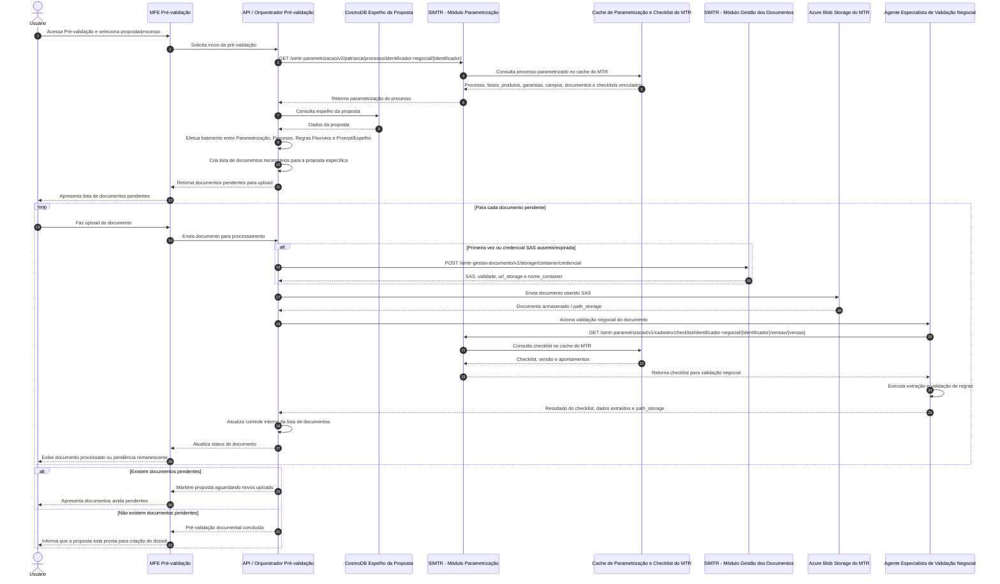
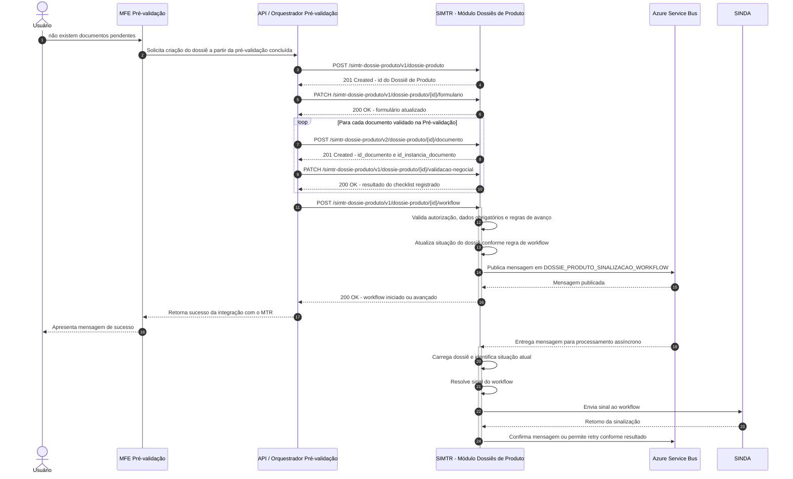
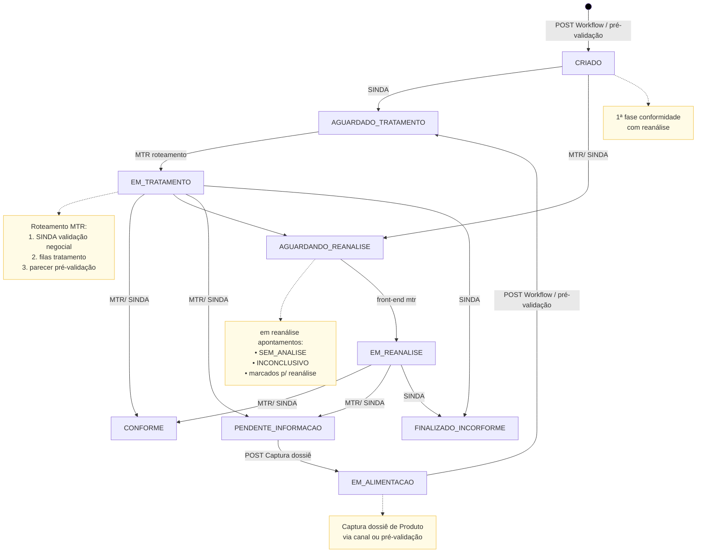

# Projeto Pré-validação - Integração com MTR

## Objetivo

Este documento tem como objetivo consolidar as alterações necessárias para integrar o sistema de Pré-validação ao SIMTR, descrevendo os endpoints envolvidos, os contratos de entrada e saída das APIs, os módulos impactados e os diagramas arquiteturais que representam a solução proposta.

A integração cobre o fluxo de pré-validação documental antes da criação do Dossiê de Produto, a criação e complementação do dossiê no MTR, o envio dos resultados de validação negocial dos checklists analisados e o avanço do workflow do dossiê.

---

## Resumo

A solução proposta define a integração entre o sistema de Pré-validação e os módulos do SIMTR necessários para montar, validar e criar um Dossiê de Produto a partir de uma proposta previamente selecionada.

O fluxo inicia com a consulta da parametrização do processo no Módulo Parametrização, incluindo fases, produtos, garantias, vínculos documentais, campos de formulário e checklists vinculados. Em seguida, a Pré-validação consulta o espelho da proposta, cruza os dados da proposta com a parametrização do processo e monta a lista de documentos necessários para aquela operação específica.

Durante o upload documental, a Pré-validação utiliza o Módulo Gestão dos Documentos para obter credencial SAS e armazenar os documentos no Azure Blob Storage do MTR. Para cada documento enviado, o Agente Especialista de Validação Negocial consulta o checklist correspondente, executa extração e validação de regras, e devolve o resultado da análise para posterior registro no Dossiê de Produto.

Quando não houver mais documentos pendentes, a Pré-validação cria o Dossiê de Produto no Módulo Dossiês de Produto, preenche os campos de formulário, vincula os documentos enviados, registra os resultados dos checklists analisados por meio do endpoint de validação negocial e aciona o avanço do workflow do dossiê.

O documento também registra os ajustes necessários nas APIs do SIMTR: nova versão do endpoint de consulta de processo, novo endpoint de consulta de checklist, nova versão do endpoint de inclusão de documento no dossiê para retorno dos identificadores do documento e da instância documental, e novo endpoint PATCH para registrar os resultados da validação negocial.

A parte arquitetural é representada por diagramas C4 de contexto, containers e componentes dos módulos envolvidos, além de diagramas de sequência que separam o fluxo de pré-validação antes da criação do dossiê e o fluxo de criação do Dossiê de Produto com avanço do workflow. O documento também inclui um diagrama de estado com as situações do dossiê produto  decorrentes da pré-validação.

---

## Índice

* [Endpoints de Integração com o MTR](#endpoints-de-integração-com-o-mtr)

  * [Alterações de endpoints necessárias para Fluxo 1](#alterações-de-endpoints-necessárias-para-fluxo-1)
  * [Módulo Parametrização](#módulo-parametrização)
  * [Módulo dossiês de produto](#módulo-dossiês-de-produto)
  * [Módulo gestão dos documentos](#módulo-gestão-dos-documentos)

* [APIs do MTR](#apis-do-mtr)

  * [Módulo Parametrização](#módulo-parametrização)

    * [Criar nova versão v2 do endpoint GET de Consulta do processo a partir de seu Identificador Negocial](#criar-nova-versão-v2-do-endpoint-get--de-consulta-do-processo-a-partir-de-seu-identificador-negocial)
    * [Criar novo endpoint de consulta de checklist](#criar-novo-endpoint-de-consulta-de-cheklist)
  * [Módulo de Dossiê Produto](#módulo-de-dossiê-produto)

    * [Criar nova versão v2 do endpoint POST de Inclusão de Documento no Dossiê de Produto](#criar-nova-versão-v2-do-endpoint-post-de-inclusão-de-documento-no-dossiê-de-produto)
    * [Criar novo endpoint de PATCH de Validação Negocial para receber o Resultado dos Checklists analisados](#criar-novo-endpoint-de-patch-de-validação-negocial-para-receber-o-resultao-dos-checklists-analisados)
    * [Manter inalterado o endpoint POST de Criação básica de Dossiê de Produto em modo rascunho](#manter-inalterado-o-endpoint-post-de-criação-básica-de-dossiê-de-produto-em-modo-rascunho)
    * [Manter inalterado o endpoint PATCH de Inclusão ou edição de Respostas de Formulário no Dossiê de Produto](#manter-inalterado-o-endpoint-patch-de-inclusão-ou-edição-de-respostas-de-formulário-no-dossiê-de-produto)
    * [Manter inalterado o endpoint POST que Inicia ou avança o fluxo de um Dossiê de Produto](#manter-inalterado-o-endpoint-post-que-inicia-ou-avança-o-fluxo-de-um-dossiê-de-produto-que-esteja-na-situação-rascunho-em-alimentação-ou-em-complementação)
    * [Manter inalterado o endpoint GET de Consulta de dossiê de produto pelo identificador](#manter-inalterado-o-endpoint-get-de-consulta-de-dossiê-de-produto-pelo-identificador)
  * [Módulo Gestão Documento](#módulo-gestão-documento)

    * [Manter inalterado o endpoint POST que Gera uma nova credencial de acesso compartilhado SAS](#manter-inalterado-o-endpoint-post-que-gera-uma-nova-credencial-de-acesso-compartilhado-sas-para-um-container-de-armazenamento-de-documentos-no-storage)

* [Diagramas arquiteturais da Integração entre Pré-validação e SIMTR](#diagramas-arquiteturais-da-integração-entre-pré-validação-e-simtr)

  * [C4 - Containers - Integração Pré-validação com SIMTR](#c4---containers---integração-pré-validação-com-simtr)
  * [C4 - Componentes - Módulo Parametrização do SIMTR](#c4---componentes---módulo-parametrização-do-simtr)
  * [C4 - Componentes - Módulo Dossiês de Produto do SIMTR](#c4---componentes---módulo-dossiês-de-produto-do-simtr)
  * [C4 - Componentes - Módulo Gestão dos Documentos do SIMTR](#c4---componentes---módulo-gestão-dos-documentos-do-simtr)

* [Diagrama de Sequência da Integração com o MTR](#diagrama-de-sequência-da-integração-com-o-mtr)

  * [Diagrama de Sequência — Pré-validação antes da criação do Dossiê de Produto](#diagrama-de-sequência--pré-validação-antes-da-criação-do-dossiê-de-produto)
  * [Diagrama de Sequência — Criação do Dossiê de Produto e avanço do Workflow](#diagrama-de-sequência--criação-do-dossiê-de-produto-e-avanço-do-workflow)

* [Diagrama de Estado — Situações de Dossiê de Produto decorrentes da pré-validação](#diagrama-de-estado--situações-de-dossiê-de-produto-decorrentes-da-pré-validação)

* [Anexos Diagramas arquiteturais da Integração entre Pré-validação e SIMTR](#anexos-diagramas-arquiteturais-da-integração-entre-pré-validação-e-simtr)

  * [1. C4 — Contexto de Sistema plantuml](#1-c4--contexto-de-sistema-plantuml)
  * [2. C4 — Containers plantuml](#2-c4--containers-plantuml)
  * [3. C4 — Componentes do Parametrização plantuml](#3-c4--componentes-do-parametrização-plantuml)
  * [4. C4 — Componentes do Dossiês de Produto plantuml](#4-c4--componentes-do-dossiês-de-produto-plantuml)
  * [5. C4 — Componentes do Gestão dos Documentos plantuml](#5-c4--componentes-do-gestão-dos-documentos-plantuml)

---

## Endpoints de Integração com o MTR

### Alterações de endpoints necessárias para **Fluxo 1**

#### Módulo Parametrização

[/simtr-parametrizacao/openapi](https://simtr-parametrizacao-des.apps.nprd.caixa/simtr-parametrizacao/doc/#/)

  - [Criar nova versão v2 do endpoint GET  de Consulta do processo a partir de seu Identificador Negocial](#criar-nova-versão-v2-do-endpoint-get--de-consulta-do-processo-a-partir-de-seu-identificador-negocial)
  - [Criar novo endpoint de consulta de cheklist](#criar-novo-endpoint-de-consulta-de-cheklist)

#### Módulo dossiês de produto

[/simtr-dossie-produto/openapi](https://simtr-dossie-produto-des.apps.nprd.caixa/simtr-dossie-produto/doc/)

  - [Criar nova versão v2 do endpoint POST de Inclusão de Documento no Dossiê de Produto](#criar-nova-versão-v2-do-endpoint-post-de-inclusão-de-documento-no-dossiê-de-produto)
  - [Criar novo endpoint de PATCH de Validação Negocial para receber o Resultao dos Checklists analisados](#criar-novo-endpoint-de-patch-de-validação-negocial-para-receber-o-resultao-dos-checklists-analisados)

  - Manter a versão atual dos endpoints:

    - POST Criação básica de Dossiê de Produto em modo rascunho 
    - PATCH Inclusão ou edição de Respostas de Formulário no Dossiê de Produto
    - PATCH Inclusão/Exclusão de Garantias no Dossiê de Produto.
    - PATCH Inclusão/Exclusão de Produtos Contratados no Dossiê de Produto.
    - POST Inicia ou avança o fluxo de um Dossiê de Produto que esteja na situação Rascunho, Em Alimentação ou Em Complementação.
    - Captura o dossiê de Produto para edição, alterando sua situação para Em Alimentação.
    - GET de Consulta de dossiê de produto pelo identificador.

####  Módulo gestão dos documentos

[/simtr-gestao-documento/openapi](https://simtr-gestao-documento-des.apps.nprd.caixa/simtr-gestao-documento/doc/)

  - Manter a versão atual do endpoint:

    - POST que Gera uma nova credencial de acesso compartilhado (SAS) para um container de armazenamento de documentos no Storage.

---

## APIs do MTR

### Módulo Parametrização

#### Criar nova versão v2 do endpoint GET  de Consulta do processo a partir de seu Identificador Negocial

Módulo: simtr-parametrização
Patriarca - API de Patriarca do SIMTR

Criar nova versão v2 para incluir no corpo da resposta os checklists vinculados por processo, fase, produto, garantia, função documental, tipo documento

- GET /simtr-parametrizacao/v2/patriarca/processo/identificador-negocial/{identificador}
Captura o processo gerador a partir de seu Identificador Negocial

Sem corpo da requisição

Corpo da resposta http 200
Processo gerador localizado com sucesso.

```json
{
    "identificador_negocial": 0,
    "nome": "string",
    "ativo": true,
    "ultima_alteracao": "dd/MM/yyyy HH:mm:ss",
    "indicador_produto_obrigatorio": false,
    "macroprocesso": {
        "identificador_negocial": 0,
        "nome": "string",
        "ativo": true,
        "ultima_alteracao": "dd/MM/yyyy HH:mm:ss"
    },
    "relacionamentos": [
        {
            "identificador_negocial": 0,
            "nome": "string",
            "tipo_pessoa": "F",
            "principal": true,
            "obrigatorio": true,
            "relacionado": true,
            "sequencia": true,
            "campos_formulario": [
                {
                    "identificador_negocial": 0,
                    "label": "string",
                    "obrigatorio": true,
                    "ativo": true,
                    "exibicao_condicional": "string",
                    "tamanho_apresentacao": 0,
                    "ordem_apresentacao": 0,
                    "tipo": "CEP",
                    "mascara": "string",
                    "placeholder": "string",
                    "tamanho_minimo": 0,
                    "tamanho_maximo": 0,
                    "orientacao_preenchimento": "string",
                    "bloquear_edicao": true,
                    "opcoes_disponiveis": [
                        {
                            "valor_opcao": "string",
                            "descricao_opcao": "string",
                            "ativo": true
                        }
                    ]
                }
            ],
            "documentos": [
                {
                    "funcao_documental": {
                        "nome": "string",
                        "tipos_documento": [
                            {
                                "codigo_tipologia": "string",
                                "nome": "string",
                                "permite_reuso": true,
                                "permite_multiplo": true,
                                "ativo": true
                            }
                        ],
                        "checklist": {
                            "identificador_checklist": 1000010029,
                            "versao_checklist": 1
                        }
                    },
                    "tipo_documento": {
                        "codigo_tipologia": "string",
                        "nome": "string",
                        "permite_reuso": true,
                        "permite_multiplo": true,
                        "ativo": true,
                        "checklist": {
                            "identificador_checklist": 1000006317,
                            "versao_checklist": 1
                        }
                    },
                    "obrigatorio": true
                }
            ]
        }
    ],
    "produtos": [
        {
            "codigo_operacao": 0,
            "codigo_modalidade": 0,
            "nome": "string",
            "campos_formulario": [
                {
                    "identificador_negocial": 0,
                    "label": "string",
                    "obrigatorio": true,
                    "ativo": true,
                    "exibicao_condicional": "string",
                    "tamanho_apresentacao": 0,
                    "ordem_apresentacao": 0,
                    "tipo": "CEP",
                    "mascara": "string",
                    "placeholder": "string",
                    "tamanho_minimo": 0,
                    "tamanho_maximo": 0,
                    "orientacao_preenchimento": "string",
                    "bloquear_edicao": true,
                    "opcoes_disponiveis": [
                        {
                            "valor_opcao": "string",
                            "descricao_opcao": "string",
                            "ativo": true
                        }
                    ]
                }
            ],
            "documentos": [
                {
                    "funcao_documental": {
                        "nome": "string",
                        "tipos_documento": [
                            {
                                "codigo_tipologia": "string",
                                "nome": "string",
                                "permite_reuso": true,
                                "ativo": true
                            }
                        ],
                        "checklist": {
                            "identificador_checklist": 1000006317,
                            "versao_checklist": 1
                        }
                    },
                    "tipo_documento": {
                        "codigo_tipologia": "string",
                        "nome": "string",
                        "permite_reuso": true,
                        "permite_multiplo": true,
                        "ativo": true,
                        "checklist": {
                            "identificador_checklist": 1000006317,
                            "versao_checklist": 1
                        }
                    },
                    "obrigatorio": true
                }
            ],
            "garantias": [
                {
                    "codigo_bacen": 0,
                    "nome_garantia": "string",
                    "fidejussoria": true,
                    "campos_formulario": [
                        {
                            "identificador_negocial": 0,
                            "label": "string",
                            "obrigatorio": true,
                            "ativo": true,
                            "exibicao_condicional": "string",
                            "tamanho_apresentacao": 0,
                            "ordem_apresentacao": 0,
                            "tipo": "CEP",
                            "mascara": "string",
                            "placeholder": "string",
                            "tamanho_minimo": 0,
                            "tamanho_maximo": 0,
                            "orientacao_preenchimento": "string",
                            "bloquear_edicao": true,
                            "opcoes_disponiveis": [
                                {
                                    "valor_opcao": "string",
                                    "descricao_opcao": "string",
                                    "ativo": true
                                }
                            ]
                        }
                    ],
                    "documentos": [
                        {
                            "funcao_documental": {
                                "nome": "string",
                                "tipos_documento": [
                                    {
                                        "codigo_tipologia": "string",
                                        "nome": "string",
                                        "permite_reuso": true,
                                        "ativo": true
                                    }
                                ],
                                "checklist": {
                                    "identificador_checklist": 1000006317,
                                    "versao_checklist": 1
                                }
                            },
                            "tipo_documento": {
                                "codigo_tipologia": "string",
                                "nome": "string",
                                "permite_reuso": true,
                                "permite_multiplo": true,
                                "ativo": true,
                                "checklist": {
                                    "identificador_checklist": 1000006317,
                                    "versao_checklist": 1
                                }
                            },
                            "obrigatorio": true
                        }
                    ]
                }
            ],
            "checklist": {
                "identificador_checklist": 1000006317,
                "versao_checklist": 1
            }
        }
    ],
    "fases": [
        {
            "identificador_negocial": 0,
            "nome": "string",
            "ativo": true,
            "ultima_alteracao": "dd/MM/yyyy HH:mm:ss",
            "ordem": 0,
            "orientacao_usuario": "string",
            "produtos": [
                {
                    "codigo_operacao": 0,
                    "codigo_modalidade": 0,
                    "nome": "string",
                    "campos_formulario": [
                        {
                            "identificador_negocial": 0,
                            "label": "string",
                            "obrigatorio": true,
                            "ativo": true,
                            "exibicao_condicional": "string",
                            "tamanho_apresentacao": 0,
                            "ordem_apresentacao": 0,
                            "tipo": "CEP",
                            "mascara": "string",
                            "placeholder": "string",
                            "tamanho_minimo": 0,
                            "tamanho_maximo": 0,
                            "orientacao_preenchimento": "string",
                            "bloquear_edicao": true,
                            "opcoes_disponiveis": [
                                {
                                    "valor_opcao": "string",
                                    "descricao_opcao": "string",
                                    "ativo": true
                                }
                            ]
                        }
                    ],
                    "documentos": [
                        {
                            "funcao_documental": {
                                "nome": "string",
                                "tipos_documento": [
                                    {
                                        "codigo_tipologia": "string",
                                        "nome": "string",
                                        "permite_reuso": true,
                                        "ativo": true
                                    }
                                ],
                                "checklist": {
                                    "identificador_checklist": 1000006317,
                                    "versao_checklist": 1
                                }
                            },
                            "tipo_documento": {
                                "codigo_tipologia": "string",
                                "nome": "string",
                                "permite_reuso": true,
                                "permite_multiplo": true,
                                "ativo": true,
                                "checklist": {
                                    "identificador_checklist": 1000006317,
                                    "versao_checklist": 1
                                }
                            },
                            "obrigatorio": true
                        }
                    ],
                    "garantias": [
                        {
                            "codigo_bacen": 0,
                            "nome_garantia": "string",
                            "fidejussoria": true,
                            "campos_formulario": [
                                {
                                    "identificador_negocial": 0,
                                    "label": "string",
                                    "obrigatorio": true,
                                    "ativo": true,
                                    "exibicao_condicional": "string",
                                    "tamanho_apresentacao": 0,
                                    "ordem_apresentacao": 0,
                                    "tipo": "CEP",
                                    "mascara": "string",
                                    "placeholder": "string",
                                    "tamanho_minimo": 0,
                                    "tamanho_maximo": 0,
                                    "orientacao_preenchimento": "string",
                                    "bloquear_edicao": true,
                                    "opcoes_disponiveis": [
                                        {
                                            "valor_opcao": "string",
                                            "descricao_opcao": "string",
                                            "ativo": true
                                        }
                                    ]
                                }
                            ],
                            "documentos": [
                                {
                                    "funcao_documental": {
                                        "nome": "string",
                                        "tipos_documento": [
                                            {
                                                "codigo_tipologia": "string",
                                                "nome": "string",
                                                "permite_reuso": true,
                                                "ativo": true
                                            }
                                        ],
                                        "checklist": {
                                            "identificador_checklist": 1000006317,
                                            "versao_checklist": 1
                                        }
                                    },
                                    "tipo_documento": {
                                        "codigo_tipologia": "string",
                                        "nome": "string",
                                        "permite_reuso": true,
                                        "permite_multiplo": true,
                                        "ativo": true,
                                        "checklist": {
                                            "identificador_checklist": 1000006317,
                                            "versao_checklist": 1
                                        }
                                    },
                                    "obrigatorio": true
                                }
                            ],
                            "checklist": {
                                "identificador_checklist": 1000006317,
                                "versao_checklist": 1
                            }
                        }
                    ]
                }
            ],
            "garantias": [
                {
                    "codigo_bacen": 0,
                    "nome_garantia": "string",
                    "fidejussoria": true,
                    "campos_formulario": [
                        {
                            "identificador_negocial": 0,
                            "label": "string",
                            "obrigatorio": true,
                            "ativo": true,
                            "exibicao_condicional": "string",
                            "tamanho_apresentacao": 0,
                            "ordem_apresentacao": 0,
                            "tipo": "CEP",
                            "mascara": "string",
                            "placeholder": "string",
                            "tamanho_minimo": 0,
                            "tamanho_maximo": 0,
                            "orientacao_preenchimento": "string",
                            "bloquear_edicao": true,
                            "opcoes_disponiveis": [
                                {
                                    "valor_opcao": "string",
                                    "descricao_opcao": "string",
                                    "ativo": true
                                }
                            ]
                        }
                    ],
                    "documentos": [
                        {
                            "funcao_documental": {
                                "nome": "string",
                                "tipos_documento": [
                                    {
                                        "codigo_tipologia": "string",
                                        "nome": "string",
                                        "permite_reuso": true,
                                        "ativo": true
                                    }
                                ],
                                "checklist": {
                                    "identificador_checklist": 1000006317,
                                    "versao_checklist": 1
                                }
                            },
                            "tipo_documento": {
                                "codigo_tipologia": "string",
                                "nome": "string",
                                "permite_reuso": true,
                                "permite_multiplo": true,
                                "ativo": true,
                                "checklist": {
                                    "identificador_checklist": 1000006317,
                                    "versao_checklist": 1
                                }
                            },
                            "obrigatorio": true
                        }
                    ],
                    "checklist": {
                        "identificador_checklist": 1000006317,
                        "versao_checklist": 1
                    }
                }
            ],
            "campos_formulario": [
                {
                    "identificador_negocial": 0,
                    "label": "string",
                    "obrigatorio": true,
                    "ativo": true,
                    "exibicao_condicional": "string",
                    "tamanho_apresentacao": 0,
                    "ordem_apresentacao": 0,
                    "tipo": "CEP",
                    "mascara": "string",
                    "placeholder": "string",
                    "tamanho_minimo": 0,
                    "tamanho_maximo": 0,
                    "orientacao_preenchimento": "string",
                    "bloquear_edicao": true,
                    "opcoes_disponiveis": [
                        {
                            "valor_opcao": "string",
                            "descricao_opcao": "string",
                            "ativo": true
                        }
                    ]
                }
            ],
            "documentos": [
                {
                    "funcao_documental": {
                        "nome": "string",
                        "tipos_documento": [
                            {
                                "codigo_tipologia": "string",
                                "nome": "string",
                                "permite_reuso": true,
                                "ativo": true
                            }
                        ],
                        "checklist": {
                            "identificador_checklist": 1000006317,
                            "versao_checklist": 1
                        }
                    },
                    "tipo_documento": {
                        "codigo_tipologia": "string",
                        "nome": "string",
                        "permite_reuso": true,
                        "permite_multiplo": true,
                        "ativo": true,
                        "checklist": {
                            "identificador_checklist": 1000006317,
                            "versao_checklist": 1
                        }
                    },
                    "obrigatorio": true
                }
            ],
            "checklists": [
                {
                    "identificador_checklist": 1000006317,
                    "versao_checklist": 1
                }
            ]
        }
    ],
    "documentos": [
        {
            "funcao_documental": {
                "nome": "string",
                "tipos_documento": [
                    {
                        "codigo_tipologia": "string",
                        "nome": "string",
                        "permite_reuso": true,
                        "ativo": true
                    }
                ],
                "checklist": {
                    "identificador_checklist": 1000006317,
                    "versao_checklist": 1
                }
            },
            "tipo_documento": {
                "codigo_tipologia": "string",
                "nome": "string",
                "permite_reuso": true,
                "permite_multiplo": true,
                "ativo": true,
                "checklist": {
                    "identificador_checklist": 1000006317,
                    "versao_checklist": 1
                }
            },
            "obrigatorio": true
        }
    ],
    "checklist": {
        "identificador_checklist": 1000006317,
        "versao_checklist": 1
    }
}
```

Corpo da resposta de erro:

```json
{
  "codigo_http": 0,
  "recurso": "string",
  "id_erro": "string",
  "codigo_erro": "string",
  "erros": [
    {
      "mensagem": "string"
    }
  ],
  "detalhe": "string",
  "stacktrace": "string"
}
```

Exemplo de Corpo da resposta de erro:

```json
{
    "codigo_http": 404,
    "id_erro": "7e1a4f41-30ea-4fac-933a-6020b99a72a7",
    "codigo_erro": "MTRPAR0003",
    "erros": [
        {
            "mensagem": "PSgPDByIN - Processo gerador com Identificador Negocial [202114235] não localizado"
        }
    ]
}
```

##### Tipos de vínculos de checklists

Tipos de vínculos de checklists e Regra de restrições de multiplicidade:

* Processo + fase (pode ter mais de um checklist vinculado)
* Processo + fase (pode ter  apenas um **checklist prévio** vinculado)
* Processo + fase + produto (pode ter  apenas um checklist vinculado sendo ele **checklist prévio** ou não)
* Processo + fase + garantia (pode ter  apenas um checklist vinculado)
* Processo + fase + tipo documento (pode ter  apenas um checklist vinculado)
* Processo + fase + função documental (pode ter  apenas um checklist vinculado)
* Processo + fase + produto +  tipo documento (pode ter  apenas um checklist vinculado)
* Processo + fase + garantia + função documental (pode ter  apenas um checklist vinculado)

#### Criar novo endpoint de consulta de cheklist

Módulo: simtr-parametrização
Cadastro - Checklist API de Apoio ao Cadastro de Checklists

Criar novo endpoint de consulta de cheklist por identificador negocial de Checklist e versão:

- GET /simtr-parametrizacao/v1/cadastro/checklist/identificador-negocial/{identificador}/versao/{versao}

Consulta um checklist pelo seu identificador negoial e versão.

Corpo da resposta http 200
Checklist localizado com sucesso.

```json
{
  "nome": "string",
  "identificador_negocial": 0,
  "versao": 0,
  "data_hora_criacao": "2026-05-11T18:22:40.134Z",
  "data_hora_ultima_alteracao": "2026-05-11T18:22:40.134Z",
  "verificacao_previa": true,
  "orientacao_operador": "string"
  "apontamentos": [
    {
      "identificador_negocial": 0,
      "nome": "string",
      "descricao": "string",
      "orientacao_operador": "string",
      "indicador_reanalise": true,
      "sequencia_apresentacao": 0
    }
  ]
}
```

Corpo da resposta de erro:

```json
{
  "codigo_http": 0,
  "recurso": "string",
  "id_erro": "string",
  "codigo_erro": "string",
  "erros": [
    {
      "mensagem": "string"
    }
  ],
  "detalhe": "string",
  "stacktrace": "string"
}
```

---

### Módulo de Dossiê Produto

Módulo: simtr-dossie-produto
Negócio - Dossiê Produto API de Apoio ao Negócio de Dossiês Produto do SIMTR

#### Criar nova versão v2 do endpoint POST de Inclusão de Documento no Dossiê de Produto

Criar nova versão v2 do endpoint POST de Inclusão de Documento no Dossiê de Produto para devolver o id do documento e o id da instancia do documento

- POST /simtr-dossie-produto/v2/dossie-produto/{id}/documento
Inclusão de Documento no Dossiê de Produto.

Corpo requisição:

```json
{
  "id": 0,
  "path_storage": "{{nome_container}}/{{nome_arquivo}}.{{extensao}}",
  "codigo_ged": "string",
  "object_store_ged": "string",
  "tipo_documento": "string",
  "vinculo_dossie": {
    "cliente": {
      "cpf": "string",
      "cnpj": "string",
      "tipo_vinculo": 0
    },
    "elemento_conteudo": 0,
    "garantia": {
      "codigo_bacen": 0,
      "produto_operacao": 0,
      "produto_modalidade": 0,
      "cliente_avalista": [
        {
          "cpf": "string",
          "cnpj": "string"
        }
      ]
    }
  },
  "atributos": [
    {
      "chave": "string",
      "valor": "string",
      "objeto": "string",
      "opcoes_selecionadas": [
        "string"
      ]
    }
  ],
  "propriedades": [
    {
      "chave": "string",
      "valor": "string",
      "objeto": "string"
    }
  ]
}
```

Corpo da resposta http 201
Documento criado com sucesso.

```json
{
  "id_documento": 0,
   "id_instancia_documento": 0
}
```

Corpo da resposta de erro:

```json
{
  "codigo_http": 0,
  "recurso": "string",
  "id_erro": "string",
  "codigo_erro": "string",
  "erros": [
    {
      "mensagem": "string"
    }
  ],
  "detalhe": "string",
  "stacktrace": "string"
}
```

#### Criar novo endpoint de PATCH de Validação Negocial para receber o Resultao dos Checklists analisados

Criar novo endpoint para receber o Resultao dos Checklists analisados com dossiê produto na situaçoa de RASCUNHO e EM_ALIMENTACAO
Inclusão do Resultao dos Checklists analisados.

- PATCH /simtr-dossie-produto/v1/dossie-produto/{id}/validacao-negocial

Corpo de requisição:

```json
{
  "verificacoes": [
    {
      "identificador_instancia_documento": 0,
      "identificador_checklist": 0,
      "versao_checklist": 0,
      "analise_realizada": true,
      "parecer_apontamentos": [
        {
          "identificador_apontamento": 0,
          "resultado": "APROVADO", /* [APROVADO, REPROVADO, SEM_ANALISE, INCONCLUSIVO ]*/
          "comentario": "string",
          "necessidade_reanalise": true, /*[true/false] indicar que aquele apontamento deve ser reanalisado*/
          "indice_ia": 0,99 /*score de confiança de ia no range [0..1] opcional*/
        }
      ],
      "garantia": {
        "codigo_bacen": 0,
        "clientes_avalistas": [
          {
            "cpf": "string",
            "cnpj": "string"
          }
        ]
      },
      "produto": {
        "codigo_operacao": 0,
        "codigo_modalidade": 0
      },
      "previo": true
    }
  ],
  "respostas_formulario": [
    {
      "campo_formulario": 29848450,
      "resposta": "string",
      "opcoes_selecionadas": [
        "string"
      ]
    }
  ]
}
```

exemplo de Corpo de requisição:

```json
{
  "verificacoes_realizadas": [
    {
      "identificador_instancia_documento": 1122928,
      "identificador_checklist": 6592,
      "identificador_negocial": 1000011694,
      "versao_checklist": 2,
      "analise_realizada": true,
      "parecer_apontamentos": [
        {
          "identificador_apontamento": 1000012877,
          "resultado": "APROVADO",
          "necessidade_reanalise": false,
          "indice_ia": 1
        },
        {
          "identificador_apontamento": 1000011696,
          "resultado": "APROVADO",
          "necessidade_reanalise": true,
          "indice_ia": 0.7
        },
        {
          "identificador_apontamento": 1000011695,
          "resultado": "APROVADO",
          "necessidade_reanalise": true,
          "indice_ia": 0.3
        }
      ]
    }
  ],
  "resposta_formulario": [
    {
      "campo_formulario": 1000011689,
      "resposta": "teste"
    },
    {
      "campo_formulario": 1000011699,
      "opcoes_selecionadas": [
        "2"
      ]
    }
  ]
}
```

sem Corpo da reposta para Http 200
Inclusão ou edição de Resultado de Checklists no Dossiê de Produto feita com sucesso.

Corpo da resposta de erro:

```json
{
  "codigo_http": 0,
  "recurso": "string",
  "id_erro": "string",
  "codigo_erro": "string",
  "erros": [
    {
      "mensagem": "string"
    }
  ],
  "detalhe": "string",
  "stacktrace": "string"
}
```

#### Manter inalterado o endpoint POST de Criação básica de Dossiê de Produto em modo rascunho

POST /simtr-dossie-produto/v1/dossie-produto

Corpo da requisição:

```json
{
  "processo": 0,
  "chave_correlacao_canal": 0,
  "numero_negocio": 0,
  "clientes": [
    {
      "cpf": "string",
      "cnpj": "string",
      "tipo_vinculo": 0,
      "cliente_relacionado": {
        "cpf": "string",
        "cnpj": "string"
      },
      "sequencia_titularidade": 0
    }
  ]
}
```

Corpo da resposta http 201 retorna o id do dossiê produto.
Dossiê de Produto criado com sucesso.

```json
{
  "id": 0
}
```

Corpo da resposta de erro:

```json
{
  "codigo_http": 0,
  "recurso": "string",
  "id_erro": "string",
  "codigo_erro": "string",
  "erros": [
    {
      "mensagem": "string"
    }
  ],
  "detalhe": "string",
  "stacktrace": "string"
}
```

Exemplo de Corpo de resposta de erro:

```json
{
    "codigo_http": 400,
    "id_erro": "84d87070-41c0-4044-8a46-92efbd57f599",
    "codigo_erro": "MTRDPP0003",
    "erros": [
        {
            "mensagem": "Processo Gerador com Identificador 202114235 não localizado."
        }
    ]
}
```

#### Manter inalterado o endpoint PATCH de Inclusão ou edição de Respostas de Formulário no Dossiê de Produto.

- PATCH /simtr-dossie-produto/v1/dossie-produto/{id}/formulario

Corpo da requisição:

```json
[
  {
    "vinculo_dossie": {
      "fase": 0,
      "cliente": {
        "cpf": "string",
        "cnpj": "string",
        "tipo_vinculo": 0
      },
      "produto": {
        "codigo_operacao": 0,
        "codigo_modalidade": 0
      },
      "garantia": {
        "codigo_bacen": 0,
        "produto_operacao": 0,
        "produto_modalidade": 0,
        "clientes_avalistas": [
          {
            "cpf": "string",
            "cnpj": "string"
          }
        ]
      },
      "respostas_formulario": [
        {
          "campo_formulario": 0,
          "resposta": "string",
          "opcoes_selecionadas": [
            "string"
          ],
          "excluir": true
        }
      ]
    }
  }
]
```

Corpo da resposta http 201 retorna o id do dossiê produto 	
Inclusão ou edição de Respostas de Formulário no Dossiê de Produto feita com sucesso.

```json
{
  "id": 0
}
```

Corpo da resposta de erro:

```json
{
  "codigo_http": 0,
  "recurso": "string",
  "id_erro": "string",
  "codigo_erro": "string",
  "erros": [
    {
      "mensagem": "string"
    }
  ],
  "detalhe": "string",
  "stacktrace": "string"
}
```

#### Manter inalterado o endpoint PATCH de Inclusão/Exclusão de Garantias no Dossiê de Produto.

- PATCH /simtr-dossie-produto/v1/dossie-produto/{id}/garantia

```json
[
  {
    "codigo_bacen": 0,
    "produto_operacao": 0,
    "produto_modalidade": 0,
    "clientes_avalistas": [
      {
        "cpf": "string",
        "cnpj": "string"
      }
    ],
    "valor_garantia": 0,
    "excluir": true
  }
]
```

Corpo da resposta http 201 retorna o id do dossiê produto 	
Inclusão ou edição de Garantia no Dossiê de Produto feita com sucesso.

```json
{
  "id": 0
}
```

Corpo da resposta de erro:

```json
{
  "codigo_http": 0,
  "recurso": "string",
  "id_erro": "string",
  "codigo_erro": "string",
  "erros": [
    {
      "mensagem": "string"
    }
  ],
  "detalhe": "string",
  "stacktrace": "string"
}
```

#### Manter inalterado o endpoint PATCH de Inclusão/Exclusão de Produtos Contratados no Dossiê de Produto.

- PATCH /simtr-dossie-produto/v1/dossie-produto/{id}/produto

```json
[
  {
    "codigo_operacao": 0,
    "codigo_modalidade": 0,
    "excluir": true
  }
]
```

Corpo da resposta http 200
Recurso criado/ alterado/ localizado ou excluído com sucesso.

Corpo da resposta de erro:

```json
{
  "codigo_http": 0,
  "recurso": "string",
  "id_erro": "string",
  "codigo_erro": "string",
  "erros": [
    {
      "mensagem": "string"
    }
  ],
  "detalhe": "string",
  "stacktrace": "string"
}
```

#### Manter inalterado o endpoint POST de Captura o dossiê de Produto para edição, alterando sua situação para Em Alimentação.

- POST /simtr-dossie-produto/v1/dossie-produto/{id}/capturar

Sem corpo de requisição.

Corpo da resposta http 200
Dossiê capturado com sucesso.

```json
{
  "id": 0
}
```

Corpo da resposta de erro:

```json
{
  "codigo_http": 0,
  "recurso": "string",
  "id_erro": "string",
  "codigo_erro": "string",
  "erros": [
    {
      "mensagem": "string"
    }
  ],
  "detalhe": "string",
  "stacktrace": "string"
}
```

#### Manter inalterado o endpoint POST que Inicia ou avança o fluxo de um Dossiê de Produto que esteja na situação Rascunho, Em Alimentação ou Em Complementação.

- POST /simtr-dossie-produto/v1/dossie-produto/{id}/workflow

Sem corpo de requisição.

Corpo da resposta http 200
Fluxo iniciado ou avançado com sucesso

Corpo da resposta de erro:

```json
{
  "codigo_http": 0,
  "recurso": "string",
  "id_erro": "string",
  "codigo_erro": "string",
  "erros": [
    {
      "mensagem": "string"
    }
  ],
  "detalhe": "string",
  "stacktrace": "string"
}
```

#### Manter inalterado o endpoint POST que Realiza o cancelamento de um dossiê de produto.

- POST /simtr-dossie-produto/v1/dossie-produto/{id}/cancelar

Corpo da requisição.

```json
{
  "motivo_cancelamento": "string"
}
```

Corpo da resposta http 200
Dossiê de produto cancelado com sucesso.

Corpo da resposta de erro:

```json
{
  "codigo_http": 0,
  "recurso": "string",
  "id_erro": "string",
  "codigo_erro": "string",
  "erros": [
    {
      "mensagem": "string"
    }
  ],
  "detalhe": "string",
  "stacktrace": "string"
}
```

#### Manter inalterado o endpoint GET de Consulta de dossiê de produto pelo identificador.

- GET /simtr-dossie-produto/v2/dossie-produto/{id}

Sem corpo de requisição.

Corpo da resposta http 200
Dossiê localizado com sucesso.

```json
{
  "id": 0,
  "chave_correlacao_canal": 0,
  "instancia_jbpm": 0,
  "numero_negocio": 0,
  "canal_criacao": "string",
  "unidade_criacao": 0,
  "data_criacao": "dd/MM/yyyy HH:mm:ss",
  "clientes": [
    {
      "cpf": "string",
      "cnpj": "string",
      "nome": "string",
      "razao_social": "string",
      "tipo_vinculo": "string",
      "identificador_negocial_vinculo": 0,
      "principal": true
    }
  ],
  "processo": {
    "id": 0,
    "nome": "string",
    "identificador_negocial": 0,
    "macroprocesso": "string",
    "data": "dd/MM/yyyy HH:mm:ss",
    "tratamento_seletivo": true,
    "complementacao_seletiva": true
  },
  "fase_atual": {
    "id": 0,
    "nome": "string",
    "identificador_negocial": 0,
    "data": "dd/MM/yyyy HH:mm:ss"
  },
  "situacao_atual": {
    "id": 0,
    "nome": "string",
    "data": "dd/MM/yyyy HH:mm:ss",
    "matricula": "string"
  },
  "unidades_tratamento": [
    0
  ],
  "produtos_contratados": [
    {
      "id": 0,
      "codigo_operacao": 0,
      "codigo_modalidade": 0,
      "nome": "string"
    }
  ]
}
```

Corpo da resposta de erro:

```json
{
  "codigo_http": 0,
  "recurso": "string",
  "id_erro": "string",
  "codigo_erro": "string",
  "erros": [
    {
      "mensagem": "string"
    }
  ],
  "detalhe": "string",
  "stacktrace": "string"
}
```

---

### Módulo Gestão Documento

Módulo: simtr-gestao-documento
API de gestão dos documentos do SIMTR

#### Manter inalterado o endpoint POST que Gera uma nova credencial de acesso compartilhado (SAS) para um container de armazenamento de documentos no Storage.

POST /simtr-gestao-documento/v1/storage/container/credencial
Gera uma nova credencial de acesso compartilhado (SAS) para um container de armazenamento de documentos no Storage.

sem Corpo da requisição


Corpo da resposta http 200
Credencial SAS gerado com sucesso.

```json
{
  "sas": "string",
  "validade": "dd/MM/yyyy HH:mm:ss",
  "url_storage": "string",
  "nome_container": "string"
}
```

Corpo da resposta de erro:

```json
{
  "codigo_http": 0,
  "recurso": "string",
  "id_erro": "string",
  "codigo_erro": "string",
  "erros": [
    {
      "mensagem": "string"
    }
  ],
  "detalhe": "string",
  "stacktrace": "string"
}
```

---

## Diagramas arquiteturais da Integração entre pré-validação e SIMTR

### C4 - Containers - Integração Pré-validação com SIMTR

[C4_Containers_Pre_Validacao_SIMTR](#2-c4--containers-plantuml)


### C4 - Componentes - Módulo Parametrização do SIMTR

[C4_Componentes_Modulo_Parametrizacao.puml](#3-c4--componentes-do-parametrização-plantuml)


### C4 - Componentes - Módulo Dossiês de Produto do SIMTR

[C4_Componentes_Modulo_Dossie_Produto.puml](#4-c4--componentes-do-dossiês-de-produto-plantuml)


### C4 - Componentes - Módulo Gestão dos Documentos do SIMTR

[C4_Componentes_Modulo_Gestao_Documentos.puml](#5-c4--componentes-do-gestão-dos-documentos-plantuml)


## Diagrama de Sequência da Integração com o MTR

### Diagrama de Sequência — Pré-validação antes da criação do Dossiê de Produto



---

### Diagrama de Sequência — Criação do Dossiê de Produto e avanço do Workflow



---

## Diagrama de Estado — Situações de Dossiê de Produto decorrentes da pré-validação



---

## Anexos Diagramas arquiteturais da Integração entre pré-validação e SIMTR

### C4 — Containers plantuml

```md
```plantuml
@startuml C4_Containers_Pre_Validacao_SIMTR

!include c:/desenvolvimento/plantuml/C4/C4_Component.puml

title C4 - Containers - Integração Pré-validação com SIMTR

Person(usuario, "Usuário", "Usuário do módulo de Pré-validação")

System_Boundary(preValidacaoBoundary, "Sistema de Pré-validação") {
    Container(spaPreValidacao, "MFE Pré-validação", "SPA", "Interface usada para seleção de proposta, apresentação de documentos pendentes e upload")
    Container(apiPreValidacao, "API / Orquestrador de Pré-validação", "Backend", "Coordena consulta de proposta, parametrização, upload, validação documental e integração com o SIMTR")
    Container(agenteValidacao, "Agente Especialista de Validação Negocial", "Agente IA / Serviço", "Executa extração, validação de regras e aplicação de checklist por documento")
    ContainerDb(repositorioProposta, "Espelho da Proposta", "Repositório", "Fonte consultada pela Pré-validação para obter dados da proposta")
}

System_Boundary(simtrBoundary, "SIMTR / MTR") {
    Container(parametrizacao, "Módulo Parametrização", "REST API", "Consulta processo, vínculos documentais, formulários e checklists")
    ContainerDb(cacheMtr, "Cache de Parametrização e Checklist do MTR", "Cache", "Disponibiliza dados de processo, vínculos documentais, formulários e checklists para consulta")
    Container(dossieProduto, "Módulo Dossiês de Produto", "REST API", "Cria dossiê, atualiza formulário, vincula documentos, recebe validação negocial e avança workflow")
    Container(gestaoDocumento, "Módulo Gestão dos Documentos", "REST API", "Gera credencial SAS para container de documentos")
    Container(blobStorage, "Azure Blob Storage do MTR", "Storage", "Armazena documentos recebidos por upload")
    ContainerDb(oracleMtr, "Banco de Dados Oracle do MTR", "Banco transacional", "Persistência dos dados transacionais do Dossiê de Produto")
    ContainerQueue(serviceBus, "Azure Service Bus", "Fila", "Fila de sinalização assíncrona do workflow")
    System_Ext(sinda, "SINDA", "BPM", "Recebe sinalização de workflow")
}

Rel(usuario, spaPreValidacao, "Opera o fluxo de pré-validação", "HTTPS")
Rel(spaPreValidacao, apiPreValidacao, "Aciona operações de proposta, upload e pré-validação", "HTTP REST")

Rel(apiPreValidacao, repositorioProposta, "Consulta espelho da proposta")
Rel(apiPreValidacao, parametrizacao, "Consulta processo parametrizado e checklists", "HTTP REST")
Rel(parametrizacao, cacheMtr, "Consulta parametrização de processo e checklist")

Rel(apiPreValidacao, gestaoDocumento, "Obtém credencial SAS", "HTTP REST")
Rel(apiPreValidacao, blobStorage, "Envia documentos", "HTTPS/SAS")
Rel(apiPreValidacao, agenteValidacao, "Aciona validação negocial por documento")
Rel(agenteValidacao, parametrizacao, "Consulta checklist por identificador e versão", "HTTP REST")

Rel(apiPreValidacao, dossieProduto, "Cria dossiê, preenche formulário, vincula documentos, envia validação negocial e avança workflow", "HTTP REST")

Rel(dossieProduto, oracleMtr, "Persiste e consulta dossiê, documentos, formulário e validação negocial")
Rel(gestaoDocumento, blobStorage, "Gera credencial SAS para container de documentos")
Rel(dossieProduto, serviceBus, "Publica mensagem de sinalização do workflow")
Rel(serviceBus, dossieProduto, "Entrega mensagem ao processador assíncrono")
Rel(dossieProduto, sinda, "Sinaliza workflow", "HTTP REST")

@enduml
```
```

### C4 — Componentes do Parametrização plantuml

```md
```plantuml
@startuml C4_Componentes_Modulo_Parametrizacao

!include c:/desenvolvimento/plantuml/C4/C4_Component.puml

title C4 - Componentes - Módulo Parametrização do SIMTR

Container(apiPreValidacao, "API / Orquestrador de Pré-validação", "Backend", "Coordena a integração com o SIMTR e consulta a parametrização do processo")
Container(agenteValidacao, "Agente Especialista de Validação Negocial", "Agente IA / Serviço", "Consulta checklist para aplicação da validação negocial do documento")

Container_Boundary(parametrizacao, "Módulo Parametrização - simtr-parametrizacao") {
    Component(patriarcaApi, "Patriarca API", "REST Controller", "GET /simtr-parametrizacao/v2/patriarca/processo/identificador-negocial/{identificador}")
    Component(checklistConsultaApi, "Cadastro Checklist API", "REST Controller", "GET /simtr-parametrizacao/v1/cadastro/checklist/identificador-negocial/{identificador}/versao/{versao}")

    Component(processoService, "Serviço de Consulta de Processo", "Service", "Consulta processo, fases, produtos, garantias, vínculos documentais, campos de formulário e checklists vinculados")
    Component(checklistService, "Serviço de Consulta de Checklist", "Service", "Consulta checklist, versão e apontamentos")

    Component(parametrizacaoCacheRepository, "Repositório de Cache de Parametrização", "Repository / Adapter", "Consulta dados de processo, vínculos documentais, formulários e checklists vinculados no cache do MTR")
    Component(checklistCacheRepository, "Repositório de Cache de Checklist", "Repository / Adapter", "Consulta checklist, versão e apontamentos no cache do MTR")
}

ContainerDb(cacheMtr, "Cache de Parametrização e Checklist do MTR", "Cache", "Disponibiliza dados de processo, vínculos documentais, formulários, checklists e apontamentos para consulta")

Rel(apiPreValidacao, patriarcaApi, "Consulta parametrização do processo", "HTTP GET")
Rel(agenteValidacao, checklistConsultaApi, "Consulta checklist por identificador e versão", "HTTP GET")

Rel(patriarcaApi, processoService, "Encaminha consulta de processo")
Rel(checklistConsultaApi, checklistService, "Encaminha consulta de checklist")

Rel(processoService, parametrizacaoCacheRepository, "Consulta parametrização de processo no cache")
Rel(checklistService, checklistCacheRepository, "Consulta checklist no cache")

Rel(parametrizacaoCacheRepository, cacheMtr, "Lê processo, vínculos documentais, formulários e checklists vinculados")
Rel(checklistCacheRepository, cacheMtr, "Lê checklist, versão e apontamentos")

@enduml
```
```

### C4 — Componentes do Dossiês de Produto plantuml

```md
```plantuml
@startuml C4_Componentes_Modulo_Dossie_Produto

!include c:/desenvolvimento/plantuml/C4/C4_Component.puml

title C4 - Componentes - Módulo Dossiês de Produto do SIMTR

Container(apiPreValidacao, "API / Orquestrador de Pré-validação", "Backend", "Integra com o Módulo Dossiês de Produto")

Container_Boundary(dossieProduto, "Módulo Dossiês de Produto - simtr-dossie-produto") {
    Component(criacaoDossieApi, "API de Criação de Dossiê", "REST Controller", "POST /simtr-dossie-produto/v1/dossie-produto")
    Component(formularioApi, "API de Formulário do Dossiê", "REST Controller", "PATCH /simtr-dossie-produto/v1/dossie-produto/{id}/formulario")
    Component(documentoApi, "API de Documento do Dossiê", "REST Controller", "POST /simtr-dossie-produto/v2/dossie-produto/{id}/documento")
    Component(validacaoNegocialApi, "API de Validação Negocial", "REST Controller", "PATCH /simtr-dossie-produto/v1/dossie-produto/{id}/validacao-negocial")
    Component(workflowApi, "API de Workflow do Dossiê", "REST Controller", "POST /simtr-dossie-produto/v1/dossie-produto/{id}/workflow")
    Component(consultaDossieApi, "API de Consulta de Dossiê", "REST Controller", "GET /simtr-dossie-produto/v2/dossie-produto/{id}")

    Component(dossieProdutoService, "Serviço de Dossiê Produto", "Service", "Orquestra criação, formulário, documento, validação negocial e workflow")
    Component(workflowValidacaoHelper, "WorkflowValidacaoHelper", "Helper", "Valida autorização e dados obrigatórios antes do avanço")
    Component(situacaoDossieService, "SituacaoDossieProdutoServico", "Service", "Registra nova situação do dossiê")
    Component(serviceBusSender, "ServiceBusSenderClientBase", "Client", "Publica mensagem na fila DOSSIE_PRODUTO_SINALIZACAO_WORKFLOW")
    Component(sinalizacaoProcessor, "DossieProdutoSinalizacaoProcessorClient", "Processor", "Consome mensagens da fila e aciona sinalização")
    Component(processaEnvioSinda, "ProcessaEnvioDossieProdutoSinda", "Service", "Resolve regra de sinalização e coordena envio ao SINDA")
    Component(sindaClient, "SindaServicoClient", "Client", "Executa chamada HTTP ao SINDA")
    Component(dossieRepository, "DossieProdutoRepositorio", "Repository", "Consulta e atualiza dados do Dossiê de Produto")
}

ContainerDb(oracleMtr, "Banco de Dados Oracle do MTR", "Banco transacional", "Persistência transacional do Dossiê de Produto")
ContainerQueue(serviceBus, "Azure Service Bus", "Fila", "DOSSIE_PRODUTO_SINALIZACAO_WORKFLOW")
System_Ext(sinda, "SINDA", "BPM", "Motor BPM corporativo")

Rel(apiPreValidacao, criacaoDossieApi, "Cria dossiê em modo rascunho", "HTTP POST")
Rel(apiPreValidacao, formularioApi, "Preenche campos de formulário", "HTTP PATCH")
Rel(apiPreValidacao, documentoApi, "Vincula documento ao dossiê", "HTTP POST")
Rel(apiPreValidacao, validacaoNegocialApi, "Envia resultado do checklist analisado", "HTTP PATCH")
Rel(apiPreValidacao, workflowApi, "Inicia ou avança workflow", "HTTP POST")
Rel(apiPreValidacao, consultaDossieApi, "Consulta dossiê por identificador", "HTTP GET")

Rel(criacaoDossieApi, dossieProdutoService, "Encaminha criação")
Rel(formularioApi, dossieProdutoService, "Encaminha atualização de formulário")
Rel(documentoApi, dossieProdutoService, "Encaminha inclusão de documento")
Rel(validacaoNegocialApi, dossieProdutoService, "Encaminha validação negocial")
Rel(workflowApi, dossieProdutoService, "Encaminha avanço de workflow")
Rel(consultaDossieApi, dossieProdutoService, "Encaminha consulta")

Rel(dossieProdutoService, workflowValidacaoHelper, "Valida avanço")
Rel(dossieProdutoService, situacaoDossieService, "Registra situação CRIADO ou ALIMENTACAO_FINALIZADA")
Rel(dossieProdutoService, serviceBusSender, "Registra necessidade de sinalização")
Rel(serviceBusSender, serviceBus, "Publica mensagem")

Rel(serviceBus, sinalizacaoProcessor, "Entrega mensagem")
Rel(sinalizacaoProcessor, processaEnvioSinda, "Processa sinalização")
Rel(processaEnvioSinda, sindaClient, "Solicita envio de sinal")
Rel(sindaClient, sinda, "Envia sinal ao workflow", "HTTP REST")

Rel(dossieProdutoService, dossieRepository, "Consulta e atualiza dossiê")
Rel(situacaoDossieService, dossieRepository, "Registra situação")
Rel(processaEnvioSinda, dossieRepository, "Consulta situação atual e dados de integração")
Rel(dossieRepository, oracleMtr, "Lê e grava dados")

@enduml
```
```

### C4 — Componentes do Gestão dos Documentos plantuml

```md
```plantuml
@startuml C4_Componentes_Modulo_Gestao_Documentos

!include c:/desenvolvimento/plantuml/C4/C4_Component.puml

title C4 - Componentes - Módulo Gestão dos Documentos do SIMTR

Container(apiPreValidacao, "API / Orquestrador de Pré-validação", "Backend", "Solicita credencial SAS e envia documento ao Storage")

Container_Boundary(gestaoDocumento, "Módulo Gestão dos Documentos - simtr-gestao-documento") {
    Component(credencialStorageApi, "API de Credencial de Storage", "REST Controller", "POST /simtr-gestao-documento/v1/storage/container/credencial")
    Component(credencialStorageService, "Serviço de Credencial SAS", "Service", "Gera credencial de acesso compartilhado para container de documentos")
    Component(storageClient, "Cliente de Storage", "Client", "Integra com o Azure Blob Storage do MTR")
}

Container(blobStorage, "Azure Blob Storage do MTR", "Storage", "Container de armazenamento de documentos")

Rel(apiPreValidacao, credencialStorageApi, "Solicita credencial SAS", "HTTP POST")
Rel(credencialStorageApi, credencialStorageService, "Encaminha solicitação")
Rel(credencialStorageService, storageClient, "Gera credencial para container")
Rel(storageClient, blobStorage, "Gera SAS para acesso ao container")
Rel(apiPreValidacao, blobStorage, "Realiza upload do documento usando SAS", "HTTPS/SAS")

@enduml
```
```