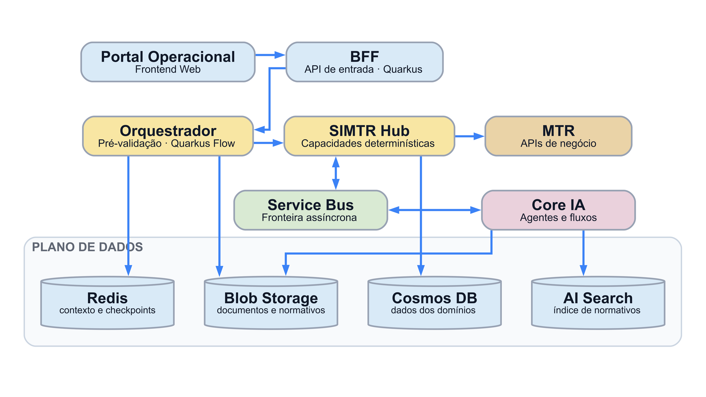
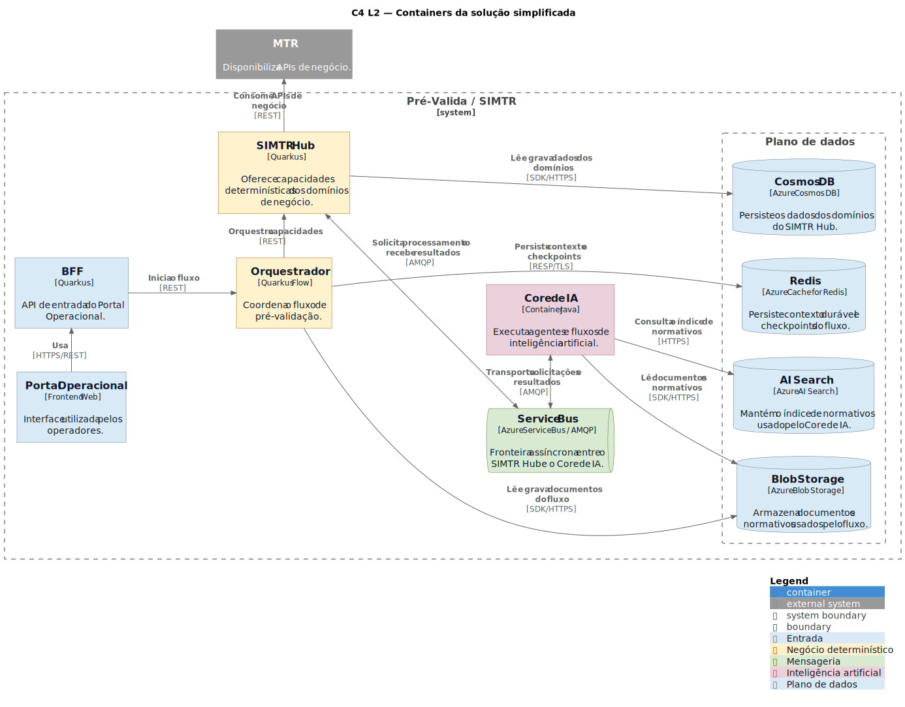
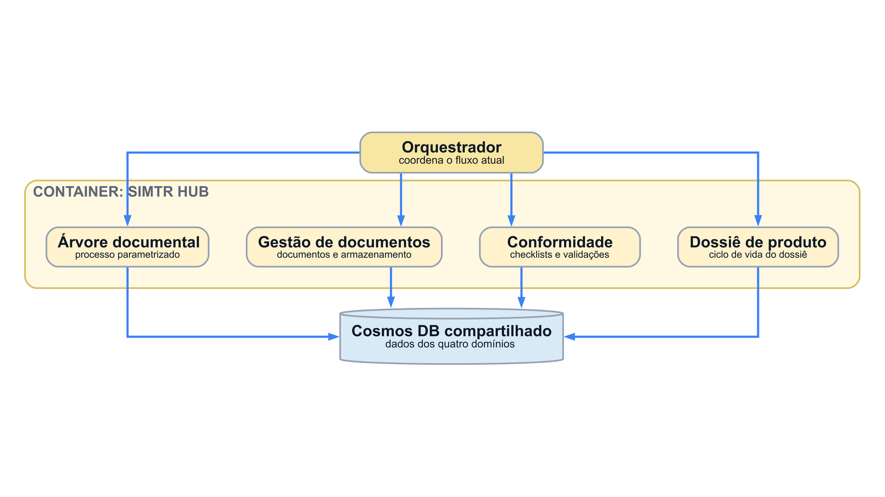
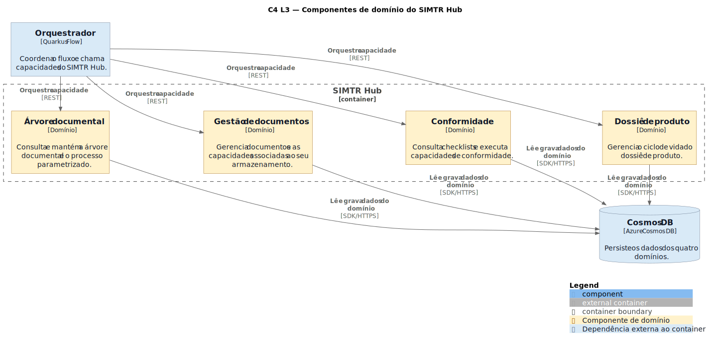
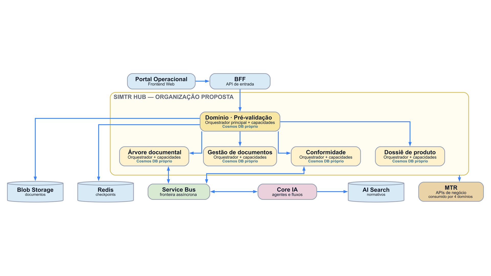
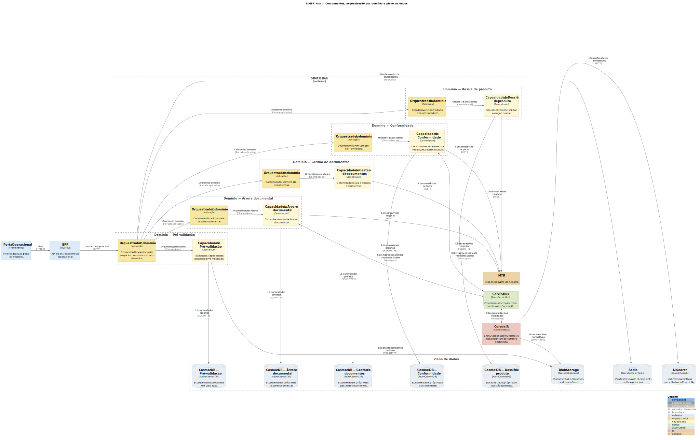

# Arquitetura distribuída da Pré-validação

Este documento apresenta, em três visões C4, a evolução da arquitetura distribuída: parte da arquitetura do MVP e chega à organização proposta por domínio.

1. **C4 L2 — Containers: Arquitetura Distribuída do MVP:** apresenta a visão geral dos containers e do plano de dados.
2. **C4 L3 — Componentes do SIMTR Hub na Arquitetura Distribuída do MVP:** detalha os componentes de domínio dentro do SIMTR Hub.
3. **C4 L4 — Componentes e orquestração por domínio: Arquitetura Distribuída Proposta:** apresenta a organização proposta dos domínios, suas capacidades, seus orquestradores e seus dados.

---

## C4 L2 — Containers: Arquitetura Distribuída do MVP

**Correspondência conceitual:** `01-arquitetura-atual-containers.png`.
[**Diagrama C4** plantuml](#c4-l2--containers-arquitetura-distribuída-do-mvp---plantuml)

<figure align="center">
  

  <figcaption><em>Figura Arquitetura Distribuída do MVP</em></figcaption>
</figure>

**Leitura resumida:**

- O Portal Operacional e o BFF formam a entrada da solução.
- O Orquestrador coordena o fluxo de pré-validação com as capacidades determinísticas do SIMTR Hub.
- O SIMTR Hub consome as APIs de negócio do MTR e integra-se de forma assíncrona ao Core de IA por meio do Service Bus.
- Redis, Blob Storage, Cosmos DB e AI Search compõem o plano de dados.

<figure align="center">
  

  <figcaption><em>Figura C4 L2 — Containers: Arquitetura Distribuída do MVP
</em></figcaption>
</figure>

---

## C4 L3 — Componentes do SIMTR Hub na Arquitetura Distribuída do MVP

**Correspondência conceitual:** `02-arquitetura-atual-simtr-hub.png`.
[**Diagrama C4** plantuml](#c4-l3--componentes-do-simtr-hub-na-arquitetura-distribuída-do-mvp---plantuml)

<figure align="center">
  

  <figcaption><em>Figura Componentes do SIMTR Hub na Arquitetura Distribuída do MVP</em></figcaption>
</figure>

**Leitura resumida:**

- A visão abre o container SIMTR Hub e apresenta quatro componentes de domínio.
- Árvore documental, Gestão de documentos, Conformidade e Dossiê de produto são coordenados pelo Orquestrador.
- Os quatro componentes persistem seus dados em um Cosmos DB compartilhado.

<figure align="center">
  

  <figcaption><em>Figura C4 L3 — Componentes do SIMTR Hub na Arquitetura Distribuída do MVP
</em></figcaption>
</figure>

---

## C4 L4 — Componentes e orquestração por domínio: Arquitetura Distribuída Proposta

**Correspondência conceitual:** `03-arquitetura-proposta-dominios.png`.
[**Diagrama C4** plantuml](#c4-l4--componentes-e-orquestração-por-domínio-arquitetura-distribuída-proposta---plantuml)

<figure align="center">
  

  <figcaption><em>Figura Componentes e orquestração por domínio: Arquitetura Distribuída Proposta</em></figcaption>
</figure>

**Leitura resumida:**

- O SIMTR Hub é organizado nos domínios Pré-validação, Árvore documental, Gestão de documentos, Conformidade e Dossiê de produto.
- Cada domínio reúne seu orquestrador, suas capacidades e seu Cosmos DB próprio.
- O domínio Pré-validação recebe o fluxo iniciado pelo BFF e coordena os outros quatro domínios.
- Service Bus, Core de IA, Blob Storage, Redis, AI Search e MTR permanecem explícitos como integrações e recursos da arquitetura distribuída.

<figure align="center">
  

  <figcaption><em>Figura C4 L4 — Componentes e orquestração por domínio: Arquitetura Distribuída Proposta
</em></figcaption>
</figure>

---

## Anexos

## C4 L2 — Containers: Arquitetura Distribuída do MVP - plantuml

```md
@startuml
!include <C4/C4_Container>

title C4 L2 — Containers da solução simplificada

LAYOUT_LEFT_RIGHT()
HIDE_STEREOTYPE()

AddElementTag("entrada", $bgColor="#D9EAF7", $fontColor="#111827", $borderColor="#64748B", $legendText="Entrada")
AddElementTag("negocio", $bgColor="#FFF2CC", $fontColor="#111827", $borderColor="#A16207", $legendText="Negócio determinístico")
AddElementTag("assinc", $bgColor="#D9EAD3", $fontColor="#111827", $borderColor="#4D7C0F", $legendText="Mensageria")
AddElementTag("ia", $bgColor="#EAD1DC", $fontColor="#111827", $borderColor="#9F5264", $legendText="Inteligência artificial")
AddElementTag("dados", $bgColor="#D9EAF7", $fontColor="#111827", $borderColor="#64748B", $legendText="Plano de dados")

System_Boundary(prevalida, "Pré-Valida / SIMTR") {
Container(portal, "Portal Operacional", "Frontend Web", "Interface utilizada pelos operadores.", $tags="entrada")
Container(bff, "BFF", "Quarkus", "API de entrada do Portal Operacional.", $tags="entrada")
Container(orquestrador, "Orquestrador", "Quarkus Flow", "Coordena o fluxo de pré-validação.", $tags="negocio")
Container(simtr_hub, "SIMTR Hub", "Quarkus", "Oferece capacidades determinísticas dos domínios de negócio.", $tags="negocio")

ContainerQueue(service_bus, "Service Bus", "Azure Service Bus / AMQP", "Fronteira assíncrona entre o SIMTR Hub e o Core de IA.", $tags="assinc")
Container(core_ia, "Core de IA", "Container Java", "Executa agentes e fluxos de inteligência artificial.", $tags="ia")

Boundary(plano_dados, "Plano de dados") {
ContainerDb(cosmos, "Cosmos DB", "Azure Cosmos DB", "Persiste os dados dos domínios do SIMTR Hub.", $tags="dados")
ContainerDb(blob, "Blob Storage", "Azure Blob Storage", "Armazena documentos e normativos usados pelo fluxo.", $tags="dados")
ContainerDb(redis, "Redis", "Azure Cache for Redis", "Persiste contexto durável e checkpoints do fluxo.", $tags="dados")
ContainerDb(ai_search, "AI Search", "Azure AI Search", "Mantém o índice de normativos usado pelo Core de IA.", $tags="dados")
}
}

System_Ext(mtr, "MTR", "Disponibiliza APIs de negócio.")

Rel_R(portal, bff, "Usa", "HTTPS/REST")
Rel_D(bff, orquestrador, "Inicia o fluxo", "REST")
Rel_R(orquestrador, simtr_hub, "Orquestra capacidades", "REST")
Rel_R(simtr_hub, mtr, "Consome APIs de negócio", "REST")

BiRel_D(simtr_hub, service_bus, "Solicita processamento e recebe resultados", "AMQP")
BiRel_R(service_bus, core_ia, "Transporta solicitações e resultados", "AMQP")

Rel_D(orquestrador, blob, "Lê e grava documentos do fluxo", "SDK/HTTPS")
Rel_D(orquestrador, redis, "Persiste contexto e checkpoints", "RESP/TLS")
Rel_D(simtr_hub, cosmos, "Lê e grava dados dos domínios", "SDK/HTTPS")
Rel_D(core_ia, blob, "Lê documentos e normativos", "SDK/HTTPS")
Rel_D(core_ia, ai_search, "Consulta o índice de normativos", "HTTPS")

Lay_R(cosmos, blob)
Lay_R(blob, redis)
Lay_R(redis, ai_search)

SHOW_LEGEND()
@enduml
```

## C4 L3 — Componentes do SIMTR Hub na Arquitetura Distribuída do MVP - plantuml

```md
@startuml
!include <C4/C4_Component>

title C4 L3 — Componentes de domínio do SIMTR Hub

LAYOUT_LEFT_RIGHT()
HIDE_STEREOTYPE()

AddElementTag("dominio", $bgColor="#FFF2CC", $fontColor="#111827", $borderColor="#A16207", $legendText="Componente de domínio")
AddElementTag("externo", $bgColor="#D9EAF7", $fontColor="#111827", $borderColor="#64748B", $legendText="Dependência externa ao container")

Container_Ext(orquestrador, "Orquestrador", "Quarkus Flow", "Coordena o fluxo e chama capacidades do SIMTR Hub.", $tags="externo")

Container_Boundary(simtr_hub, "SIMTR Hub") {
Component(arvore, "Árvore documental", "Domínio", "Consulta e mantém a árvore documental e o processo parametrizado.", $tags="dominio")
Component(documentos, "Gestão de documentos", "Domínio", "Gerencia documentos e as capacidades associadas ao seu armazenamento.", $tags="dominio")
Component(conformidade, "Conformidade", "Domínio", "Consulta checklists e executa capacidades de conformidade.", $tags="dominio")
Component(dossie, "Dossiê de produto", "Domínio", "Gerencia o ciclo de vida do dossiê de produto.", $tags="dominio")
}

ContainerDb_Ext(cosmos, "Cosmos DB", "Azure Cosmos DB", "Persiste os dados dos quatro domínios.", $tags="externo")

Rel_R(orquestrador, arvore, "Orquestra capacidade", "REST")
Rel_R(orquestrador, documentos, "Orquestra capacidade", "REST")
Rel_R(orquestrador, conformidade, "Orquestra capacidade", "REST")
Rel_R(orquestrador, dossie, "Orquestra capacidade", "REST")

Rel_R(arvore, cosmos, "Lê e grava dados do domínio", "SDK/HTTPS")
Rel_R(documentos, cosmos, "Lê e grava dados do domínio", "SDK/HTTPS")
Rel_R(conformidade, cosmos, "Lê e grava dados do domínio", "SDK/HTTPS")
Rel_R(dossie, cosmos, "Lê e grava dados do domínio", "SDK/HTTPS")

Lay_D(arvore, documentos)
Lay_D(documentos, conformidade)
Lay_D(conformidade, dossie)

SHOW_LEGEND()
@enduml
```

## C4 L4 — Componentes e orquestração por domínio: Arquitetura Distribuída Proposta - plantuml

```md
@startuml
!include <C4/C4_Component>

title SIMTR Hub — Componentes, orquestração por domínio e plano de dados

LAYOUT_LEFT_RIGHT()
HIDE_STEREOTYPE()

' Paleta simples e semântica
AddElementTag("entrada", $bgColor="#DCEBFA", $fontColor="#111111", $borderColor="#8FA9C2")
AddElementTag("orquestrador", $bgColor="#F8E6A3", $fontColor="#111111", $borderColor="#B59B45")
AddElementTag("capacidade", $bgColor="#FFF7D6", $fontColor="#111111", $borderColor="#C7B772")
AddElementTag("dados", $bgColor="#E8EEF4", $fontColor="#111111", $borderColor="#93A4B4")
AddElementTag("assincrono", $bgColor="#DDEBCB", $fontColor="#111111", $borderColor="#8DA66F")
AddElementTag("ia", $bgColor="#EBC9C1", $fontColor="#111111", $borderColor="#AF7D72")
AddElementTag("externo", $bgColor="#EAD3A7", $fontColor="#111111", $borderColor="#AC8D53")

' Elementos preservados do C4 L2
Container_Ext(portal, "Portal Operacional", "Frontend Web", "Interface utilizada pelos operadores.", $tags="entrada")
Container_Ext(bff, "BFF", "Quarkus", "API de entrada do Portal Operacional.", $tags="entrada")
System_Ext(mtr, "MTR", "Disponibiliza APIs de negócio.", $tags="externo")

Container_Boundary(simtr_hub, "SIMTR Hub") {

Boundary(dominio_pre_validacao, "Domínio — Pré-validação") {
Component(orq_pre_validacao, "Orquestrador do domínio", "Aplicação", "Orquestra o fluxo principal de negócio e coordena os quatro domínios.", $tags="orquestrador")
Component(cap_pre_validacao, "Capacidades de Pré-validação", "Casos de uso", "Executa as capacidades próprias da Pré-validação.", $tags="capacidade")
}

Boundary(dominio_arvore, "Domínio — Árvore documental") {
Component(orq_arvore, "Orquestrador do domínio", "Aplicação", "Coordena o fluxo interno da árvore documental.", $tags="orquestrador")
Component(cap_arvore, "Capacidades de Árvore documental", "Casos de uso", "Consulta e manipula a árvore documental.", $tags="capacidade")
}

Boundary(dominio_documentos, "Domínio — Gestão de documentos") {
Component(orq_documentos, "Orquestrador do domínio", "Aplicação", "Coordena o fluxo interno de documentos.", $tags="orquestrador")
Component(cap_documentos, "Capacidades de Gestão de documentos", "Casos de uso", "Obtém credenciais e gerencia documentos.", $tags="capacidade")
}

Boundary(dominio_conformidade, "Domínio — Conformidade") {
Component(orq_conformidade, "Orquestrador do domínio", "Aplicação", "Coordena o fluxo interno de conformidade.", $tags="orquestrador")
Component(cap_conformidade, "Capacidades de Conformidade", "Casos de uso", "Consulta checklist e executa validações determinísticas.", $tags="capacidade")
}

Boundary(dominio_dossie, "Domínio — Dossiê de produto") {
Component(orq_dossie, "Orquestrador do domínio", "Aplicação", "Coordena o ciclo de vida do dossiê de produto.", $tags="orquestrador")
Component(cap_dossie, "Capacidades de Dossiê de produto", "Casos de uso", "Cria, atualiza, inclui, valida e avança o dossiê.", $tags="capacidade")
}
}

' Fronteira assíncrona e IA — containers preservados como caixas opacas
ContainerQueue_Ext(service_bus, "Service Bus", "Azure Service Bus", "Fronteira assíncrona entre os domínios e o Core de IA.", $tags="assincrono")
Container_Ext(core_ia, "Core de IA", "Container Java", "Executa agentes e fluxos de IA; detalhes internos ficam fora desta visão.", $tags="ia")

' Plano de dados — cada recurso permanece um container independente
Boundary(plano_dados, "Plano de dados") {
ContainerDb_Ext(cosmos_pre_validacao, "Cosmos DB — Pré-validação", "Azure Cosmos DB", "Estado e dados próprios da Pré-validação.", $tags="dados")
ContainerDb_Ext(cosmos_arvore, "Cosmos DB — Árvore documental", "Azure Cosmos DB", "Estado e dados próprios da árvore documental.", $tags="dados")
ContainerDb_Ext(cosmos_documentos, "Cosmos DB — Gestão de documentos", "Azure Cosmos DB", "Estado e dados próprios da gestão de documentos.", $tags="dados")
ContainerDb_Ext(cosmos_conformidade, "Cosmos DB — Conformidade", "Azure Cosmos DB", "Estado e dados próprios da conformidade.", $tags="dados")
ContainerDb_Ext(cosmos_dossie, "Cosmos DB — Dossiê de produto", "Azure Cosmos DB", "Estado e dados próprios do dossiê de produto.", $tags="dados")
ContainerDb_Ext(blob_storage, "Blob Storage", "Azure Blob Storage", "Documentos e normativos usados pelo fluxo.", $tags="dados")
ContainerDb_Ext(redis, "Redis", "Azure Cache for Redis", "Contexto durável e checkpoints do fluxo principal.", $tags="dados")
ContainerDb_Ext(ai_search, "AI Search", "Azure AI Search", "Índice de normativos consultado pelo Core de IA.", $tags="dados")
}

' Entrada do fluxo principal
Rel_R(portal, bff, "Usa", "HTTPS")
Rel_R(bff, orq_pre_validacao, "Inicia o fluxo principal", "REST")

' Pré-validação: domínio coordenador do fluxo principal
Rel_D(orq_pre_validacao, cap_pre_validacao, "Orquestra capacidades", "Chamada local")
Rel_R(orq_pre_validacao, orq_arvore, "Coordena o domínio", "Porta de aplicação")
Rel_R(orq_pre_validacao, orq_documentos, "Coordena o domínio", "Porta de aplicação")
Rel_R(orq_pre_validacao, orq_conformidade, "Coordena o domínio", "Porta de aplicação")
Rel_R(orq_pre_validacao, orq_dossie, "Coordena o domínio", "Porta de aplicação")

' Orquestração interna de cada domínio
Rel_D(orq_arvore, cap_arvore, "Orquestra capacidades", "Chamada local")
Rel_D(orq_documentos, cap_documentos, "Orquestra capacidades", "Chamada local")
Rel_D(orq_conformidade, cap_conformidade, "Orquestra capacidades", "Chamada local")
Rel_D(orq_dossie, cap_dossie, "Orquestra capacidades", "Chamada local")

' Propriedade dos dados por domínio
Rel_R(cap_pre_validacao, cosmos_pre_validacao, "Lê e grava dados próprios", "SDK/HTTPS")
Rel_R(cap_arvore, cosmos_arvore, "Lê e grava dados próprios", "SDK/HTTPS")
Rel_R(cap_documentos, cosmos_documentos, "Lê e grava dados próprios", "SDK/HTTPS")
Rel_R(cap_conformidade, cosmos_conformidade, "Lê e grava dados próprios", "SDK/HTTPS")
Rel_R(cap_dossie, cosmos_dossie, "Lê e grava dados próprios", "SDK/HTTPS")

' Recursos adicionais do domínio Pré-validação
Rel_R(cap_pre_validacao, blob_storage, "Lê e grava documentos do fluxo", "SDK/HTTPS")
Rel_R(orq_pre_validacao, redis, "Mantém contexto e checkpoints", "RESP/TLS")

' Os quatro domínios coordenados consomem capacidades de negócio do MTR
Rel_R(cap_arvore, mtr, "Consome APIs de negócio", "REST")
Rel_R(cap_documentos, mtr, "Consome APIs de negócio", "REST")
Rel_R(cap_conformidade, mtr, "Consome APIs de negócio", "REST")
Rel_R(cap_dossie, mtr, "Consome APIs de negócio", "REST")

' Somente Árvore documental e Conformidade solicitam IA
BiRel_R(cap_arvore, service_bus, "Solicita processamento e recebe resultado", "Mensagens")
BiRel_R(cap_conformidade, service_bus, "Solicita processamento e recebe resultado", "Mensagens")
BiRel_R(service_bus, core_ia, "Entrega solicitações e resultados", "Mensagens")
Rel_D(core_ia, blob_storage, "Lê documentos e normativos", "SDK/HTTPS")
Rel_D(core_ia, ai_search, "Consulta índice de normativos", "HTTPS")

' Pistas de layout para reduzir cruzamentos
Lay_D(portal, bff)
Lay_D(bff, orq_pre_validacao)
Lay_D(orq_pre_validacao, orq_arvore)
Lay_D(orq_arvore, orq_documentos)
Lay_D(orq_documentos, orq_conformidade)
Lay_D(orq_conformidade, orq_dossie)
Lay_R(orq_dossie, mtr)
Lay_D(cosmos_pre_validacao, cosmos_arvore)
Lay_D(cosmos_arvore, cosmos_documentos)
Lay_D(cosmos_documentos, cosmos_conformidade)
Lay_D(cosmos_conformidade, cosmos_dossie)
Lay_D(cosmos_dossie, blob_storage)
Lay_D(blob_storage, redis)
Lay_D(redis, ai_search)
Lay_R(service_bus, core_ia)

SHOW_LEGEND()
@enduml
```
