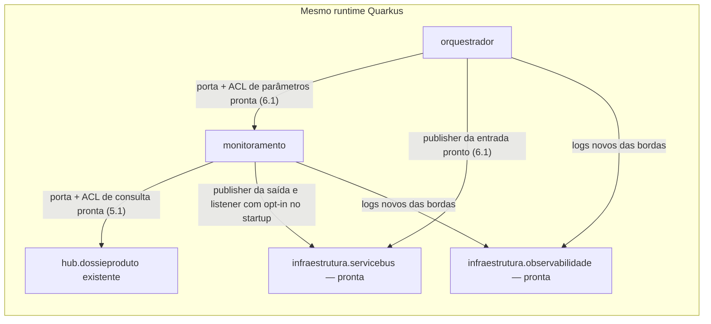

# Guia Service Bus — orquestrador e monitoramento de dossiê

A continuidade do acompanhamento durável e do tracing está no
[guia Cosmos e Jaeger para o desenvolvedor](../../tasks/features/rastreabilidade-fluxo-dossie-cosmos/guia-desenvolvimento.md).
Ele distingue a base já codificada do trabalho P2–P10 ainda necessário, com testes e critérios por etapa.

## Contexto consolidado para manutenção — commit 58920dd

Este documento é o ponto de entrada para manter o fluxo assíncrono de dossiê. O marco
`58920dd` consolidou o fluxo funcional já existente, o primeiro trecho de observabilidade
e o gate técnico do Cosmos. A feature não está encerrada: a persistência operacional do
acompanhamento e a cadeia completa de spans continuam nos incrementos P2–P10.

O fluxo funcional atual é:

```text
POST /simtr-hub/v1/monitoramentos-dossie
  -> orquestrador cria monitoramento e publica tentativa na fila de entrada
  -> monitoramento recebe, consulta Pré-Valida e MTR/Hub
  -> ignora, publica resultado ou agenda nova tentativa na entrada
  -> orquestrador recebe o resultado da fila de saída
  -> registra o log final e conclui a entrega
```

Os listeners de entrada e saída têm ativação independente e ficam desabilitados por padrão.
Reagendamento executa `schedule + Complete` em uma transação da mesma entidade. Falha
técnica anterior ao settlement usa Abandon; contrato inválido pode ir para a DLQ com motivo
controlado. Quarentena funcional continua diferente de Dead Letter do broker.

### Decisões arquiteturais aplicáveis

- [ADR-0002](../adr/0002-limites-por-dominio-e-capacidade.md): direção de dependências e
  domínio independente de SDKs.
- [ADR-0003](../adr/0003-orquestracao-e-colaboracao-por-portas.md): colaboração
  entre capacidades por portas públicas e ACLs locais.
- [ADR-0006](../adr/0006-compatibilidade-observabilidade-e-testes.md): compatibilidade dos
  sinais e provas antes de substituir comportamento observável.
- [ADR-0010](../adr/0010-extensao-quarkus-service-bus-connection-string-dev-services.md):
  Service Bus, Dev Services local e autenticação SAS nos ambientes reais desta feature.
- [ADR-0011](../adr/0011-composicao-local-monitoramento-e-fabrica-service-bus.md): ownership e
  fechamento dos clientes Service Bus.
- [ADR-0013](../adr/0013-acompanhamento-dossie-cosmos.md): acompanhamento durável no Cosmos,
  eventos/snapshot por dossiê, intenção/confirmação, observação de filas/DLQs e correlação
  homogênea Jaeger/log/Cosmos. O ADR está Aceito após o GO humano de 2026-09-12.

O ADR-0013 prevê a capacidade `br.gov.caixa.simtr.acompanhamento`, ainda sem package de
produção. Orquestrador e monitoramento colaborarão com ela por portas de saída e ACLs próprias.
DTOs/documentos do Cosmos ficam no adapter de persistência; regras de política, classificação,
prazo e routing continuam pertencendo ao monitoramento. Não colocar SDK Cosmos ou
OpenTelemetry no domínio.

### Estado implementado e estado pendente

| Área | Implementado no marco | Ainda necessário |
|---|---|---|
| Fluxo Service Bus | POST, entrada, processamento, resultado, reagendamento transacional, saída, log, Complete/Abandon/DLQ | Preservar comportamento enquanto a persistência e os spans restantes forem inseridos |
| Tracing | SERVER do POST, INTERNAL de iniciação, PRODUCER da publicação inicial, carrier W3C e log técnico ligado ao span | B2–B5: receber entrada, avaliar/consultar, publicar/agendar, settlements, receber saída e registrar resultado |
| Cosmos | Dependência, configuração local/DES e teste opt-in de CRUD, partição, corpo, ETag e batch/rollback | Modelo, adapter operacional, bootstrap/validação, eventos/snapshot, idempotência, consultas e spans CLIENT |
| Investigação | Logs JSON e provas com emulador; Jaeger local acessível | Navegação real Jaeger → EVENTO/EXECUCAO → Jaeger e observação paginada das filas/DLQs |
| Ambientes | Dev Services local; parâmetros externos previstos para DES | Validar recursos preexistentes, TLS e credencial no Cosmos real de DES sem fallback local |

O container aprovado é `doctree`, database local `simtr-hub`, partition key
`/idDossiePreValidacao`. A aplicação ainda não grava eventos de negócio nele: o database e
o container criados atualmente pertencem ao teste `CosmosDevServicesTest`. Não interpretar
o gate P1 como acompanhamento operacional ou durabilidade depois de remover o emulador.

### Contrato homogêneo de observabilidade

Cada etapa usa o mesmo vínculo entre os sinais:

| Referência | Responsabilidade |
|---|---|
| `traceId` | Localiza o trace no Jaeger e os EVENTO relacionados no Cosmos |
| `spanId` | Localiza a operação exata; é persistido no evento correspondente |
| `monitoramentoId` | Identifica uma execução durável do fluxo |
| `idDossiePreValidacao` | Identifica o dossiê e a partição Cosmos; preserva a string original |
| `messageId`, tentativa e fase | Identificam mensagem/efeito para idempotência e histórico |

O evento Cosmos registra `traceId`/`spanId` do span da operação de negócio. A gravação ou
consulta do banco possui span CLIENT filho; seu span não substitui a referência da operação.
O parentage continua vindo de `traceparent`/`tracestate` W3C. Nunca reconstruir parentage a
partir do Cosmos, MDC, correlationId ou ID de negócio.

Spans e logs não recebem corpo da mensagem, partition key, situação externa, credencial,
lock token ou texto bruto de erro. Esses detalhes ficam no Cosmos conforme o modelo aprovado.
O span de uma entrega termina depois do settlement conhecido. A espera por mensagem agendada
não mantém span aberto. Movimento automático para DLQ só é registrado quando observado; não
fabricar span retrospectivo para um instante desconhecido.

### Persistência e consistência aprovadas

O container reúne dois tipos físicos na mesma partição:

- `EXECUCAO`, com `id=execucao:<monitoramentoId>` e projeção limitada do estado atual;
- `EVENTO`, imutável e criado com identidade determinística de operação e fase.

Uma preparação persiste o corpo exato enviado ao SDK, seu SHA-256, envelope permitido,
destino e horário aplicável. A confirmação referencia essa preparação. Evento e projeção
são gravados em batch na mesma partição; ETag protege a projeção. Mesma identidade/conteúdo
é idempotente; mesma identidade com conteúdo diferente é conflito. Evento atrasado permanece
no histórico sem regredir outra dimensão já avançada.

Cosmos e Service Bus não compartilham transação. A intenção durável vem antes do efeito.
A confirmação vem depois do ACK/commit. Se a intenção falhar, o efeito protegido não ocorre.
Se a confirmação Cosmos falhar depois de um ACK conhecido, preservar o efeito e o retorno
funcional — inclusive HTTP 202 —, deixar a intenção pendente e registrar diagnóstico seguro.
Não enviar, agendar ou liquidar novamente por dedução. Não existe dispatcher/replay automático
nem garantia exactly-once no escopo aprovado.

## O que os desenvolvedores recebem nesta branch

**O workspace implementa o fluxo até 9.1: POST, consumo opt-in da entrada, processamento,
reagendamento/publicação e consumo/log da saída, com prova funcional no emulador.**
9.1-A/B/C e o primeiro incremento de tracing B1 estão publicados neste marco. B1 cobre
POST → iniciação → publicação inicial; a correlação das demais etapas continua pendente.
Os parágrafos abaixo situam a evolução já implementada.
Política/configuração CDI, consultas de pré-validação/Hub, contratos/mappers e logs de erro
já estavam prontos. Agora também funcionam parâmetros pela ACL, fábrica de clientes, iniciação
e publisher inicial. Em 7.1-A foi implementado o publisher de resultado na saída.
O caso de uso de processamento está implementado em 7.1-B e o listener da entrada em 7.1-C,
com início explícito. A 8.1 conecta o reagendamento transacional e foi exercitada com o fluxo
até conclusão, teto ou prazo original. A 8.2 acrescenta ativação da entrada por configuração
no startup, desabilitada por padrão. A 9.1-B conecta o consumo da saída com opt-in independente;
a 9.1-C comprova startup/log/Complete e DLQ da saída no emulador, com o Hub controlado.

| Parte | Estado atual | O que a evidência comprova |
|---|---|---|
| Extensão Azure Service Bus e Dev Services | Implementados | Builder CDI e envio/recebimento/Complete nas duas filas em teste de infraestrutura |
| Política progressiva, configuração e catálogo por versão | Implementados | Intervalos, limites, resolução da versão recebida com v1 padrão se ausente e rejeição de configuração inválida/ambígua |
| REST e publicação inicial | Implementados em 6.1 | Validação, parâmetros pela política, IDs no servidor e `202` somente após confirmação da publicação |
| Reagendamento | Implementado em 8.1 | Próxima tentativa dentro do prazo original; schedule + Complete na mesma transação e preservação de IDs/versão |
| Resultado | Modelos, DTOs, mappers, erros e publisher implementados | Compatibilidade entre bordas, validação e publicação confirmada de conclusivo/quarentena, acionada pelo caso de uso de 7.1-B |
| Logging técnico e fronteiras | Implementados | Campos JSON tipados, diagnóstico seguro, isolamento de bordas e ACLs |
| Consultas de 5.1 | Implementadas e injetáveis | Mock com ativação explícita, DTO/mapper próprios e ACL pela porta pública do Hub; resultados mínimos e falhas verificados |
| Clientes Service Bus | Implementados em 6.1 | Quatro clientes duradouros, qualifiers por fila e fechamento completo/idempotente |
| Conexões funcionais | Até 9.1-C implementado | Onze portas conectadas, incluindo reagendamento por entrega e consumo/log da saída; não restam esqueletos inativos |

As evidências da suíte padrão sem broker e do checkpoint vigente estão na
[continuidade de 9.1](../../tasks/features/orquestrador-monitoramento-service-bus/continuidade-9-1.md).
Os números históricos de 7.1/8.1 abaixo permanecem como marcos anteriores.
7.1-B conecta contrato, catálogo e portas no caso de uso: no-op, limites, classificação literal,
publicação confirmada e intenção de reagendamento. 7.1-C acrescenta listener CDI com início
explícito, settlement serial, falhas sem segunda liquidação e shutdown antes da fábrica.
7.1-D acrescenta nove cenários terminais com emulador; o perfil completo passou com 15 testes,
incluindo as seis provas anteriores. Somente a porta pública do Hub é controlada nesses nove
cenários. A 8.1 acrescenta provas de transação, progressão/repetição, máximo de tentativas e
prazo original com fallback v1, elevando o total a 21 integrações em cinco classes.
Essas provas anteriores não exercitavam o consumo/log da saída; a 9.1-C acrescentou essa
verificação no emulador. Azure gerenciado permanece sem validação.

**C2 aceito e 9.1-A/B/C publicadas. Próximo item funcional: 10.1.**
A prova atual cobre ambos os listeners pelo startup; passaram 1.345 testes padrão e
27 integrações, com build/Sonar COMPLIANT. Evidências e métricas completas nas tasks.
Para assumir o trabalho, começar pelo
[roteiro do desenvolvedor](../../tasks/features/orquestrador-monitoramento-service-bus/guia-desenvolvimento.md#roteiro-para-assumir-a-entrega).
O [pacote de 9.1](../../tasks/features/orquestrador-monitoramento-service-bus/pacote-commit-9-1.md)
registra os commits fcbe38a e 2c6c4cd, confirmados no remoto. Os manifestos de 8.1/8.2 são históricos.
O guia do dev contém os roteiros completos de Dev Services e filas Azure, com fixture 4324680,
comandos de ativação e política curta opcional. A validação manual em dev mode continua pendente;
o problema de startup relatado será analisado após a publicação, por orientação do usuário.

## Escopo e decisões vigentes

Este guia descreve a feature `orquestrador-monitoramento-service-bus`, na branch
`feature/orquestrador-monitoramento-service-bus`. O nome histórico do arquivo foi preservado
para manter os links, mas esta implementação **não altera o package `br.gov.caixa.simtr.dossie`**.
O Hub, suas capacidades, contratos, simuladores, logs e erros também permanecem preservados.

Os componentes novos são `br.gov.caixa.simtr.orquestrador` e
`br.gov.caixa.simtr.monitoramento`. O orquestrador publica na fila de entrada e consome a fila
de saída quando seu listener está habilitado. O monitoramento consome a entrada, executa os critérios e reagenda
na própria entrada ou publica um resultado na saída. Os dois packages estão no mesmo artifact e
runtime, simulando responsabilidades de microsserviços. O consumo da saída e o encerramento por
log no orquestrador estão implementados e verificados em 9.1.

A plataforma e a autenticação já estão decididas no
[ADR-0010 aceito](../adr/0010-extensao-quarkus-service-bus-connection-string-dev-services.md):

- extensão `io.quarkiverse.azureservices:quarkus-azure-servicebus:1.2.5`;
- BOM Quarkiverse Azure Services `1.2.5`, Quarkus `3.33.2.1` e JDK `25`;
- ambientes reais autenticados por SAS na connection string externa;
- desenvolvimento local com Service Bus Emulator e SQL Server iniciados por Dev Services;
- Microsoft Entra ID não é a autenticação desta feature.

O [ADR-0009](../adr/0009-azure-sdk-service-bus-dossie.md) preserva a decisão histórica de SDK
direto/Entra ID e foi substituído. Seus exemplos e os antigos contratos de dois campos não
orientam esta implementação. O histórico documental anterior permanece nas
[tasks do guia antigo](../../tasks/features/guia-service-bus-amqp-dossie/todo.md).

Para implementar e acompanhar o trabalho, consultar o
[plano vigente](../../tasks/features/orquestrador-monitoramento-service-bus/plan.md),
[checklist vigente](../../tasks/features/orquestrador-monitoramento-service-bus/todo.md) e
[inventário Java com roteiro de continuidade](../../tasks/features/orquestrador-monitoramento-service-bus/guia-desenvolvimento.md).
Este guia explica o fluxo; o inventário aponta cada arquivo e seu estado.

## Arquitetura e decisões para implementar

### Componentes no mesmo runtime

Este recorte usa o monólito modular Quarkus existente. Os packages abaixo delimitam
responsabilidades; não representam três aplicações implantadas separadamente.
A arquitetura segue os [ADRs 0001](../adr/0001-monolito-modular-e-hexagonal.md),
[0003](../adr/0003-orquestracao-e-colaboracao-por-portas.md) e
[0010](../adr/0010-extensao-quarkus-service-bus-connection-string-dev-services.md):

| Área | Responsabilidade | Limite de implementação |
|---|---|---|
| `orquestrador` | Receber solicitação, preparar a primeira mensagem e receber o resultado | Não é dono da política nem consulta configuração interna do monitoramento |
| `monitoramento` | Política, prazo, tentativa funcional, consultas, decisão terminal e reagendamento | Não incorpora contratos nem implementações internas do Hub |
| `hub.dossieproduto` | Fornecer a capacidade atômica existente de consulta por identificador | Mantém REST/MTR/simulador, regras, logs e erros existentes |
| `arquitetura.infraestrutura.servicebus` | Criar e encerrar os quatro clientes compartilhados | Factory implementada; não recebe regra, DTO ou modelo de negócio |
| `arquitetura.infraestrutura.observabilidade` | Acrescentar campos JSON tipados a novos registros elegíveis | Já implementada; não centraliza classificação, identidade ou sanitização de erros |
| `dossie` e `hub.arquitetura` existentes | Manter suas responsabilidades atuais | Não são destino dos novos listeners/publishers nem alvo de migração nesta feature |



O diagrama mostra as conexões locais implementadas. O fluxo assíncrono pelas duas filas está
no diagrama seguinte; a colaboração local não substitui esse fluxo nem ativa o listener.

### Hexagonal pragmática e contratos por borda

Domínio contém política e significado dos dados; aplicação coordena casos de uso e portas;
adapters traduzem REST/JSON/AMQP, acessam fontes e executam efeitos externos. SDK Azure e
handles de entrega ficam nas bordas. Domínio não depende de aplicação; contratos das portas
de entrada não expõem casos de uso concretos nem portas de saída.

**Quarkus, CDI, Jakarta, MicroProfile, Mutiny, Jackson e OpenTelemetry podem apoiar domínio e
aplicação.** Não criar wrappers apenas para esconder o framework. Essa permissão não leva
clientes Azure, DTOs de transporte ou infraestrutura técnica ao núcleo, nem permite bloquear
o event loop. Essa escolha está explícita nos ADRs 0001, 0010 e 0011.

Pelo [ADR-0004](../adr/0004-contratos-independentes-por-borda.md), cada borda tem DTO e mapper
próprios. O caminho é DTO → mapper → tipo interno → mapper da outra borda → DTO. A mensagem
JSON compatível é o contrato entre produtor e consumidor; igualdade de campos não autoriza
compartilhar a classe Java. Os erros Service Bus também têm DTO e RuntimeException próprios.
Não importar o DTO técnico de erro REST do Hub para economizar essas classes.

### Colaboração com o Hub e preparação inicial

O [ADR-0011](../adr/0011-composicao-local-monitoramento-e-fabrica-service-bus.md) fixa dois
caminhos implementados: consulta do Hub em 5.1 e preparação inicial em 6.1.

- **Implementado em 5.1:** `ConsultarSituacaoDossie` → `SituacaoDossieHubAcl` → porta pública
  `hub.dossieproduto.aplicacao.porta.entrada.ConsultarDossieProduto`. A ACL converte o
  identificador validado para Long positivo e traduz a situação para modelo do monitoramento.
  Ela não chama HTTP local, Resource, caso de uso concreto, DTO REST/MTR ou porta de saída do Hub.
- **Implementado em 6.1:** `ObterParametrosMonitoramento` → `ParametrosMonitoramentoAcl` →
  `PrepararMonitoramento`. A operação local recebe `iniciadoEm` e devolve
  `limiteEm`/`politicaMonitoramentoVersao`; a ACL traduz para o record do orquestrador.
  A política e sua configuração continuam no monitoramento. Esse cálculo não consulta fontes,
  gera IDs, envia mensagens ou processa tentativas.

IDs e instante inicial pertencem ao início da orquestração; prazo/versão vêm da política.
Esses valores devem ser preservados nos futuros reagendamentos. Os dois records de parâmetros
já têm cálculo/tradução conectados por CDI; o orquestrador não importa política ou configuração.

### Consultas implementadas em 5.1

A colaboração segue os ADRs 0003/0011: a ACL injeta somente `ConsultarDossieProduto` e
usa os modelos públicos dessa assinatura. `idDossieMtr` permanece string nos contratos;
a conversão para `Long` positivo ocorre na ACL, aceita zeros à esquerda e rejeita formato
inválido, zero e overflow antes de chamar o Hub. A seleção MTR/simulador permanece no Hub.

O retorno é `SituacaoDossieConsultada(Integer id, String nome)`: preserva id, inclusive
nulo, e nome original não vazio, sem normalizar ou transportar data, matrícula ou objeto
completo do Hub. A fixture existente `4324680` retorna `1 / Rascunho`; não fornece IDs
para os nomes conclusivos informados. Esses nomes já são aceitos literalmente no contrato
de resultado. A ACL preserva situações desconhecidas; a classificação do caso de uso
está implementada em 7.1-B e usa os nomes originais do Hub; não é inferida da fixture.

Pelo ADR-0004, o simulador possui `PreValidacaoSimuladaDto` e
`PreValidacaoSimuladaMapper` próprios. Sua porta retorna
`PreValidacaoConsultada(String situacao, boolean simulada)`, com situação não vazia
e `simulada=true` nos cenários abaixo:

| `idDossiePreValidacao` | Situação retornada |
|---|---|
| `pre-em-analise` | `EM_ANALISE_ENVIO_MTR` |
| `pre-conforme` | `CONFORME` |
| `pre-nao-conforme` | `NAO_CONFORME` |

A configuração é `monitoramento.simulador.prevalidacao.habilitado=false`.
Para habilitar explicitamente no desenvolvimento:

```powershell
mvn quarkus:dev "-Dmonitoramento.simulador.prevalidacao.habilitado=true"
```

O comando habilita os dados simulados. O endpoint de 6.1 publica a tentativa inicial, mas ainda
não consulta pré-validação: essa etapa pertence ao processamento de 7.1.
Os testes habilitam a flag somente em profile específico. Com a flag desabilitada, a
consulta falha e as capacidades atuais do Hub continuam inicializando normalmente.

As duas portas retornam `Uni` e executam na assinatura, sem bloqueio. Ausência da
pré-validação produz falha, distinta de situação não elegível; resposta/situação do Hub
ausente ou nome vazio também falha. Não há retorno fictício, retry ou log adicional.
Falhas locais usam mensagens fixas sem o valor rejeitado; falhas do Hub seguem pelo mesmo
fluxo assíncrono, preservando o comportamento existente. Classificação de erro e settlement
são tratados na borda consumidora implementada em 7.1-C, com início explícito.

Esses detalhes foram aprovados no [C5.1](../../tasks/features/orquestrador-monitoramento-service-bus/preparacao-consultas-5-1.md).
Os 70 testes novos cobrem comportamento e CDI; as seis classes implementadas têm 100% das
linhas e condições medidas pelo JaCoCo. O guardrail também inclui a borda do simulador.

### Fábrica e ciclo de vida dos clientes

Também pelo ADR-0011, somente `ClientesServiceBus`, implementada em 6.1, injeta e configura o
`ServiceBusClientBuilder` da extensão. Ela cria sender/receiver assíncronos duradouros para
cada fila, diferenciados por qualifiers CDI de entrada/saída. Os adapters recebem clientes,
nunca o builder; não há cliente por mensagem. Os quatro produtores CDI entregam singletons
com `@FilaEntrada`/`@FilaSaida`; receivers usam `PEEK_LOCK` e auto-complete desabilitado.
Criar os receivers não inicia consumo.

A fábrica fecha todos os clientes em ordem inversa, mesmo após falha parcial na criação ou
no fechamento. O encerramento é idempotente: observer de `ShutdownEvent` com prioridade
`PLATFORM_AFTER` e `@PreDestroy` usam a mesma rotina. Os futuros listeners devem cancelar suas
assinaturas em prioridade anterior; essa coordenação com listeners ainda será verificada.

Somente a fábrica é condicionada por `quarkus.azure.servicebus.enabled`. O Resource e o caso
de uso permanecem disponíveis com a extensão desabilitada; o publisher resolve o cliente
qualificado via `Instance` ao enviar e falha explicitamente quando indisponível. A fábrica
exige a connection string da extensão, fornecida por Dev Services ou pelo ambiente. Não há
fallback para Entra ID.
A infraestrutura não importa Hub, orquestrador ou monitoramento; somente os adapters
Service Bus acessam a fábrica. Ela não é barramento genérico, dona do retry funcional,
reagendamento, validação, DTO ou settlement. Essas responsabilidades continuam nos componentes.

## Fluxo completo a implementar

O diagrama representa o fluxo aprovado. REST, iniciação, publicações, consultas, processamento
e listener da entrada estão implementados; a 8.2 permite opt-in no startup. Integração
terminal no emulador está verificada em 7.1-D; a 8.1 conecta reagendamento. Consumo/log da saída
estão conectados em 9.1-A/B, com integração verificada no emulador em 9.1-C.


O listener inicia o processamento pela porta de entrada. A aplicação do monitoramento coordena
as consultas e a política; o listener não passa a ser dono das regras de negócio. A decisão
semântica orienta os efeitos das portas de saída. Serialização, clientes e settlement ficam
nos adapters. Em 8.1, o listener chama associar(receiver, mensagem) no adapter sem estado;
a porta devolvida captura os handles somente na borda. O domínio fornece próxima tentativa
e horário, sem SDK ou contexto transacional. A fábrica do [ADR-0011](../adr/0011-composicao-local-monitoramento-e-fabrica-service-bus.md)
continua dona dos clientes.

### Quem escreve e quem lê

| Fila | Quem escreve | Quem lê | Finalidade |
|---|---|---|---|
| `q.prevalidacao.monitoramento-mtr.in` | Orquestrador, na tentativa inicial; monitoramento, no reagendamento | Listener de entrada do monitoramento | Executar uma tentativa do monitoramento |
| `q.prevalidacao.monitoramento-mtr.out` | Publisher de resultado do monitoramento | Listener de resultado do orquestrador | Informar resultado terminal ou quarentena e encerrar o demonstrador com log |

A direção de um package é relativa ao componente: o orquestrador escreve na fila de entrada
por `adaptador.saida.servicebus` e lê a fila de saída por `adaptador.entrada.servicebus`.

### Caminhos de aplicação e arquivos

Todos os nomes abaixo existem no código e os caminhos estão conectados até 9.1-B.
A verificação integrada da saída foi concluída em 9.1-C.

| Etapa | Caminho no componente | Item |
|---|---|---|
| Iniciar | `MonitoramentoDossieResource` → `IniciarMonitoramento.executar` → `IniciarMonitoramentoUseCase` | 6.1 implementado |
| Publicar entrada | `PublicarTentativaMonitoramento.executar` → `MonitoramentoEntradaPublisher` → mapper próprio → sender da entrada | 6.1 implementado |
| Consumir entrada | `MonitoramentoEntradaListener` → mapper de entrada → `ProcessarTentativaMonitoramento.executar` → caso de uso | Implementado; reagendamento em 8.1 e opt-in no startup em 8.2 |
| Consultar fontes | `ConsultarPreValidacao` → `PreValidacaoSimuladaAdapter`; `ConsultarSituacaoDossie` → `SituacaoDossieHubAcl` → porta pública `ConsultarDossieProduto` | 5.1 implementado |
| Reagendar | Decisão da política → modelo limita horário → listener associa entrega → porta no adapter → mapper próprio → fila de entrada | Implementado em 8.1; schedule + Complete com commit confirmado |
| Publicar resultado | `PublicarResultadoMonitoramento.executar` → `MonitoramentoResultadoPublisher` → mapper próprio → fila de saída | Publisher implementado em 7.1-A e acionado pelo caso de uso de 7.1-B |
| Consumir resultado | `MonitoramentoResultadoListener` → mapper próprio → `ReceberResultadoMonitoramento.executar` → caso de uso | 9.1 |
| Finalizar recorte | `RegistrarResultadoMonitoramento.executar` → `ResultadoMonitoramentoLogAdapter` → conclusão da saída pelo listener | 9.1 |

O acesso ao Hub é local por porta pública e ACL do monitoramento. Não há chamada HTTP ao
próprio Hub nem implementação de mensageria dentro de `dossie`. A factory técnica
`arquitetura.infraestrutura.servicebus.ClientesServiceBus` concentra apenas criação e
lifecycle dos clientes da extensão; não contém política, DTO de negócio ou processamento.

## Critérios de monitoramento

A coordenação funcional abaixo está implementada no caso de uso de 7.1-B.
A política calcula limites/intervalos; o caso de uso consulta e publica pelas portas.
Registro do no-op e settlement estão implementados em 7.1-C. Agendamento efetivo está conectado em 8.1;
o listener associa a intenção de reagendamento à entrega e espera o commit antes da próxima entrega.
Os dois listeners são ativados por flags independentes, desabilitadas por padrão.

| Condição, na ordem de avaliação | Comportamento esperado |
|---|---|
| Envelope/JSON inválido | Mapper registra erro de contrato; listener executa DeadLetter com motivo/descrição fixos |
| Pré-validação diferente de `EM_ANALISE_ENVIO_MTR` | Registrar no-op e concluir a entrada; não consultar MTR, reagendar ou produzir novo resultado |
| Prazo ou máximo de tentativas atingido | Calcular `QUARENTENA`, publicar resultado e concluir entrada após confirmação |
| Situação do Hub conclusiva conforme a direção humana de 2026-09-09 | Resultado terminal preserva `situacaoMtr` e calcula `situacaoPreValidacao` separadamente; contrato e classificação funcional de 7.1-B usam os nomes originais |
| Outra situação do MTR, ainda dentro dos limites | Calcular próxima tentativa/intervalo; limitar horário ao prazo original e executar a transação de reagendamento |
| Falha técnica recuperável | Propagar/classificar falha para Abandon/redelivery; não incrementar tentativa funcional |

A [tabela informada pelo usuário e a diferença para o contrato atual](../../tasks/features/orquestrador-monitoramento-service-bus/guia-desenvolvimento.md#situações-informadas-e-diferença-para-o-contrato-atual)
orientam 7.1-B: FINALIZADO_CONFORME → CONFORME, FINALIZADO_INCONFORME → INCONFORME e
PENDENTE_INFORMACA → INCONFORME, preservando a situação MTR. As duas bordas já aceitam
esses nomes exatos por direção humana, sem corrigir grafias nem inferir IDs numéricos.
Os valores anteriormente publicados continuam aceitos por compatibilidade.

`QUARENTENA` é resultado funcional na saída. DLQ é tratamento técnico de uma entrega e não
substitui a quarentena. Esta feature não persiste a situação da pré-validação: ela é calculada
para o resultado. O log do orquestrador encerra o recorte; não retoma, suspende ou finaliza um
workflow durável.

A [política implementada](../../src/main/java/br/gov/caixa/simtr/monitoramento/dominio/politica/PoliticaMonitoramentoProgressiva.java)
usa intervalos ordenados; após a lista, repete o último. Lista unitária equivale a intervalo
fixo. A configuração padrão atual é `PT30M`, duração máxima `PT24H`, versão
`v1` e máximo de tentativas opcional, ausente por padrão. O prazo encerra quando o instante
de processamento é igual ou posterior a `limiteEm`; tem precedência sobre o máximo de
tentativas. Uma lista configurada como `PT3H,PT4H,PT6H` produz esperas de 3 h, 4 h, 6 h
e repete 6 h enquanto o monitoramento estiver dentro do prazo. São intervalos entre tentativas,
não horários desde o início. A ausência de teto por contagem vale para o padrão;
`max-tentativas` permanece disponível para outras configurações. A política fornece a próxima
tentativa e o intervalo, não agenda a mensagem.
Todas as definições são validadas no bootstrap, inclusive as não selecionadas; o producer
entrega a instância escolhida por nome. A [configuração v1 e seus arquivos](../../tasks/features/orquestrador-monitoramento-service-bus/guia-desenvolvimento.md#configuração-v1-já-implementada)
estão prontos desde 4.1. A resolução por versão da mensagem está conectada ao caso de uso em 7.1-B.

No início, o orquestrador gera IDs e `iniciadoEm` no servidor. Antes de publicar, obtém
`limiteEm` e `politicaMonitoramentoVersao` por `ObterParametrosMonitoramento` →
`ParametrosMonitoramentoAcl` → `PrepararMonitoramento`. Essa colaboração síncrona calcula
parâmetros em memória; não substitui a fila para processar tentativas.
Reagendamentos preservam instante inicial, prazo, versão e IDs.
`CatalogoPoliticasMonitoramento` resolve a definição da versão recebida, inclusive inativa.
Se ausente, fornece v1 padrão em memória: PT30M repetido, PT24H e máximo de tentativas ausente. Não gera QUARENTENA por falta de definição.
A seleção ativa e as propriedades permanecem iguais; novos monitoramentos usam a ativa.

A resolução diferencia versão solicitada, política efetiva e padrão aplicado. O caso de uso
avalia a política com o limite recebido, preservando a versão e sem reiniciar as 24 horas.
Definições presentes inválidas, seleção ativa inválida e versões duplicadas falham no bootstrap.
O catálogo, a composição CDI e sua conexão ao caso de uso estão implementados.
Antes da consulta são contadas as tentativas anteriores; após resposta não conclusiva, a atual.
max-tentativas=1 permite uma consulta. Prazo tem precedência sobre contagem no encerramento;
resposta conclusiva de consulta iniciada no prazo prevalece sobre expiração durante a consulta.
O próximo horário é min(processadoEm + intervalo, limiteEm). A entrega no prazo original
publica QUARENTENA/PRAZO_MAXIMO sem nova consulta. O teto de tentativas e o maior inteiro
representável são verificados antes do incremento; o padrão segue sem teto operacional configurado.
`DeliveryCount` não é `tentativaAtual`; rollback não promete seu incremento.
Ver [ADR-0011](../adr/0011-composicao-local-monitoramento-e-fabrica-service-bus.md).

## Contratos de borda

### REST inicial e fila de entrada

O contrato REST aprovado é `POST /simtr-hub/v1/monitoramentos-dossie`, com
`idDossiePreValidacao` e `idDossieMtr`. O response contém `monitoramentoId` e
`orquestracaoId`, com `202 Accepted` somente após confirmação da publicação inicial.
Resource, caso de uso e publisher estão implementados em 6.1. Autenticação e autorização
preservam a postura vigente do serviço. A iniciação é assíncrona, sem bloqueio: gera dois UUIDs
e `iniciadoEm`, obtém prazo/versão pela ACL e envia a tentativa 1. Reassinaturas do mesmo `Uni`
compartilham o resultado e não reenviam; requisições HTTP diferentes geram novas iniciações.
Isso não fornece idempotência durável nem garantia de entrega exatamente uma vez.

A validação mantém `400/ARVDOCP0001` no mapper global existente. Falha na iniciação/publicação
retorna `500/ARVDOCP9999`, mensagem genérica e ID de erro, sem causa ou dados do broker.
`ErroInicioMonitoramentoDto` pertence à borda REST do orquestrador e preserva o formato
existente, sem importar o DTO do Hub. Não foram acrescentados logs manuais ou spans neste item;
os logs de erro dos mappers permanecem. Campos desconhecidos não controlam IDs ou tentativa.

A fila de entrada usa os nove campos v1 abaixo. Exemplo sintético compatível com os mappers
já implementados:

```json
{
  "schemaVersion": 1,
  "monitoramentoId": "MON-1",
  "orquestracaoId": "ORQ-1",
  "idDossiePreValidacao": "pre-externa",
  "idDossieMtr": "0007",
  "tentativaAtual": 1,
  "iniciadoEm": "2026-09-04T12:00:00Z",
  "limiteEm": "2026-09-05T12:00:00Z",
  "politicaMonitoramentoVersao": "v1"
}
```

| Propriedade AMQP | Entrada inicial e reagendamento |
|---|---|
| `MessageId` | `<monitoramentoId>:tentativa:<tentativaAtual>` |
| `CorrelationId` | `<orquestracaoId>` |
| `Subject` | `MONITORAR_DOSSIE_MTR` |
| `ContentType` | `application/json` |

`tentativaAtual` é inteiro positivo no **corpo JSON**. Identificadores permanecem strings;
`idDossieMtr` deve representar inteiro decimal de `1` a `9223372036854775807`,
preservando zeros à esquerda. Campos obrigatórios não podem ser nulos/brancos;
`limiteEm` deve ser posterior a `iniciadoEm`. Campos JSON desconhecidos são tolerados
conforme o contrato aprovado. Não importar limites de 256 caracteres/64 KiB ou rejeição de
campos desconhecidos dos antigos exemplos do ADR-0009 como requisitos já implementados.

Cada borda possui DTO e mapper próprios: produtor inicial no orquestrador, consumidor no
monitoramento e produtor de reagendamento no monitoramento. A compatibilidade é demonstrada
pelo JSON; os tipos Java não são compartilhados entre essas bordas.
O mapper monta a mensagem; o publisher inicial já a envia. O agendamento permanece responsabilidade
do adapter futuro de reagendamento.

### Fila de saída

Os modelos, DTOs e mappers independentes das duas bordas de resultado estão **implementados
e verificados em 4.1**. O produtor serializa e monta o envelope; o consumidor valida e produz
o modelo próprio do orquestrador. O publisher de 7.1-A é acionado pelo caso de uso de 7.1-B;
o listener da entrada de 7.1-C aguarda essa confirmação antes de Complete. O consumidor da saída
está conectado em 9.1-B: valida, chama a porta e liquida a entrega conforme o resultado da operação.

Exemplo conclusivo com os 13 campos do contrato v1 anteriormente publicado, que continua
aceito pelos mappers. As duas bordas também aceitam os três nomes originais informados
pelo Hub, com situação de pré-validação independente. O caso de uso de 7.1-B classifica
somente os três nomes originais do Hub; os nomes antigos abaixo são compatibilidade de transporte:

```json
{
  "schemaVersion": 1,
  "monitoramentoId": "MON-1",
  "orquestracaoId": "ORQ-1",
  "idDossiePreValidacao": "pre-externa",
  "idDossieMtr": "0007",
  "resultadoMonitoramento": "CONCLUSIVO",
  "situacaoMtr": "PENDENTE_INFORMACAO",
  "situacaoPreValidacao": "NAO_CONFORME",
  "motivo": "SITUACAO_CONCLUSIVA_MTR",
  "tentativasRealizadas": 3,
  "iniciadoEm": "2026-09-04T12:00:00Z",
  "concluidoEm": "2026-09-04T18:30:00Z",
  "inputSequenceNumber": 13527
}
```

| Campo/regra | Comportamento implementado |
|---|---|
| `schemaVersion` | Exatamente 1 |
| Identificadores | Strings obrigatórias; MTR no mesmo intervalo decimal positivo da entrada, preservando zeros |
| `tentativasRealizadas` | Inteiro não negativo; em CONCLUSIVO, pelo menos 1 |
| `situacaoMtr` em CONCLUSIVO | FINALIZADO_CONFORME, FINALIZADO_INCONFORME ou PENDENTE_INFORMACA; também CONFORME, NAO_CONFORME e PENDENTE_INFORMACAO por compatibilidade |
| QUARENTENA sem consulta | Admite `situacaoMtr=null` e zero tentativas; consumidor também aceita ausência do campo de situação |
| Datas | Ambas obrigatórias; `concluidoEm` pode coincidir com `iniciadoEm`, mas não precedê-lo |
| `inputSequenceNumber` | Inteiro representável como long, inclusive zero/negativo; sequência técnica não é contador funcional |
| Envelope/JSON | Rejeita divergências, tipos incorretos, overflow e conteúdo adicional depois do objeto; campos desconhecidos são ignorados |

A nulidade e o contador da quarentena foram confirmados pelo usuário e estão registrados no
[plano/checklist](../../tasks/features/orquestrador-monitoramento-service-bus/todo.md).
Exemplo de quarentena antes da primeira consulta: no objeto acima, o resultado e a situação
da pré-validação são `QUARENTENA`, `situacaoMtr` é
ull`,
`tentativasRealizadas` é `0` e o motivo descreve o limite atingido. O prazo pode vencer
antes da primeira consulta; o mapper não inventa uma situação MTR para preencher o campo.

A validação adicional exige evidência de consulta para CONCLUSIVO, mas o mapper não calcula
a correspondência entre situação MTR e situação de pré-validação: recebe e preserva esses
valores. A decisão de negócio da tabela de critérios será executada em 7.1. A propriedade
auxiliar usada na validação não aparece no JSON.

| Propriedade AMQP | Resultado |
|---|---|
| `MessageId` | `<monitoramentoId>:resultado:v1` |
| `CorrelationId` | `<orquestracaoId>` |
| `Subject` | `RESULTADO_MONITORAMENTO_DOSSIE_MTR` |
| `ContentType` | `application/json` |

O produtor pertence a `monitoramento.adaptador.saida.servicebus`; o consumidor pertence a
`orquestrador.adaptador.entrada.servicebus`. Situação original MTR e situação calculada da
pré-validação permanecem separadas. O demonstrador não persiste essas situações nem retoma
workflow durável.

## Extensão, connection string e Dev Services

O [pom.xml](../../pom.xml) já importa `quarkus-azure-services-bom:1.2.5` e declara
`quarkus-azure-servicebus` sem versão individual. O SDK resolvido e caracterizado na feature
é `azure-messaging-servicebus:7.17.12`. Usar o `ServiceBusClientBuilder` produzido pela
extensão, encapsulado pela fábrica técnica implementada conforme o ADR-0011. Não copiar o antigo BOM
Azure `1.3.8`, adicionar Azure Identity ou construir uma cadeia de credenciais Entra.

| Ambiente | Credencial e infraestrutura | Transporte |
|---|---|---|
| `dev` local sem configuração externa de Service Bus | Dev Services inicia emulador e SQL e fornece a connection string local | `AMQP` sobre TCP |
| Testes padrão | Extensão/Dev Services desabilitados; mocks/stubs, sem broker | Nenhum |
| Integração explícita com Dev Services | Profile Maven `servicebus-integration` habilita extensão/Dev Services e recusa configuração externa | `AMQP` sobre TCP |
| Azure real; no dev usar `dev,azure` | `QUARKUS_AZURE_SERVICEBUS_CONNECTION_STRING` fornecida externamente; Dev Services desabilitado | `AMQP_WEB_SOCKETS` |
| `prod` | Dev Services desabilitado; connection string externa obrigatória no desenho aprovado | A propriedade base é `AMQP`; a seleção WebSockets está no profile `azure` |

A property da extensão é `quarkus.azure.servicebus.connection-string`. Seu valor real não
é gravado no repositório, argumentos, logs, spans ou relatórios. O
[application.properties](../../src/main/resources/application.properties) deixa essa property
sem placeholder global obrigatório para permitir a detecção de Dev Services em dev/test.
Não configurar apenas namespace/credencial Entra como alternativa de autenticação.
A política SAS real usa `Send + Listen`, sem `Manage` ou `RootManageSharedAccessKey`,
no menor escopo operacional permitido para as duas filas do mesmo runtime.

A configuração executável atual mantém:

- `monitoramento.service-bus.input-queue`, com alias `SERVICE_BUS_INPUT_QUEUE`;
- `monitoramento.service-bus.output-queue`, com alias `SERVICE_BUS_OUTPUT_QUEUE`;
- `quarkus.azure.servicebus.devservices.emulator.config-file-path=config.json`;
- arquivo em [src/main/azure/servicebus-emulator/config.json](../../src/main/azure/servicebus-emulator/config.json);
- emulador `1.1.2` e SQL Server `2022-CU14-ubuntu-22.04`, com imagens fixadas.

A property contém `config.json`; o arquivo continua no diretório exigido pela extensão.
Não movê-lo para outra pasta. Os testes comuns desabilitam a extensão e Dev Services. O
[ServiceBusDevServicesTest](../../src/test/java/br/gov/caixa/simtr/monitoramento/adaptador/configuracao/ServiceBusDevServicesTest.java)
prova envio/recebimento nas duas filas, e o
[MonitoramentoEntradaEmuladorTest](../../src/test/java/br/gov/caixa/simtr/orquestrador/integracao/MonitoramentoEntradaEmuladorTest.java)
prova REST → publicação inicial. Ambos exigem seleção explícita; não equivalem ao processamento
completo. O recebimento e Complete nesses testes são apenas limpeza/verificação da integração.

Há três recursos diferentes: o **emulador Service Bus** atende ao transporte; o
**adapter simulado de pré-validação**, implementado em 5.1 com ativação explícita, fornece cenários de negócio;
o **simulador existente do Hub** atende à consulta de dossiê quando seu profile/property já
existente o habilita. Eles permanecem com responsabilidades separadas.

### Escolha local do desenvolvedor e execução dos testes

A escolha do broker para executar a aplicação é independente da suíte unitária/de contratos:

| Objetivo | Comando na raiz | Condição |
|---|---|---|
| Testes padrão, sem broker | `mvn test` | Não exige emulador nem acesso a filas Azure |
| Somente integração com emulador | `mvn -Pservicebus-integration test` | Docker disponível; sem configuração externa de Service Bus |
| Aplicação local com emulador | `mvn quarkus:dev` | Sem connection string/namespace externo; Dev Services fornece emulador/SQL |
| Aplicação local com filas Azure | `mvn quarkus:dev "-Dquarkus.profile=dev,azure"` | Connection string SAS e nomes das filas fornecidos pelo ambiente |

Para Azure, configurar externamente `QUARKUS_AZURE_SERVICEBUS_CONNECTION_STRING`,
`SERVICE_BUS_INPUT_QUEUE` e `SERVICE_BUS_OUTPUT_QUEUE`. O profile `azure` desabilita Dev Services
e seleciona `AMQP_WEB_SOCKETS`; os nomes devem apontar para as filas de desenvolvimento.
Não colocar credenciais nos argumentos Maven, no repositório ou no guia.

Para emulador, usar uma sessão sem connection string/namespace externo. O profile de integração
fixa `test` e verifica as fontes efetivas do Quarkus antes do bootstrap: ambiente, propriedades
JVM, arquivos e configurações `%test`. Conexão/namespace presentes são rejeitados sem expandir
expressões; falha de leitura também impede a execução, com erro fixo sem causa externa.
Isso evita que a prova local publique acidentalmente no Azure. Os testes padrão usam dependências substituídas;
o teste de configuração Azure usa uma connection string sintética e não envia mensagens.

No `pom.xml`, Surefire usa `!servicebus-integration` por padrão; o profile Maven seleciona apenas
a tag `servicebus-integration`. O checkpoint Sonar usa a suíte padrão. Não habilitar Dev Services
em testes unitários para aumentar cobertura; integração e sua evidência são registradas à parte.
A flag do mock de pré-validação é uma escolha separada e não é necessária para publicar em 6.1.

Para validar o estado atual, executar `mvn clean verify` e, separadamente,
`mvn -q -Pservicebus-integration clean test`. A suíte padrão continua sem broker; datas,
contagens e checkpoint estão na [continuidade de 8.2](../../tasks/features/orquestrador-monitoramento-service-bus/continuidade-8-2.md).
Não executar as suítes em paralelo.

A propriedade `monitoramento.service-bus.entrada.consumo-habilitado` tem default false.
Com true, o observer StartupEvent chama iniciar() no listener da entrada, uma vez por instância.
O shutdown continua cancelando a assinatura antes de fechar os clientes. Falha síncrona ao
obter cliente propaga diagnóstico sanitizado; falha assíncrona encerra o consumo sem retry
adicional. Reiniciar a aplicação após corrigir a falha. Isso não fornece readiness do broker.

Para executar com emulador e mock explícito, conforme pré-requisitos do [README](../../README.md#execucao-local):

```powershell
mvn quarkus:dev -Ddebug=false "-Dmonitoramento.service-bus.entrada.consumo-habilitado=true" "-Dmonitoramento.simulador.prevalidacao.habilitado=true"
```

A escolha Azure/emulador e as credenciais permanecem externas. A flag não muda conexão nem
habilita o mock automaticamente. Para Azure já configurado, acrescentar
"-Dquarkus.profile=dev,azure". O consumo usa as filas desse ambiente.

A prova `mvn -q -Pservicebus-integration "-Dtest=MonitoramentoAtivacaoEmuladorTest" test`
inicia o runtime por configuração, chama o POST e verifica terminal/reagendamento sem acesso
ao listener pelo teste. O harness lê/confirma a saída; consumo/log dessa fila continuam em 9.1.
O [roteiro de execução](../../tasks/features/orquestrador-monitoramento-service-bus/guia-desenvolvimento.md#verificação-rápida-do-marco-até-82)
traz o request, os cenários, os limites e os demais testes. Dev mode interativo e Azure real
não foram executados nesta fatia.

Pontos de entrada oficiais: [Quarkus Azure Services](https://docs.quarkiverse.io/quarkus-azure-services/dev/index.html)
e [extensão Service Bus/Dev Services](https://docs.quarkiverse.io/quarkus-azure-services/dev/quarkus-azure-servicebus.html).
Conferir exemplos contra as versões fixadas no projeto; este guia não autoriza upgrade.

## Consumo, confirmação e tratamento de erro

Os listeners planejados usam `ServiceBusReceiverAsyncClient`, prefetch inicial zero, concorrência limitada e consumo contínuo com
`PEEK_LOCK` e auto-complete desabilitado. Os publishers usam
`ServiceBusSenderAsyncClient`; a aplicação compõe a conclusão em Mutiny sem bloquear o
event loop. Não criar cliente por mensagem nem usar scheduler local para simular agendamento.

| Caminho | Quando concluir a mensagem atual |
|---|---|
| Resultado terminal/quarentena | Depois da confirmação da publicação na saída |
| Reagendamento | No mesmo efeito transacional que agenda a próxima mensagem na entrada, após prova de API/emulador |
| No-op | Depois de confirmar a condição e registrar a decisão |
| Consumo da saída | Depois da submissão ao logger; não confirma escrita no destino (C9.1-L) |
| Falha recuperável | Abandon/redelivery conforme classificação; não incrementar tentativa funcional |
| Contrato permanentemente inválido | DeadLetter com diagnóstico controlado, sem payload ou segredo |

A transação de entidade única `schedule + Complete` está implementada em 8.1 e foi provada
no SDK resolvido e no emulador, incluindo commit, rollback/redelivery e cancelamento.
Essa garantia não alcança publicar a saída e concluir a entrada: sem Outbox, uma falha
nessa janela pode repetir o resultado. Não criar contexto
mutável de entrega em singleton nem transportar handles Azure ao domínio/aplicação.

O adapter de log implementado usa o evento `orquestrador.monitoramento-dossie.resultado.registrado`
com os campos textuais `monitoramento_id`/`orquestracao_id` no objeto `mdc` do JSON.
A porta confirma submissão ao logger padrão, sem confirmação de escrita: falhas internas
ou filtros podem perder esse log sem provocar Abandon após Complete. Falhas anteriores
à submissão propagadas pela porta continuam recuperáveis; redelivery pode duplicar o log.
O caso de uso, adapter e listener estão conectados por CDI. A flag
monitoramento.service-bus.saida.consumo-habilitado=true ativa a saída no startup, independentemente
da entrada. Default false; falha de settlement encerra a assinatura sem nova liquidação.
Shutdown cancela antes da fábrica, sem fechar o cliente. A integração de 9.1-C confirma
POST terminal, reagendamento até conclusão/limite, DLQ e consumo de novo resultado após DLQ.
O receiver auxiliar da prova aguarda a movimentação visível por peek antes de receber/concluir
a DLQ, preservando o consumo principal. Detalhes e limites do diagnóstico ficam nas tasks.
Erros do novo desenvolvimento usam
o padrão JSON aprovado no [ADR-0012](../adr/0012-campos-json-tipados-logs-service-bus.md):
`recurso`, `id_erro`, `codigo_erro`, `erros: [{mensagem}]`, `detalhe` e,
quando técnico, `stacktrace` sanitizado. `codigo_http` é omitido em AMQP.
O array deve ser JSON real no formatter, não texto escapado em `message`.

A falha reconhecida é registrada uma vez em ERROR e propagada com o mesmo id/código.
Preservar RuntimeException própria e não ignorar a exceção. Diagnóstico contém tipo e frames
sem mensagem original, causas, suppressed, processor ou payload. Trace/span só são acrescentados
quando o contexto é válido. O Hub conserva seus logs, erros e comportamento atuais.
Armazenamento e ações automáticas a partir desses registros continuam fora do incremento.

A validação local das duas bordas admite `situacaoMtr` nula e contador zero em QUARENTENA
antes de consulta. Contadores negativos são rejeitados; CONCLUSIVO exige pelo menos uma
tentativa e aceita os nomes originais FINALIZADO_CONFORME, FINALIZADO_INCONFORME e
PENDENTE_INFORMACA, preservados literalmente. CONFORME, NAO_CONFORME e PENDENTE_INFORMACAO
continuam aceitos por compatibilidade com o contrato publicado. A propriedade auxiliar
de validação não integra o JSON. O mapper não recalcula nem persiste as situações; a
classificação funcional é executada pelo caso de uso de 7.1-B.

### Como o erro JSON é emitido sem alterar o Hub

O [ADR-0012](../adr/0012-campos-json-tipados-logs-service-bus.md) decidiu uma composição
técnica já implementada em `arquitetura.infraestrutura.observabilidade`:

1. A borda classifica a falha, gera a identidade, monta seu DTO e sanitiza o diagnóstico.
2. `CamposLogJson` transporta somente o objeto JSON imutável já sanitizado; não recebe Throwable.
3. `FormatoLogJsonServiceBus` delega ao formatter JSON existente e acrescenta campos tipados
   apenas quando a categoria é uma das novas bordas Service Bus e o registro possui o marcador.
4. `ConfiguracaoLogJsonServiceBus` instala a decoração no início e restaura os delegates
   no encerramento, inclusive quando há handlers intermediários.

O formatter preserva metadados e rejeita sobrescrita de campos do logger. Categorias do Hub e
registros sem marcador mantêm a saída original. Não se cria writer, destino, rotação ou nível
novo, nem se usa MDC para representar arrays/números como texto. DTOs, eventos, códigos,
mensagens, identidade e sanitização continuam locais; a infraestrutura não trata o negócio.

A repetição entre helpers é um ponto de manutenção registrado: a medição atual é 4,3%, abaixo
do limite de 5%. Reduzi-la por extração transversal exige decisão arquitetural concreta;
não compartilhar DTOs ou sanitização nem excluir arquivos da análise para reduzir o indicador.

### Telemetria: marco B1 implementado e continuidade pendente

Pelos [ADRs 0006](../adr/0006-compatibilidade-observabilidade-e-testes.md),
[0010](../adr/0010-extensao-quarkus-service-bus-connection-string-dev-services.md) e
[0013](../adr/0013-acompanhamento-dossie-cosmos.md), a instrumentação primeiro caracteriza
o que o SDK efetivo emite. O marco B1 comprovou ausência de provider de tracing do Azure SDK
no runtime atual e implementou a primeira lacuna: SERVER do POST, INTERNAL da iniciação,
PRODUCER do envio inicial, carrier W3C e log de confirmação/falha. Os spans B2–B5 e a
persistência da referência técnica no Cosmos ainda precisam ser implementados.

| Contrato planejado no C0.4 | Nome/kind |
|---|---|
| Entrada REST | `simtr-hub.api.monitoramento-dossie.iniciar` — SERVER — implementado em B1 |
| Início da orquestração | `orquestrador.service.monitoramento-dossie.iniciar` — INTERNAL — implementado em B1 |
| Consulta de pré-validação | `doctree.service.prevalidacao.dossie.consultar` — INTERNAL |
| Avaliação do monitoramento | `doctree.service.monitoramento-mtr.avaliar` — INTERNAL |
| Registro do resultado | `orquestrador.service.monitoramento-dossie.resultado-registrar` — INTERNAL |
| Enviar/agendar | `send <fila>` e `schedule <fila>` — PRODUCER; envio inicial implementado em B1, demais pendentes |
| Processar entrega | `process <fila>` — CONSUMER |
| Settlement | `complete <fila>`, `abandon <fila>`, `dead_letter <fila>` — CLIENT |

Os prefixos `doctree` acima são nomes observáveis do planejamento original, não packages
Java atuais. A revisão humana dos packages não os renomeou automaticamente. Conferir o
contrato de sinais antes da implementação; eventual alteração exige checkpoint próprio.

Os logs de publicação inicial confirmada/falha, resultado registrado, decisão,
falha de processamento e settlement já são emitidos. B2–B5 devem executá-los dentro dos spans
causais correspondentes e completar os caminhos de falha aprovados. Os eventos atuais incluem
`orquestrador.monitoramento-dossie.resultado.registrado`,
`doctree.monitoramento-mtr.decisao.tomada`,
`doctree.monitoramento-mtr.processamento.falhou` e
`doctree.monitoramento-mtr.settlement.executado`. Eles são distintos dos erros de mapper
já implementados com prefixos `monitoramento.servicebus`/`orquestrador.servicebus`.

Os sinais podem usar IDs técnicos validados, tentativa funcional, delivery count, sequência,
decisão e settlement. Nomes/atributos de mensageria devem ser conferidos com a versão efetiva
do SDK. Payload, connection string, SAS, namespace, documentos e PII ficam fora da telemetria.
IDs de alta cardinalidade não viram labels de métrica; novas métricas/dashboards estão fora
desta feature. Os logs atuais só acrescentam trace/span quando já existe contexto válido.
A caracterização A1 do SDK efetivo comprovou ausência de provider de tracing Azure no runtime e
registrou os metadados técnicos observados no emulador. Ela não comprova segurança/correlação
de todos os sinais em Azure real; essa validação permanece em P10.

## Continuidade manual e estado real

Na estrutura existente, Javadoc de classe informa responsabilidade, fluxo, item pendente e
verificação. Javadoc dos métodos das portas descreve entrada, resultado, conclusão assíncrona
e falha. Classes vazias não ganham métodos fictícios para ilustrar o fluxo; o desenvolvedor
deverá declarar os métodos/implementações ao executar o item correspondente.

| Estado | Entrega |
|---|---|
| Implementado e verificado anteriormente | Extensão, configuração/Dev Services, política, configuração tipada/producer CDI, contratos REST e da entrada, mappers e logs das bordas da entrada |
| Estrutura restante | Onze portas e os dois listeners conectados, com flags independentes; nenhum @Vetoed restante; prova integrada da saída concluída em 9.1-C |
| Contratos de reagendamento (4.1) | DTO/mapper v1 próprios, validação, envelope e log de erro JSON; agendamento executado pelo adapter de 8.1 |
| 4.1 tecnicamente concluído | Contratos/mappers de resultado, validação confirmada de quarentena/conclusivo e guardrails verificados |
| 5.1 tecnicamente concluído | Consulta simulada de pré-validação, DTO/mapper próprios e ACL do Hub com testes de comportamento, CDI e fronteiras |
| 6.1 implementado | Parâmetros locais, factory, POST, caso de uso e publisher inicial; integração explícita comprovada |
| 7.1-A implementado | Publisher da saída com confirmação, falhas seguras e testes sem broker/integração explícita |
| 7.1-B implementado | Caso de uso CDI, no-op, limites, classificação, confirmação da publicação e intenção pendente de reagendamento |
| 7.1-C implementado | Listener da entrada CDI com início explícito, settlement serial, logs mínimos e lifecycle; testes sem broker |
| 7.1-D verificado | Nove cenários novos com emulador, incluídos no perfil completo de 15 integrações; checkpoint nas tasks |
| 8.1 implementada | Agendamento transacional ligado ao listener; cancelamento, teto e prazo original verificados |
| 8.2 implementada | Ativação da entrada por configuração no startup; evidências atuais nas tasks |
| 9.1 implementada e verificada | Caso de uso/log e listener/ativação conectados; integração da saída concluída em 9.1-C |
| 10.1-B1 implementado | POST, iniciação, publicação inicial, carrier W3C e log técnico correlacionados |
| 10.1-B2–B5 pendentes | Entrada, avaliação/consultas, resultado/reagendamento, saída/log e settlements ainda precisam de spans causais |
| P1 Cosmos implementado | Extensão/configuração e gate local; sem gravação operacional |
| P2–P10 pendentes | Modelo, adapter, integração do diário, observador de filas/DLQs e prova Jaeger/Cosmos |

O mapper de reagendamento já está implementado. Os testes preservados provaram JSON/envelope,
validação equivalente à entrada, compatibilidade com o consumidor e erro JSON sanitizado.
O RED da pausa permanece registrado como etapa anterior no checklist, junto das evidências atuais.

O item 6.1 está tecnicamente concluído, incluindo o ajuste Sonar autorizado.
C2 foi aceito pelo usuário em 2026-09-09. 7.1 está concluída tecnicamente, com publisher da
saída, caso de uso/listener da entrada e integração terminal local verificados. A 8.1 concluiu
o reagendamento transacional e a 8.2 acrescentou ativação da entrada no startup por opt-in.
O consumo/log da saída está conectado em 9.1-A/B, com opt-in, e foi verificado no emulador
em 9.1-C. Preservar as entregas; B1 está concluído. Seguir pelo P2 do checklist Cosmos e coordenar B2–B5 com P6–P8.
Os comandos e critérios de verificação estão no guia de desenvolvimento e no plano.

O [manifesto de commit](../../tasks/features/orquestrador-monitoramento-service-bus/pacote-commit.md)
descreve o marco anterior de 8.2. O commit `58920dd` consolidou 9.1, B1, o gate P1 Cosmos
e as decisões/documentação de continuidade.
O checklist registra a evidência executável e as pendências; a preparação documental não executa publicação Git.
Preservar arquivos rastreados e não rastreados ao materializar novas entregas.

A [solução ampla de origem](../feat/solucao-duas-filas-azure-service-bus-quarkus-azure-servicebus-reactive-jdk25.md)
inclui alternativas amplas. Para a continuidade vigente, prevalece o ADR-0013: sem alteração
em `dossie` ou nas regras do Hub, com acompanhamento durável próprio no Cosmos. O adapter
operacional ainda não existe; Outbox com dispatcher, replay automático e exactly-once
continuam fora do escopo.

## Roteiro atual para completar manualmente

A fonte do próximo item é o
[checklist do acompanhamento](../../tasks/features/rastreabilidade-fluxo-dossie-cosmos/todo.md).
O P1 está concluído; iniciar por P2. Antes de cada RED, registrar a subfatia no
[plano](../../tasks/features/rastreabilidade-fluxo-dossie-cosmos/plan.md), limitando-a a
cinco arquivos executáveis. Mudança de contrato público, arquitetura, segurança ou sinal
observável exige o checkpoint humano definido em `AGENTS.md`.

| Ordem | Implementação manual | Pontos existentes a integrar | Prova mínima |
|---|---|---|---|
| P2 | Criar domínio de acompanhamento e redução de eventos por dimensões | `TentativaMonitoramento`, `ResultadoMonitoramento`, `DecisaoProcessamento`, `PreValidacaoConsultada`, `SituacaoDossieConsultada` somente como fatos de entrada | Várias execuções por dossiê; repetição/conflito; evento atrasado sem regressão; observado e calculado distintos |
| P3 | Criar porta, documentos/mapper e adapter Cosmos | Extensão 1.2.5 fornece `CosmosClient` síncrono `Dependent`, sem disposer | Batch EVENTO+EXECUCAO, ETag, idempotência, concorrência, corpo exato, paginação, lifecycle, DES/TLS e spans CLIENT |
| P4 | Criar portas de saída e ACLs de orquestrador/monitoramento | Nova capacidade `br.gov.caixa.simtr.acompanhamento` | ArchUnit/guardrails impedem SDK/DTO Cosmos nos núcleos consumidores |
| P5 | Integrar intenção e confirmação da publicação inicial | `IniciarMonitoramentoUseCase`, `MonitoramentoEntradaPublisher`, mapper da entrada | Intenção antes do send; confirmação após ACK; 202 preservado se só confirmação Cosmos falhar; sem segundo envio |
| P6 / B2–B3 | Instrumentar e registrar entrada, consultas, decisão, publicação de resultado e Complete | `MonitoramentoEntradaListener`, `ProcessarTentativaMonitoramentoUseCase`, adapters Pré-Valida/Hub, publisher da saída | Um CONSUMER por entrega, parent W3C correto, situações/origem, resultado/quarentena/no-op e settlement separados |
| P7 / B4 | Integrar diário e tracing do reagendamento | Adapter/mapper de reagendamento e transação Service Bus | ACK de schedule/Complete ainda pendente até commit; rollback/ambiguidade sem replay; nova tentativa guarda carrier próprio |
| P8 / B5 | Integrar saída, log e Complete | `MonitoramentoResultadoListener`, `ReceberResultadoMonitoramentoUseCase`, `ResultadoMonitoramentoLogAdapter` | CONSUMER de saída, log submetido e settlement distintos; preservar limite C9.1-L e falha pós-ACK |
| P9 | Criar observador não destrutivo de entrada, saída e DLQs | Clientes de observação próprios; não reutilizar receive link cancelado | Peek paginado/limitado, fonte/data/motivo; nenhuma liquidação/republicação; ausência não vira conclusão |
| P10 | Executar prova integrada local e roteiro DES | Cosmos/Service Bus/Jaeger, logs JSON e consultas do `doctree` | Caminhos conclusivo, no-op, quarentena, reagendamento e DLQ; falhas; reinício; navegação nos dois sentidos |

### Comandos de desenvolvimento e verificação

```powershell
# Suíte padrão: integrações excluídas antes da descoberta JUnit
mvn -q clean test

# Gates explícitos com emuladores
mvn -q -Pcosmos-integration clean test
mvn -q -Pservicebus-integration clean test
mvn -q -Pazure-integration clean test

# Aplicação local com exportação OTLP para Jaeger
mvn quarkus:dev "-Ddebug=false" "-Dquarkus.profile=dev,jaeger" `
  "-Dmonitoramento.service-bus.entrada.consumo-habilitado=true" `
  "-Dmonitoramento.service-bus.saida.consumo-habilitado=true"
```

O Jaeger local usa UI em `http://localhost:16686` e OTLP gRPC em `localhost:4317`.
O profile `dev` inicia Dev Services de Service Bus e Cosmos. Não executar os testes de
emulador com connection string/namespace Service Bus ou endpoint/chave Cosmos externos.
Tags sozinhas não impedem o bootstrap na descoberta: usar os profiles Maven acima.

Para DES, iniciar processo novo com profile `des`. Fornecer externamente
`SIMTR_COSMOS_ENDPOINT`, `SIMTR_COSMOS_DATABASE` e a credencial escolhida para o ambiente.
Dev Services deve permanecer desabilitado; o container `doctree` com partition key
`/idDossiePreValidacao` deve existir e o bypass de certificado local deve ser recusado.
Nenhuma credencial entra em código, argumento, log, task ou commit.

### Critérios que impedem um falso encerramento

- Jaeger acessível não comprova trace completo: conferir nomes, kinds, parentage, erros e
  ausência de spans duplicados no backend real.
- Evento Cosmos gravado não comprova presença atual na fila; toda localização exige fonte
  e instante. Peek sem resultado continua inconclusivo.
- `Complete`, send ou commit confirmado não pode ser repetido porque a confirmação Cosmos
  posterior falhou. A intenção permanece pendente para diagnóstico/reconciliação por evidência.
- Quarentena funcional e DLQ são dimensões diferentes. Registrar motivo funcional e motivo
  do broker separadamente.
- Entrada e saída podem coexistir. A projeção não força uma localização única falsa nem
  usa timestamp como único critério de ordem.
- Uma execução termina sem publicação de saída quando a decisão é no-op; não fabricar
  mensagem, log ou span de uma operação inexistente.
- A feature só está completa após P10, checkpoint técnico e aceite humano de encerramento.

### Onde registrar e onde investigar

Decisões permanentes ficam neste guia, no
[consolidado arquitetural](../arquitetura-distribuida/arquitetura-ddd-integracoes-atomicas.md)
e nos ADRs. Estado e evidência incremental ficam nas tasks da feature. Não colocar histórico
de execução em ADR nem transformar log bruto em documentação permanente.

Partindo do Jaeger, consultar EVENTO por `traceId` e, para uma etapa, `spanId`. O resultado
fornece `idDossiePreValidacao` e `monitoramentoId`; então ler `execucao:<monitoramentoId>`
com a partition key original e paginar os eventos daquela execução. No caminho inverso,
abrir `/trace/<traceId>` na base configurada e localizar o `spanId`. Uma busca cross-partition
pode retornar várias execuções; não escolher uma silenciosamente.

A especificação completa de campos, transições e consultas está em
[estado/histórico](../../tasks/features/rastreabilidade-fluxo-dossie-cosmos/especificacao.md)
e [observabilidade homogênea](../../tasks/features/rastreabilidade-fluxo-dossie-cosmos/observabilidade-homogenea.md).
As provas e limitações do gate estão em
[execução P1](../../tasks/features/rastreabilidade-fluxo-dossie-cosmos/execucao-p1.md).
