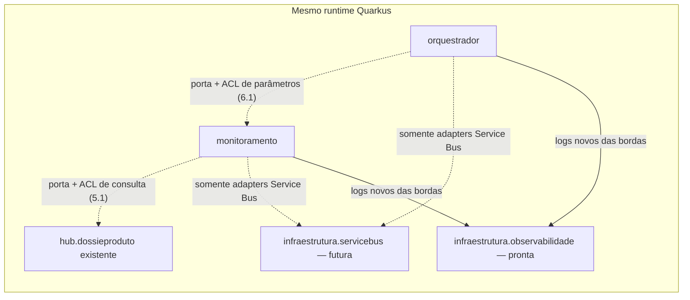
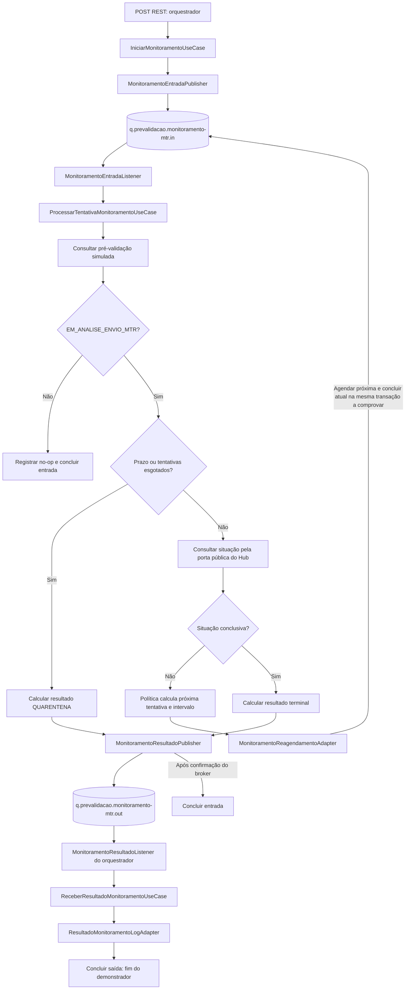

# Guia Service Bus — orquestrador e monitoramento de dossiê

## O que os desenvolvedores recebem nesta branch

**A base até o item 4.1 está implementada e verificada. O fluxo completo ainda será conectado.**
Já existem política/configuração CDI, contratos e mappers REST/AMQP, logs de erro tipados e
guardrails de arquitetura. O endpoint REST, os listeners, os publishers, as consultas e os
casos de uso ainda não executam o monitoramento.

| Parte | Estado atual | O que a evidência comprova |
|---|---|---|
| Extensão Azure Service Bus e Dev Services | Implementados | Builder CDI e envio/recebimento/Complete nas duas filas em teste de infraestrutura |
| Política progressiva e seleção por configuração | Implementadas | Intervalos, limites, versão e rejeição de configuração inválida no bootstrap |
| Contratos/mappers REST e entrada AMQP | Implementados | Validação e tradução de dados; não expõem endpoint nem publicam |
| Reagendamento | Mapper e erro implementados | JSON/envelope compatíveis com a entrada; não agenda nem incrementa tentativa |
| Resultado | Modelos, DTOs, mappers e erros implementados | Compatibilidade entre bordas, validação de conclusivo/quarentena e JSON exato |
| Logging técnico e fronteiras | Implementados | Campos JSON tipados, diagnóstico seguro, isolamento de bordas e ACLs |
| Conexões do fluxo | Pendentes a partir de 5.1 | Existem 11 portas, dois records de parâmetros e 19 esqueletos inativos; não são serviços funcionais |

A referência de verificação registrada no [checklist](../../tasks/features/orquestrador-monitoramento-service-bus/todo.md)
é de **1.046 testes aprovados**, checkpoint **COMPLIANT**, cobertura **87,0%** e duplicação
**4,4%**. Isso verifica o código entregue, não o fluxo completo em produção.

## Escopo e decisões vigentes

Este guia descreve a feature `orquestrador-monitoramento-service-bus`, na branch
`feature/orquestrador-monitoramento-service-bus`. O nome histórico do arquivo foi preservado
para manter os links, mas esta implementação **não altera o package `br.gov.caixa.simtr.dossie`**.
O Hub, suas capacidades, contratos, simuladores, logs e erros também permanecem preservados.

Os componentes novos são `br.gov.caixa.simtr.orquestrador` e
`br.gov.caixa.simtr.monitoramento`. O orquestrador publica na fila de entrada e consome a fila
de saída. O monitoramento consome a entrada, executa os critérios de monitoramento e reagenda
na própria entrada ou publica um resultado na saída. O orquestrador encerra este demonstrador
registrando o resultado em log.

A plataforma e a autenticação já estão decididas no
[ADR-0010 aceito](../adr/0010-extensao-quarkus-service-bus-connection-string-dev-services.md):

- extensão `io.quarkiverse.azureservices:quarkus-azure-servicebus:1.2.5`;
- BOM Quarkiverse Azure Services `1.2.5`, Quarkus `3.33.2.1` e JDK `25`;
- ambientes reais autenticados por SAS na connection string externa;
- desenvolvimento local com Service Bus Emulator e SQL Server iniciados por Dev Services;
- Microsoft Entra ID não é a autenticação desta feature.

O [ADR-0009](../adr/0009-azure-sdk-service-bus-dossie.md) preserva a decisão histórica de SDK
direto/Entra ID e foi substituído. Seus exemplos e os antigos contratos de dois campos não
orientam esta implementação. O histórico documental anterior permanece nas
[tasks do guia antigo](../../tasks/features/guia-service-bus-amqp-dossie/todo.md).

Para implementar e acompanhar o trabalho, consultar o
[plano vigente](../../tasks/features/orquestrador-monitoramento-service-bus/plan.md),
[checklist vigente](../../tasks/features/orquestrador-monitoramento-service-bus/todo.md) e
[inventário Java com roteiro de continuidade](../../tasks/features/orquestrador-monitoramento-service-bus/guia-desenvolvimento.md).
Este guia explica o fluxo; o inventário aponta cada arquivo e seu estado.

## Arquitetura e decisões para implementar

### Componentes no mesmo runtime

Este recorte usa o monólito modular Quarkus existente. Os packages abaixo delimitam
responsabilidades; não representam três aplicações implantadas separadamente.
A arquitetura segue os [ADRs 0001](../adr/0001-monolito-modular-e-hexagonal.md),
[0003](../adr/0003-orquestracao-e-colaboracao-por-portas.md) e
[0010](../adr/0010-extensao-quarkus-service-bus-connection-string-dev-services.md):

| Área | Responsabilidade | Limite de implementação |
|---|---|---|
| `orquestrador` | Receber solicitação, preparar a primeira mensagem e receber o resultado | Não é dono da política nem consulta configuração interna do monitoramento |
| `monitoramento` | Política, prazo, tentativa funcional, consultas, decisão terminal e reagendamento | Não incorpora contratos nem implementações internas do Hub |
| `hub.dossieproduto` | Fornecer a capacidade atômica existente de consulta por identificador | Mantém REST/MTR/simulador, regras, logs e erros existentes |
| `arquitetura.infraestrutura.servicebus` | Futuramente criar e encerrar os clientes compartilhados | Não recebe regra, DTO ou modelo de negócio; a factory ainda é inativa |
| `arquitetura.infraestrutura.observabilidade` | Acrescentar campos JSON tipados a novos registros elegíveis | Já implementada; não centraliza classificação, identidade ou sanitização de erros |
| `dossie` e `hub.arquitetura` existentes | Manter suas responsabilidades atuais | Não são destino dos novos listeners/publishers nem alvo de migração nesta feature |



As setas pontilhadas são conexões aprovadas ainda não implementadas. O fluxo assíncrono pelas
duas filas está no diagrama seguinte; a colaboração local não substitui esse fluxo.

### Hexagonal pragmática e contratos por borda

Domínio contém política e significado dos dados; aplicação coordena casos de uso e portas;
adapters traduzem REST/JSON/AMQP, acessam fontes e executam efeitos externos. SDK Azure e
handles de entrega ficam nas bordas. Domínio não depende de aplicação; contratos das portas
de entrada não expõem casos de uso concretos nem portas de saída.

**Quarkus, CDI, Jakarta, MicroProfile, Mutiny, Jackson e OpenTelemetry podem apoiar domínio e
aplicação.** Não criar wrappers apenas para esconder o framework. Essa permissão não leva
clientes Azure, DTOs de transporte ou infraestrutura técnica ao núcleo, nem permite bloquear
o event loop. Essa escolha está explícita nos ADRs 0001, 0010 e 0011.

Pelo [ADR-0004](../adr/0004-contratos-independentes-por-borda.md), cada borda tem DTO e mapper
próprios. O caminho é DTO → mapper → tipo interno → mapper da outra borda → DTO. A mensagem
JSON compatível é o contrato entre produtor e consumidor; igualdade de campos não autoriza
compartilhar a classe Java. Os erros Service Bus também têm DTO e RuntimeException próprios.
Não importar o DTO técnico de erro REST do Hub para economizar essas classes.

### Colaboração com o Hub e preparação inicial

O [ADR-0011](../adr/0011-composicao-local-monitoramento-e-fabrica-service-bus.md) fixa dois
caminhos, ambos ainda a implementar:

- Em **5.1**, `ConsultarSituacaoDossie` → `SituacaoDossieHubAcl` → porta pública
  `hub.dossieproduto.aplicacao.porta.entrada.ConsultarDossieProduto`. A ACL converte o
  identificador validado para Long positivo e traduz a situação para modelo do monitoramento.
  Ela não chama HTTP local, Resource, caso de uso concreto, DTO REST/MTR ou porta de saída do Hub.
- Em **6.1**, `ObterParametrosMonitoramento` → `ParametrosMonitoramentoAcl` →
  `PrepararMonitoramento`. A operação local recebe `iniciadoEm` e devolve
  `limiteEm`/`politicaMonitoramentoVersao`; a ACL traduz para o record do orquestrador.
  A política e sua configuração continuam no monitoramento. Esse cálculo não consulta fontes,
  gera IDs, envia mensagens ou processa tentativas.

IDs e instante inicial pertencem ao início da orquestração; prazo/versão vêm da política.
Esses valores são preservados nos reagendamentos. Os dois records de parâmetros e as portas
existem; suas implementações e ligação CDI ainda pertencem a 6.1.

### Fábrica e ciclo de vida dos clientes

Também pelo ADR-0011, somente a futura `ClientesServiceBus` injeta e configura o
`ServiceBusClientBuilder` da extensão. Ela cria sender/receiver assíncronos duradouros para
cada fila, diferenciados por qualifiers CDI de entrada/saída. Os adapters recebem clientes,
nunca o builder; não haverá cliente por mensagem.

A fábrica fecha os clientes. Cada listener cancela sua assinatura antes desse fechamento.
A infraestrutura não importa Hub, orquestrador ou monitoramento; somente os adapters
Service Bus acessam a fábrica. Ela não é barramento genérico, dona do retry funcional,
reagendamento, validação, DTO ou settlement. Essas responsabilidades continuam nos componentes.

## Fluxo completo a implementar

O diagrama representa o comportamento aprovado. Endpoint, listeners, publishers e processamento
ainda são estruturas sem lógica; a existência dos arquivos não torna o fluxo executável.



O listener inicia o processamento pela porta de entrada. A aplicação do monitoramento coordena
as consultas e a política; o listener não passa a ser dono das regras de negócio. A decisão
semântica orienta os efeitos das portas de saída. Serialização, clientes e settlement ficam
nos adapters. A coordenação da mesma entrega com a transação de reagendamento ainda será
detalhada antes de 8.1, conforme [ADR-0011](../adr/0011-composicao-local-monitoramento-e-fabrica-service-bus.md).

### Quem escreve e quem lê

| Fila | Quem escreve | Quem lê | Finalidade |
|---|---|---|---|
| `q.prevalidacao.monitoramento-mtr.in` | Orquestrador, na tentativa inicial; monitoramento, no reagendamento | Listener de entrada do monitoramento | Executar uma tentativa do monitoramento |
| `q.prevalidacao.monitoramento-mtr.out` | Publisher de resultado do monitoramento | Listener de resultado do orquestrador | Informar resultado terminal ou quarentena e encerrar o demonstrador com log |

A direção de um package é relativa ao componente: o orquestrador escreve na fila de entrada
por `adaptador.saida.servicebus` e lê a fila de saída por `adaptador.entrada.servicebus`.

### Caminhos de aplicação e arquivos

Todos os nomes abaixo existem no código; as conexões funcionais indicadas permanecem pendentes.

| Etapa | Caminho no componente | Item |
|---|---|---|
| Iniciar | `MonitoramentoDossieResource` → `IniciarMonitoramento.executar` → `IniciarMonitoramentoUseCase` | 6.1 |
| Publicar entrada | `PublicarTentativaMonitoramento.executar` → `MonitoramentoEntradaPublisher` → mapper próprio → sender da entrada | 6.1 |
| Consumir entrada | `MonitoramentoEntradaListener` → mapper de entrada → `ProcessarTentativaMonitoramento.executar` → caso de uso | 7.1/8.1 |
| Consultar fontes | `ConsultarPreValidacao` → `PreValidacaoSimuladaAdapter`; `ConsultarSituacaoDossie` → `SituacaoDossieHubAcl` → porta pública `ConsultarDossieProduto` | 5.1 |
| Reagendar | Caso de uso/política → `ReagendarTentativaMonitoramento.executar` → `MonitoramentoReagendamentoAdapter` → mapper próprio → fila de entrada | 8.1 |
| Publicar resultado | Caso de uso → `PublicarResultadoMonitoramento.executar` → `MonitoramentoResultadoPublisher` → mapper próprio → fila de saída | 7.1 |
| Consumir resultado | `MonitoramentoResultadoListener` → mapper próprio → `ReceberResultadoMonitoramento.executar` → caso de uso | 9.1 |
| Finalizar recorte | `RegistrarResultadoMonitoramento.executar` → `ResultadoMonitoramentoLogAdapter` → conclusão da saída pelo listener | 9.1 |

O acesso ao Hub é local por porta pública e ACL do monitoramento. Não há chamada HTTP ao
próprio Hub nem implementação de mensageria dentro de `dossie`. A factory técnica
`arquitetura.infraestrutura.servicebus.ClientesServiceBus` concentra apenas criação e
lifecycle dos clientes da extensão; não contém política, DTO de negócio ou processamento.

## Critérios de monitoramento

A ordem abaixo corresponde à estratégia do plano; a coordenação funcional será implementada
em 7.1/8.1. A política de intervalos/prazo já existe, mas não consulta as fontes nem publica.

| Condição, na ordem de avaliação | Comportamento esperado |
|---|---|
| Envelope/JSON inválido | Classificar e registrar erro; a borda futura decide DeadLetter conforme falha permanente |
| Pré-validação diferente de `EM_ANALISE_ENVIO_MTR` | Registrar no-op e concluir a entrada; não consultar MTR, reagendar ou produzir novo resultado |
| Prazo ou máximo de tentativas atingido | Calcular `QUARENTENA`, publicar resultado e concluir entrada após confirmação |
| MTR retorna `CONFORME` | Resultado terminal; situação de pré-validação calculada como `CONFORME` |
| MTR retorna `NAO_CONFORME` | Resultado terminal; situação calculada como `NAO_CONFORME` |
| MTR retorna `PENDENTE_INFORMACAO` | Resultado terminal preserva a situação original do MTR; situação de pré-validação calculada como `NAO_CONFORME` |
| Outra situação do MTR, ainda dentro dos limites | Calcular próxima tentativa e intervalo; reagendar na fila de entrada |
| Falha técnica recuperável | Propagar/classificar falha para Abandon/redelivery; não incrementar tentativa funcional |

`QUARENTENA` é resultado funcional na saída. DLQ é tratamento técnico de uma entrega e não
substitui a quarentena. Esta feature não persiste a situação da pré-validação: ela é calculada
para o resultado. O log do orquestrador encerra o recorte; não retoma, suspende ou finaliza um
workflow durável.

A [política implementada](../../src/main/java/br/gov/caixa/simtr/monitoramento/dominio/politica/PoliticaMonitoramentoProgressiva.java)
usa intervalos ordenados; após a lista, repete o último. Lista unitária equivale a intervalo
fixo. A configuração atual é `PT30M,PT3H,PT4H,PT6H`, duração máxima `PT24H`, versão
`v1` e máximo de tentativas opcional, ausente por padrão. O prazo encerra quando o instante
de processamento é igual ou posterior a `limiteEm`; tem precedência sobre o máximo de
tentativas. A política fornece a próxima tentativa e o intervalo, não agenda a mensagem. Todas as definições de política são validadas no bootstrap, inclusive as não selecionadas; o producer entrega a instância escolhida por configuração.

No início, o orquestrador gera IDs e `iniciadoEm` no servidor. Antes de publicar, obtém
`limiteEm` e `politicaMonitoramentoVersao` por `ObterParametrosMonitoramento` →
`ParametrosMonitoramentoAcl` → `PrepararMonitoramento`. Essa colaboração síncrona calcula
parâmetros em memória; não substitui a fila para processar tentativas.
Reagendamentos preservam instante inicial, prazo, versão e IDs. Uma versão antiga de política
não pode ser trocada silenciosamente pela seleção atual; seu tratamento ainda será detalhado
antes de 7.1/8.1. `DeliveryCount` não é `tentativaAtual`.

## Contratos de borda

### REST inicial e fila de entrada

O contrato REST aprovado é `POST /simtr-hub/v1/monitoramentos-dossie`, com
`idDossiePreValidacao` e `idDossieMtr`. O response contém `monitoramentoId` e
`orquestracaoId`, com `202 Accepted` somente após confirmação da publicação inicial.
DTOs/mappers REST já existem; o endpoint funcional pertence a 6.1. Autenticação e autorização seguirão a postura vigente do serviço, sem inventar papel novo. Os erros HTTP usam o padrão REST existente; falha de publicação não expõe dados do broker.

A fila de entrada usa os nove campos v1 abaixo. Exemplo sintético compatível com os mappers
já implementados:

```json
{
  "schemaVersion": 1,
  "monitoramentoId": "MON-1",
  "orquestracaoId": "ORQ-1",
  "idDossiePreValidacao": "pre-externa",
  "idDossieMtr": "0007",
  "tentativaAtual": 1,
  "iniciadoEm": "2026-09-04T12:00:00Z",
  "limiteEm": "2026-09-05T12:00:00Z",
  "politicaMonitoramentoVersao": "v1"
}
```

| Propriedade AMQP | Entrada inicial e reagendamento |
|---|---|
| `MessageId` | `<monitoramentoId>:tentativa:<tentativaAtual>` |
| `CorrelationId` | `<orquestracaoId>` |
| `Subject` | `MONITORAR_DOSSIE_MTR` |
| `ContentType` | `application/json` |

`tentativaAtual` é inteiro positivo no **corpo JSON**. Identificadores permanecem strings;
`idDossieMtr` deve representar inteiro decimal de `1` a `9223372036854775807`,
preservando zeros à esquerda. Campos obrigatórios não podem ser nulos/brancos;
`limiteEm` deve ser posterior a `iniciadoEm`. Campos JSON desconhecidos são tolerados
conforme o contrato aprovado. Não importar limites de 256 caracteres/64 KiB ou rejeição de
campos desconhecidos dos antigos exemplos do ADR-0009 como requisitos já implementados.

Cada borda possui DTO e mapper próprios: produtor inicial no orquestrador, consumidor no
monitoramento e produtor de reagendamento no monitoramento. A compatibilidade é demonstrada
pelo JSON; os tipos Java não são compartilhados entre essas bordas.
O mapper monta a mensagem; publicar/agendar é responsabilidade posterior dos adapters.

### Fila de saída

Os modelos, DTOs e mappers independentes das duas bordas de resultado estão **implementados
e verificados em 4.1**. O produtor serializa e monta o envelope; o consumidor valida e produz
o modelo próprio do orquestrador. Publisher e listener continuam pendentes em 7.1/9.1.

Exemplo conclusivo com os 13 campos do contrato v1:

```json
{
  "schemaVersion": 1,
  "monitoramentoId": "MON-1",
  "orquestracaoId": "ORQ-1",
  "idDossiePreValidacao": "pre-externa",
  "idDossieMtr": "0007",
  "resultadoMonitoramento": "CONCLUSIVO",
  "situacaoMtr": "PENDENTE_INFORMACAO",
  "situacaoPreValidacao": "NAO_CONFORME",
  "motivo": "SITUACAO_CONCLUSIVA_MTR",
  "tentativasRealizadas": 3,
  "iniciadoEm": "2026-09-04T12:00:00Z",
  "concluidoEm": "2026-09-04T18:30:00Z",
  "inputSequenceNumber": 13527
}
```

| Campo/regra | Comportamento implementado |
|---|---|
| `schemaVersion` | Exatamente 1 |
| Identificadores | Strings obrigatórias; MTR no mesmo intervalo decimal positivo da entrada, preservando zeros |
| `tentativasRealizadas` | Inteiro não negativo; em CONCLUSIVO, pelo menos 1 |
| `situacaoMtr` em CONCLUSIVO | CONFORME, NAO_CONFORME ou PENDENTE_INFORMACAO |
| QUARENTENA sem consulta | Admite `situacaoMtr=null` e zero tentativas; consumidor também aceita ausência do campo de situação |
| Datas | Ambas obrigatórias; `concluidoEm` pode coincidir com `iniciadoEm`, mas não precedê-lo |
| `inputSequenceNumber` | Inteiro representável como long, inclusive zero/negativo; sequência técnica não é contador funcional |
| Envelope/JSON | Rejeita divergências, tipos incorretos, overflow e conteúdo adicional depois do objeto; campos desconhecidos são ignorados |

A nulidade e o contador da quarentena foram confirmados pelo usuário e estão registrados no
[plano/checklist](../../tasks/features/orquestrador-monitoramento-service-bus/todo.md).
Exemplo de quarentena antes da primeira consulta: no objeto acima, o resultado e a situação
da pré-validação são `QUARENTENA`, `situacaoMtr` é `null`,
`tentativasRealizadas` é `0` e o motivo descreve o limite atingido. O prazo pode vencer
antes da primeira consulta; o mapper não inventa uma situação MTR para preencher o campo.

A validação adicional exige evidência de consulta para CONCLUSIVO, mas o mapper não calcula
a correspondência entre situação MTR e situação de pré-validação: recebe e preserva esses
valores. A decisão de negócio da tabela de critérios será executada em 7.1. A propriedade
auxiliar usada na validação não aparece no JSON.

| Propriedade AMQP | Resultado |
|---|---|
| `MessageId` | `<monitoramentoId>:resultado:v1` |
| `CorrelationId` | `<orquestracaoId>` |
| `Subject` | `RESULTADO_MONITORAMENTO_DOSSIE_MTR` |
| `ContentType` | `application/json` |

O produtor pertence a `monitoramento.adaptador.saida.servicebus`; o consumidor pertence a
`orquestrador.adaptador.entrada.servicebus`. Situação original MTR e situação calculada da
pré-validação permanecem separadas. O demonstrador não persiste essas situações nem retoma
workflow durável.

## Extensão, connection string e Dev Services

O [pom.xml](../../pom.xml) já importa `quarkus-azure-services-bom:1.2.5` e declara
`quarkus-azure-servicebus` sem versão individual. O SDK resolvido e caracterizado na feature
é `azure-messaging-servicebus:7.17.12`. Usar o `ServiceBusClientBuilder` produzido pela
extensão, encapsulado pela fábrica técnica prevista no ADR-0011. Não copiar o antigo BOM
Azure `1.3.8`, adicionar Azure Identity ou construir uma cadeia de credenciais Entra.

| Ambiente | Credencial e infraestrutura | Transporte |
|---|---|---|
| `dev` local sem configuração externa de Service Bus | Dev Services inicia emulador e SQL e fornece a connection string local | `AMQP` sobre TCP |
| Testes de integração com Dev Services | Profile de teste habilita extensão/Dev Services e recusa configuração externa | `AMQP` sobre TCP |
| Ambiente real no profile `azure` | `QUARKUS_AZURE_SERVICEBUS_CONNECTION_STRING` fornecida externamente; Dev Services desabilitado | `AMQP_WEB_SOCKETS` |
| `prod` | Dev Services desabilitado; connection string externa obrigatória no desenho aprovado | A propriedade base é `AMQP`; a seleção WebSockets está no profile `azure` |

A property da extensão é `quarkus.azure.servicebus.connection-string`. Seu valor real não
é gravado no repositório, argumentos, logs, spans ou relatórios. O
[application.properties](../../src/main/resources/application.properties) deixa essa property
sem placeholder global obrigatório para permitir a detecção de Dev Services em dev/test.
Não configurar apenas namespace/credencial Entra como alternativa de autenticação.
A política SAS real usa `Send + Listen`, sem `Manage` ou `RootManageSharedAccessKey`,
no menor escopo operacional permitido para as duas filas do mesmo runtime.

A configuração executável atual mantém:

- `monitoramento.service-bus.input-queue`, com alias `SERVICE_BUS_INPUT_QUEUE`;
- `monitoramento.service-bus.output-queue`, com alias `SERVICE_BUS_OUTPUT_QUEUE`;
- `quarkus.azure.servicebus.devservices.emulator.config-file-path=config.json`;
- arquivo em [src/main/azure/servicebus-emulator/config.json](../../src/main/azure/servicebus-emulator/config.json);
- emulador `1.1.2` e SQL Server `2022-CU14-ubuntu-22.04`, com imagens fixadas.

A property contém `config.json`; o arquivo continua no diretório exigido pela extensão.
Não movê-lo para outra pasta. Os testes comuns desabilitam a extensão; o
[ServiceBusDevServicesTest](../../src/test/java/br/gov/caixa/simtr/monitoramento/adaptador/configuracao/ServiceBusDevServicesTest.java)
a habilita explicitamente e prova envio/recebimento nas duas filas. Essa prova não equivale
aos listeners e ao processo de monitoramento completos.

Há três recursos diferentes: o **emulador Service Bus** atende ao transporte; o
**adapter simulado de pré-validação**, ainda pendente em 5.1, fornece cenários de negócio;
o **simulador existente do Hub** atende à consulta de dossiê quando seu profile/property já
existente o habilita. Eles permanecem com responsabilidades separadas.

Pontos de entrada oficiais: [Quarkus Azure Services](https://docs.quarkiverse.io/quarkus-azure-services/dev/index.html)
e [extensão Service Bus/Dev Services](https://docs.quarkiverse.io/quarkus-azure-services/dev/quarkus-azure-servicebus.html).
Conferir exemplos contra as versões fixadas no projeto; este guia não autoriza upgrade.

## Consumo, confirmação e tratamento de erro

Os listeners planejados usam `ServiceBusReceiverAsyncClient`, prefetch inicial zero, concorrência limitada e consumo contínuo com
`PEEK_LOCK` e auto-complete desabilitado. Os publishers usam
`ServiceBusSenderAsyncClient`; a aplicação compõe a conclusão em Mutiny sem bloquear o
event loop. Não criar cliente por mensagem nem usar scheduler local para simular agendamento.

| Caminho | Quando concluir a mensagem atual |
|---|---|
| Resultado terminal/quarentena | Depois da confirmação da publicação na saída |
| Reagendamento | No mesmo efeito transacional que agenda a próxima mensagem na entrada, após prova de API/emulador |
| No-op | Depois de confirmar a condição e registrar a decisão |
| Consumo da saída | Depois que o registro do resultado pelo orquestrador concluir |
| Falha recuperável | Abandon/redelivery conforme classificação; não incrementar tentativa funcional |
| Contrato permanentemente inválido | DeadLetter com diagnóstico controlado, sem payload ou segredo |

A transação de entidade única `schedule + Complete` ainda precisa de prova no SDK resolvido
e no emulador; não está implementada. Não afirmar atomicidade entre publicar saída e concluir
entrada: sem Outbox, uma falha nessa janela pode repetir o resultado. Não criar contexto
mutável de entrega em singleton nem transportar handles Azure ao domínio/aplicação.

O log final previsto usa o evento `orquestrador.monitoramento-dossie.resultado.registrado`
e correlação por `monitoramentoId`/`orquestracaoId`. Erros do novo desenvolvimento usam
o padrão JSON aprovado no [ADR-0012](../adr/0012-campos-json-tipados-logs-service-bus.md):
`recurso`, `id_erro`, `codigo_erro`, `erros: [{mensagem}]`, `detalhe` e,
quando técnico, `stacktrace` sanitizado. `codigo_http` é omitido em AMQP.
O array deve ser JSON real no formatter, não texto escapado em `message`.

A falha reconhecida é registrada uma vez em ERROR e propagada com o mesmo id/código.
Preservar RuntimeException própria e não ignorar a exceção. Diagnóstico contém tipo e frames
sem mensagem original, causas, suppressed, processor ou payload. Trace/span só são acrescentados
quando o contexto é válido. O Hub conserva seus logs, erros e comportamento atuais.
Armazenamento e ações automáticas a partir desses registros continuam fora do incremento.

A validação local das duas bordas admite `situacaoMtr` nula e contador zero em QUARENTENA
antes de consulta. Contadores negativos são rejeitados; CONCLUSIVO exige pelo menos uma
tentativa e situação MTR CONFORME, NAO_CONFORME ou PENDENTE_INFORMACAO. A propriedade
auxiliar de validação não integra o JSON. O mapper não recalcula nem persiste as situações.

### Como o erro JSON é emitido sem alterar o Hub

O [ADR-0012](../adr/0012-campos-json-tipados-logs-service-bus.md) decidiu uma composição
técnica já implementada em `arquitetura.infraestrutura.observabilidade`:

1. A borda classifica a falha, gera a identidade, monta seu DTO e sanitiza o diagnóstico.
2. `CamposLogJson` transporta somente o objeto JSON imutável já sanitizado; não recebe Throwable.
3. `FormatoLogJsonServiceBus` delega ao formatter JSON existente e acrescenta campos tipados
   apenas quando a categoria é uma das novas bordas Service Bus e o registro possui o marcador.
4. `ConfiguracaoLogJsonServiceBus` instala a decoração no início e restaura os delegates
   no encerramento, inclusive quando há handlers intermediários.

O formatter preserva metadados e rejeita sobrescrita de campos do logger. Categorias do Hub e
registros sem marcador mantêm a saída original. Não se cria writer, destino, rotação ou nível
novo, nem se usa MDC para representar arrays/números como texto. DTOs, eventos, códigos,
mensagens, identidade e sanitização continuam locais; a infraestrutura não trata o negócio.

A repetição entre helpers é um ponto de manutenção registrado: a medição atual é 4,4%, abaixo
do limite de 5%. Reduzi-la por extração transversal exige decisão arquitetural concreta;
não compartilhar DTOs ou sanitização nem excluir arquivos da análise para reduzir o indicador.

### Telemetria do fluxo ainda a implementar

Pelos [ADRs 0006](../adr/0006-compatibilidade-observabilidade-e-testes.md) e
[0010](../adr/0010-extensao-quarkus-service-bus-connection-string-dev-services.md), a Task 10
primeiro caracteriza o que o SDK efetivo já emite. Propagação W3C nas application properties
e spans manuais só preenchem lacunas comprovadas; não duplicar instrumentação automática.

| Contrato planejado no C0.4 | Nome/kind |
|---|---|
| Entrada REST | `simtr-hub.api.monitoramento-dossie.iniciar` — SERVER |
| Início da orquestração | `orquestrador.service.monitoramento-dossie.iniciar` — INTERNAL |
| Consulta de pré-validação | `doctree.service.prevalidacao.dossie.consultar` — INTERNAL |
| Avaliação do monitoramento | `doctree.service.monitoramento-mtr.avaliar` — INTERNAL |
| Registro do resultado | `orquestrador.service.monitoramento-dossie.resultado-registrar` — INTERNAL |
| Enviar/agendar | `send <fila>` e `schedule <fila>` — PRODUCER |
| Processar entrega | `process <fila>` — CONSUMER |
| Settlement | `complete <fila>`, `abandon <fila>`, `dead_letter <fila>` — CLIENT |

Os prefixos `doctree` acima são nomes observáveis do planejamento original, não packages
Java atuais. A revisão humana dos packages não os renomeou automaticamente. Conferir o
contrato de sinais antes da implementação; eventual alteração exige checkpoint próprio.

Os eventos planejados incluem publicação confirmada/falha e resultado registrado/falha no
orquestrador, e `doctree.monitoramento-mtr.decisao.tomada`,
`doctree.monitoramento-mtr.processamento.falhou` e
`doctree.monitoramento-mtr.settlement.executado`. Eles são distintos dos erros de mapper
já implementados com prefixos `monitoramento.servicebus`/`orquestrador.servicebus`.

Os sinais podem usar IDs técnicos validados, tentativa funcional, delivery count, sequência,
decisão e settlement. Nomes/atributos de mensageria devem ser conferidos com a versão efetiva
do SDK. Payload, connection string, SAS, namespace, documentos e PII ficam fora da telemetria.
IDs de alta cardinalidade não viram labels de métrica; novas métricas/dashboards estão fora
desta feature. Os logs atuais só acrescentam trace/span quando já existe contexto válido.

## Continuidade manual e estado real

Na estrutura existente, Javadoc de classe informa responsabilidade, fluxo, item pendente e
verificação. Javadoc dos métodos das portas descreve entrada, resultado, conclusão assíncrona
e falha. Classes vazias não ganham métodos fictícios para ilustrar o fluxo; o desenvolvedor
deverá declarar os métodos/implementações ao executar o item correspondente.

| Estado | Entrega |
|---|---|
| Implementado e verificado anteriormente | Extensão, configuração/Dev Services, política, configuração tipada/producer CDI, contratos REST e da entrada, mappers e logs das bordas da entrada |
| Estrutura antecipada | Onze portas, dois records de parâmetros e 19 classes `@Vetoed`, ainda sem fluxo conectado |
| Reagendamento implementado | DTO/mapper v1 próprios, validação, envelope e log de erro JSON; sem publicar ou agendar |
| 4.1 tecnicamente concluído | Contratos/mappers de resultado, validação confirmada de quarentena/conclusivo e guardrails verificados |
| 5.1–9.1 pendentes | Consultas, factory, endpoint, publishers, listeners, processamento, agendamento e log final |
| 10.1 em diante pendente | Correlação ponta a ponta, cenários integrados e fechamento do demonstrador |

O mapper de reagendamento já está implementado. Os testes preservados provaram JSON/envelope,
validação equivalente à entrada, compatibilidade com o consumidor e erro JSON sanitizado.
O RED da pausa permanece registrado como etapa anterior no checklist, junto das evidências atuais.

O item 4.1 está tecnicamente concluído. O próximo incremento é 5.1, ainda não iniciado.
Preservar as entregas concluídas e seguir o checklist para a continuidade.
Os comandos e critérios de verificação estão no guia de desenvolvimento e no plano.

O [manifesto de commit](../../tasks/features/orquestrador-monitoramento-service-bus/pacote-commit.md)
descreve a seleção preparada para a publicação solicitada na branch. Preservar arquivos rastreados
e não rastreados ao materializar a entrega.

A [solução ampla de origem](../feat/solucao-duas-filas-azure-service-bus-quarkus-azure-servicebus-reactive-jdk25.md)
inclui persistência e continuidade durável que não pertencem a este recorte. Para esta feature,
prevalecem as adaptações explícitas do plano e dos ADRs aceitos: sem alteração em `dossie`
ou Hub, sem persistência nova, e encerramento do demonstrador por log.

## Roteiro para continuar a implementação

| Item | Entrega a implementar | Verificação para considerar pronta |
|---|---|---|
| **5.1 — próximo** | Consulta simulada da pré-validação e ACL do Hub | Cenários determinísticos, ativação explícita do mock, tradução mínima, falhas e fronteiras |
| 6.1 | Preparação de parâmetros, factory de clientes, caso de uso, Resource e publisher inicial | Clientes únicos e shutdown, contrato REST, `202` após broker, erros e checkpoint C2 |
| 7.1 | Listener da entrada e processamento terminal | Ordem de no-op/limites/consulta, preservação de situação original/calculada e saída confirmada antes de Complete |
| 8.1 | Reagendamento de situação não conclusiva | Política/versão, preservação dos valores, prova de `schedule + Complete`, rollback e redelivery |
| 9.1 | Listener da saída, caso de uso e log final | Registro do resultado e Complete/Abandon/DeadLetter coerentes com a falha |
| 10.1 e C3 | Correlação e fluxo integrado no emulador | Propagação, sinais sem duplicação, caminhos de sucesso, falha e quarentena |
| 11.1–CF | Verificação final e revisão do demonstrador | Suíte/checkpoint, documentação e decisão humana de encerramento |

Ao assumir uma fatia, seguir o [inventário Java](../../tasks/features/orquestrador-monitoramento-service-bus/guia-desenvolvimento.md):
implementar a porta no adapter/caso de uso correspondente, retirar `@Vetoed` apenas quando
funcional e remover o tipo do inventário de inatividade junto dos testes. Não ligar todos os
esqueletos ao CDI para aparentar fluxo pronto. Reutilizar contratos/mappers já verificados.

As definições de arquitetura já estão aceitas, mas permanecem pontos técnicos a resolver nas
fatias correspondentes: versão de política de mensagens antigas; acoplamento da entrega à
transação de reagendamento; comprovação de atomicidade no SDK/emulador; lifecycle e credencial
externa na factory; caracterização da telemetria automática. Não aplicar fallback silencioso.

Esta revisão preparou o pacote para commit e push solicitados pelo usuário. O histórico de
execução permanece nas tasks; a branch não é um demonstrador completo nem uma entrega produtiva.
Persistência, Cosmos DB, Outbox, idempotência durável, workflow durável, métricas e novas
integrações ficam fora deste recorte.
