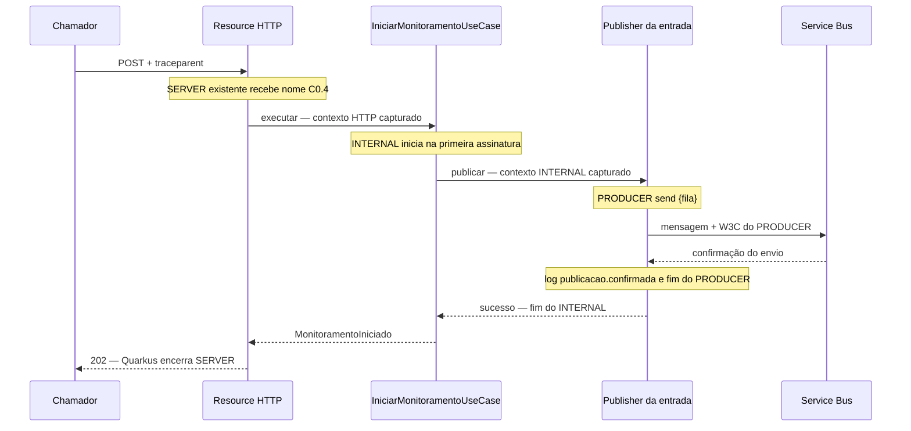

# Desenho de 10.1-B1 — POST até confirmação da entrada

## 10.1-B1.4 — concluída tecnicamente — 2026-09-11

Eventos confirmada/falhou da publicação inicial entregues em cinco arquivos executáveis,
com contexto do PRODUCER, campos seguros e política de logging aprovada em CP-B1.
**92 focados, 2 integrações A2 e 1.403 padrão/194 classes** aprovados.
Após **ContinuarAjustes** humano, extraída a finalização privada do publisher;
**45 focados e o checkpoint completo** passaram novamente. S3776 CLOSED/FIXED.

Sonar **COMPLIANT / NOT_REQUIRED**: nenhuma issue nova ou grave, cobertura 88,3%,
duplicação 4,4%. Baseline/assessment originais preservados; fingerprint conferido.
A2: exatamente 3/6 spans e 3/16 logs, uma confirmação inicial correlacionada ao PRODUCER.
[Execução, ajuste, inventários e checkpoint](execucao-10-1-b1-4.md).

**Próximo item: 10.1-B1.5**, prova POST → broker e consolidação de B1, com GO
já recebido para o desenho/CP-B1. B1.5 e B2–B5 permanecem pendentes;
C0.4/C9.1-L preservados. Sem staging/commit/push; C3 e encerramento humano da feature pendentes.
Os registros abaixo conservam os marcos anteriores.

## B1.2 implementada e verificada — 2026-09-11

[Execução e checkpoint](execucao-10-1-b1-2.md): 41 focados, 2 A2 e 1.358 padrão
aprovados; Sonar COMPLIANT, baseline preservado. Próximo incremento: B1.3.

Refinamentos locais confirmados em B1.2: informar a mesma rota com precedência
CONTROLLER antes de renomear o SERVER; contextualSupplier da API MP envolve a
construção inteira do Uni, incluindo o predicado de memoização, com OTel manual.
Um future local permite fechar Scope antes do encaminhamento terminal, inclusive
na conclusão síncrona. Não houve configuração/provider global, dependência nova
ou relaxamento dos critérios do caso de uso. O diagnóstico do provider MP externo
e os cuidados para B1.3 estão registrados na execução.

O GO original permanece válido para os detalhes previstos das próximas subfatias;
o desenho original abaixo preserva a intenção e os critérios.

## GO e execução de B1.1 — 2026-09-11

Após o pedido "10.1-B1", o usuário respondeu **"go"**: autorização registrada para este
desenho e os detalhes CP-B1 descritos abaixo. Executado somente o próximo incremento,
B1.1, concluído tecnicamente. [Testes e checkpoint](execucao-10-1-b1-1.md).
**Próximo item: B1.2**, sem nova solicitação de GO para os mesmos detalhes.
O planejamento original abaixo preserva a intenção e os critérios dos demais incrementos.

## Estado e intenção — 2026-09-11

Pedido humano: **"desenho da 10.1-B1"**. Entrega exclusivamente documental;
implementação de B1 ainda não iniciada. A1/A2 estão concluídas tecnicamente, conforme
[evidência executada](continuidade-10-1.md). Os critérios abaixo são propostas e
verificações futuras, não resultados executados.

Completar a correlação da aceitação HTTP até a confirmação do envio da primeira
tentativa ao Service Bus, preservando publicação única, resposta segura e memorização.
C0.4 já autoriza os nomes e o preenchimento das lacunas. O checkpoint CP-B1 abaixo
trata somente dos detalhes novos; não reabre C0.4 ou C9.1-L.

## Base confirmada e limites

| Ponto | Estado confirmado no código e nas provas A1/A2 |
|---|---|
| HTTP | Quarkus exporta um SERVER chamado `POST /simtr-hub/v1/monitoramentos-dossie`, com parent remoto correto. |
| Iniciação | `IniciarMonitoramentoUseCase` cria IDs/parâmetros e publica em um Uni lazy, memorizado por invocação; não abre span. |
| Envio | `MonitoramentoEntradaPublisher` prepara a mensagem, aguarda `sendMessage(...).toFuture()` e memoriza sucesso/falha; não abre span nem publica os eventos C0.4 de confirmação/falha. |
| Mensagem | Mapper cria mensagem nova, com corpo/IDs/subject/content-type existentes e application properties vazias. |
| SDK | A1 comprovou provider Azure ausente, zero spans SDK e ausência de carrier nas operações observadas. Não habilitar provider novo. |
| Serialização | `LogErroSerializacaoEntrada` já emite evento sanitizado e exceção própria; usa o span corrente quando válido. Preservar esse contrato. |
| Depois da fila | A2 observou consultas Hub em traces próprios, decisões/log final sem contexto e settlement referenciando HTTP. Essa correlação parcial não prova contexto ativo no processamento. |

Arquitetura, índice de ADRs e ADRs 0006/0010/0011/0012 conferidos contra código e testes.
As portas, os DTOs de borda e a fábrica de clientes continuam existentes. Helpers de
produção, se necessários, serão privados ou locais ao adapter; não haverá framework
compartilhado de tracing nem importação do helper interno do Hub. Não há decisão
arquitetural nova que justifique ADR neste desenho.

**Escopo:** nome do SERVER existente, span de iniciação, PRODUCER do envio inicial,
carrier W3C na primeira mensagem, eventos de publicação e regressões correspondentes.
**Fora de escopo:** consumo/extraction, pré-validação, consulta Hub/MTR, resultado,
settlement, reagendamento e novas tentativas (B2–B5); métricas, sampler/exporter,
dependências, timeouts/retries, configuração operacional, contratos REST/JSON/DTO,
credenciais, transações ou nova infraestrutura Azure. A inconsistência documental sobre
listener futuro já inventariada em A2 permanece para a consolidação correspondente.

## Cadeia e propriedade dos spans



| Span | Kind / parent | Início e término propostos |
|---|---|---|
| `simtr-hub.api.monitoramento-dossie.iniciar` | SERVER existente / parent HTTP já extraído pelo Quarkus | Resource chama `updateName` no span corrente. Quarkus continua proprietário do lifecycle/status HTTP; nenhum segundo SERVER ou `end` manual. |
| `orquestrador.service.monitoramento-dossie.iniciar` | INTERNAL / contexto capturado na invocação do caso de uso | Primeira assinatura, antes de parâmetros/IDs; termina quando a operação memorizada confirma ou falha. |
| `send {fila}` | PRODUCER / contexto capturado na invocação do publisher | Antes de preparar a mensagem; termina após confirmação/falha do envio e tentativa do log correspondente. Não fica aberto durante permanência na fila. |

O nome da fila vem da configuração de entrada já existente. Não derivar namespace
ou endereço de conexão para compor nome/atributos. Não criar span separado de Create.

A renomeação cobre a execução do método REST (202 e falhas convertidas em 500).
Validação/deserialização rejeitada antes do método mantém o SERVER automático, sem
iniciação/envio. Não introduzir filtro global para renomear esses 400. O teste HTTP
deve provar o nome exportado ao final; se o runtime o sobrescrever, revisar a solução
antes de acrescentar interceptador ou outro ponto de instrumentação.

### Lifecycle reativo

Usar o Tracer CDI já disponível e a API pública de Context/Span. O contexto pai é local
à invocação, capturado antes do retorno do Uni; a criação dos spans permanece lazy.
Uma invocação sob contexto A assinada depois sob B pertence a A. Invocações distintas
não compartilham contexto, estado de término, IDs ou publicação.

A instrumentação fica **antes de `memoize().indefinitely()`**: uma operação upstream,
um span por etapa e uma publicação, inclusive com assinaturas concorrentes/tardias e
falha memorizada. Guardar o Context da operação para callbacks; abrir e fechar Scope
em cada bloco síncrono que precisa dele, na mesma thread: preparação, chamada da
porta, assinatura efetiva do envio e callback de log/término. Não manter Scope aberto
entre a chamada e a conclusão em outra thread; não instalar hooks globais de Reactor.

O fonte de Mutiny 3.1.1 mostra que cancelar uma assinatura do Uni memorizado apenas
remove esse assinante: não cancela o upstream. Portanto, **cancelamento de todos os
assinantes não encerra o span nem cancela o envio pendente**. Quando o SDK concluir,
encerrar uma única vez e manter o resultado disponível à assinatura tardia. Se a
operação upstream efetivamente falhar, inclusive por cancelamento emitido como falha,
preservar o caminho de erro atual. Não introduzir timeout para forçar término.

Isso esclarece o critério geral de cancelamento do plano 10.1: ausência de span órfão
é verificada depois do término real da operação, não pela remoção de um observador.
B1.1 deve confirmar esse comportamento em testes antes de modificar produção.

O `WithSpanInterceptor` e o `MutinyTracingHelper` instalados foram inspecionados:
encaminham/registram Throwable e fecham Scope no término assíncrono. O helper também
não oferece Kind PRODUCER no método inspecionado. Por isso, propor lifecycle explícito
local, sem usar esses mecanismos nos novos pontos e sem modificar o runtime.

### Status e atributos novos — proposta CP-B1

Sucesso: status UNSET, sem descrição/eventos/links. Falha: ERROR com `error.type`
controlado, sem descrição, mensagem externa, Throwable ou `recordException`.

| Etapa/falha | `error.type` proposto | Comportamento funcional preservado |
|---|---|---|
| Iniciação, qualquer falha da operação | `FALHA_INICIO` | Propaga a mesma falha recebida; REST continua respondendo seu 500 seguro. O caso de uso não depende de tipo do adapter. |
| Serialização tipada da entrada | `SERIALIZACAO_ENTRADA` | Exceção sanitizada e log de serialização existentes, sem segundo evento genérico. |
| Preparação inesperada da mensagem | `FALHA_PREPARACAO_PUBLICACAO` | Preserva a falha atual; nenhuma chamada SDK. |
| Obtenção do sender/envio síncrono ou assíncrono | `FALHA_PUBLICACAO` | Mesma exceção pública segura do publisher atual, sem causa/suppressed originais. |

No PRODUCER, acrescentar somente `messaging.system=servicebus`,
`messaging.destination.name={fila configurada}`, `messaging.operation.name=send`
e `messaging.operation.type=send`, além de `error.type` quando aplicável.
IDs técnicos ficam nos logs, evitando atributos redundantes. Não acrescentar payload,
IDs de negócio/dossiê, namespace, URL, SAS, baggage, delivery_count ou sequence_number.
Não remover atributos HTTP automáticos ou atributos preexistentes do Hub.

## Carrier W3C da primeira mensagem — proposta CP-B1

Após criar o PRODUCER e preparar a mensagem nova, injetar seu Context com
`W3CTraceContextPropagator` nas application properties. Usar somente esse propagador;
não aplicar o propagador composto global que poderia incluir baggage.

| Propriedade | Regra |
|---|---|
| `traceparent` | Gerado a partir do SpanContext válido do PRODUCER. Seu spanId deve ser o do span `send {fila}`, e não o HTTP ou o de iniciação. |
| `tracestate` | Emitido pelo propagador quando o estado válido não for vazio; ausente quando vazio. |
| Outras propriedades | Não adicionar `baggage`, `Diagnostic-Id`, header HTTP bruto ou propriedade de negócio. |

Não codificar header manualmente nem inventar traceId quando o contexto for inválido.
Contexto válido não gravável também deve propagar: não condicionar a `isRecording`.
As flags são as do span efetivamente criado conforme o sampler vigente. Com
`always_on`, não prometer que um parent remoto 00 resulte em filho 00; testar
propagação de contexto válido não gravável separadamente e preservar a configuração.

O mapper atual fornece um carrier novo e vazio. Não há carrier anterior a mesclar
neste recorte. Se aparecer propriedade automática ou provider durante a regressão A1,
interromper a escolha manual e revisar a precedência antes de alterar produção afetada.
Extração e eventual compatibilidade com carriers recebidos pertencem ao desenho B2.

Corpo, messageId, correlationId, subject e content-type permanecem iguais. CorrelationId
AMQP mantém sua finalidade técnica e não substitui W3C. A confirmação considerada é
a conclusão do envio pelo SDK; não significa consumo ou consulta concluídos.

## Logs de publicação — proposta CP-B1

Helper local `LogPublicacaoEntrada`, no adapter de saída Service Bus, reutilizando
`CamposLogJson` e o formatter existentes (ADR-0012). Sem nova saída/configuração ou
helper compartilhado. Registrar explicitamente o par traceId/spanId do PRODUCER e
campos permitidos por registro, sem mutação global de MDC ou cópia indiscriminada de MDC.

| Resultado | Evento C0.4 / nível / momento |
|---|---|
| Confirmação do SDK | `orquestrador.monitoramento-dossie.publicacao.confirmada`, INFO, uma submissão ao logger após ACK. |
| Falha técnica de preparação/envio | `orquestrador.monitoramento-dossie.publicacao.falhou`, ERROR, uma submissão no caminho de falha, com `error_type` controlado. |
| Serialização tipada já registrada | Somente `orquestrador.servicebus.entrada.falhou` existente, agora correlacionado ao PRODUCER. |
| Falha anterior ao publisher | Sem evento de publicação; não houve tentativa de envio. |

Campos novos: evento, camada=adaptador, componente=MonitoramentoEntradaPublisher,
operacao=publicar, monitoramento_id, orquestracao_id, message_id e tentativa_atual
numérica, mais error_type apenas na falha. Copiar somente valores técnicos disponíveis
dos modelos internos. Se a preparação falhar antes de existir mensagem, derivar
message_id pela regra já existente somente quando os IDs internos forem válidos;
caso contrário, omitir os campos indisponíveis. Sem stacktrace/exception nos novos logs.

**Política proposta para falha do próprio logging:** preservar ACK e falha original
da publicação. Uma RuntimeException restrita à emissão do novo evento não deve gerar
500 depois de mensagem aceita, segundo envio ou substituição do erro seguro do SDK.
Não capturar erros da publicação nesse tratamento nem capturar Error. Não tentar
outro destino ou gerar recursivamente outro evento. O evento pode ficar ausente;
submissão ao logger não comprova escrita durável. Testar handler/filtro defeituoso
e falha propagada pelo helper em escopo restrito.

Essa limitação recebeu GO humano em CP-B1 para estes novos eventos; preservar seu
escopo restrito frente ao critério de falha de emissão do ADR-0012. O aceite
C9.1-L do log final da saída permanece válido e não é reavaliado por B1.
Falha isolada do logging após ACK não marca a publicação como ERROR.

## Incrementos ordenados

A estimativa anterior de B1 (três classes e até dois testes) não comporta lifecycle,
logs e evolução das provas A2. Este desenho a substitui pelos cinco incrementos abaixo,
cada um com no máximo cinco arquivos executáveis. Markdown acompanha a evidência.

Raízes: produção em `src/main/java/br/gov/caixa/simtr/orquestrador/`; testes em
`src/test/java/br/gov/caixa/simtr/orquestrador/`. Caminhos abaixo são relativos a elas.

### 10.1-B1.1 — fixar lifecycle atual e preparar regressões

**Dependência:** A2 concluída; próximo item executável, somente testes.

**Aceitação:** cancelar um/todos os assinantes antes do ACK mantém uma operação;
assinatura tardia recebe sucesso/falha memorizados; invocações independentes não se
misturam. Centralizar somente as asserções repetidas da cadeia inicial A2 no suporte,
mantendo inventário completo, quantidades exatas, controles de captura, resultados e
relações dos logs. Não criar flags para aceitar presença/ausência opcional de spans futuros.

**Cinco arquivos:** `aplicacao/casodeuso/IniciarMonitoramentoUseCaseTest.java`,
`adaptador/saida/servicebus/MonitoramentoEntradaPublisherTest.java`,
`integracao/SuporteTelemetriaMonitoramento.java`,
`integracao/MonitoramentoTelemetriaEmuladorTest.java` e
`integracao/MonitoramentoTelemetriaHubEmuladorTest.java`.

**Verificação:** testes de lifecycle focados com futures controlados, sem sleeps;
dois cenários A2 preservam o inventário atual 1/4 spans e 2/15 logs. Não inventar RED
para comportamento já correto; registrar sua caracterização e manter regressão.
Revisão e checkpoint do incremento conforme seção de verificações.

### 10.1-B1.2 — correlacionar HTTP e iniciação

**Dependência:** B1.1; CP-B1 concluído antes da alteração de produção afetada.

**Aceitação:** único SERVER com nome aprovado para 202/500; INTERNAL filho correto,
lazy e único até término upstream; parâmetros/falhas/IDs/respostas preservados.
Scopes restaurados após invocação/callback, inclusive conclusão em outra thread,
assinatura sob outro contexto e cancelamento de todos os observadores.

**Cinco arquivos:** `adaptador/entrada/rest/v1/MonitoramentoDossieResource.java`,
`aplicacao/casodeuso/IniciarMonitoramentoUseCase.java`, respectivos
`MonitoramentoDossieResourceTest.java` e `IniciarMonitoramentoUseCaseTest.java`,
e `integracao/SuporteTelemetriaMonitoramento.java`.

**Verificação:** RED dos nomes/parent/lifecycle/status, GREEN mínimo; 400 continua sem
chamar porta; erro original não chega a eventos/status. A2 passa a exigir exatamente
2 spans no terminal e 5 na fixture; logs ainda 2/15. Revisão e checkpoint.

### 10.1-B1.3 — instrumentar envio e injetar W3C

**Dependência:** B1.2 e decisão CP-B1 sobre carrier/atributos.

**Aceitação:** PRODUCER filho do INTERNAL, início antes da serialização, término no
ACK/falha, publicação única e status sanitizado. Header corresponde ao PRODUCER
e preserva tracestate/flags válidos conforme sampler; contextos independentes,
inválidos e não graváveis cobertos. Erro de serialização recebe o contexto sem mudar
seu evento ou tipo de exceção. Não há evento novo de publicação nesta etapa.

**Quatro arquivos:** `adaptador/saida/servicebus/MonitoramentoEntradaPublisher.java`,
seu `MonitoramentoEntradaPublisherTest.java`, novo
`adaptador/saida/servicebus/MonitoramentoEntradaPublisherSpansTest.java` e
`integracao/SuporteTelemetriaMonitoramento.java`. Injeções adicionais locais: Tracer
CDI e valor da configuração da fila existente; sem mudança na fábrica ou no mapper.

**Verificação:** RED/GREEN de span/carrier e matriz de falhas síncronas/assíncronas,
sem assinatura, cancelamento e reassinatura. Executar também
`OrquestradorEntradaLogTest`. A2 exige 3/6 spans, primeiro carrier com W3C do PRODUCER
e dois reagendamentos ainda sem carrier; logs 2/15. Revisão e checkpoint.

### 10.1-B1.4 — registrar confirmação/falha da publicação

**Dependência:** B1.3 e decisão CP-B1 sobre falha de logging.

**Aceitação:** evento único no ponto correto, par do PRODUCER e campos seguros no JSON
real; nenhum evento confirmado antes do ACK ou em falha; serialização sem duplicação.
Falha isolada de logging respeita a decisão registrada sem alterar publicação/resposta.

**Cinco arquivos (refinamento B1.4):** `adaptador/saida/servicebus/MonitoramentoEntradaPublisher.java`,
novos `adaptador/saida/servicebus/LogPublicacaoEntrada.java` e
`adaptador/saida/servicebus/LogPublicacaoEntradaTest.java`,
`integracao/SuporteTelemetriaMonitoramento.java` e
`adaptador/saida/servicebus/MonitoramentoEntradaPublisherSpansTest.java`.
O quinto arquivo substitui a exigência transitória de zero eventos novos por contagens
exatas, preservando as provas de spans/carrier/contextos da B1.3. Não muda o escopo CP-B1.

**Verificação:** RED/GREEN com confirmação pendente, erro SDK/serialização, handler/filtro
defeituoso e sentinelas em Throwable/baggage/MDC. Reexecutar contratos do publisher e
`OrquestradorEntradaLogTest`. A2 exige 3/6 spans e 3/16 logs nos cenários de sucesso,
um evento inicial novo. Revisão e checkpoint.

### 10.1-B1.5 — provar POST até broker e consolidar B1

**Dependência:** B1.4.

**Aceitação:** POST real com parent sintético retorna 202 após envio real; mensagem
própria observada contém exatamente W3C do PRODUCER e o contrato AMQP/JSON anterior.
Três spans relacionados, um log confirmado, nenhuma duplicação/campo proibido novo.
A captura deve falhar se o exporter não registrar o controle positivo.

**Arquivo novo:** `integracao/MonitoramentoInicioTelemetriaEmuladorTest.java`, com
profile local reutilizando a proteção do emulador e ambos os listeners desabilitados.
No máximo um suporte adicional, se comprovadamente necessário.

**Verificação:** exporter CDI/forceFlush e JSON real; peek com sequência explícita,
sem outro consumidor da fila, conferir identidade antes de receber/concluir somente a
mensagem própria. Inventariar toda a captura, inclusive limpeza, antes de selecionar
os três spans da operação. Executar A1/A2 e suíte opt-in completa, revisão e checkpoint.
Registrar limites do emulador, atualizar consolidado conforme o estado efetivamente
implementado e apontar B2 como próximo desenho, sem declarar 10.1/C3 completos.

## Matriz comum de aceitação

| Cenário | Evidência exigida |
|---|---|
| Sucesso pendente e confirmado | Antes de assinatura: nenhum efeito/span novo. Antes de ACK: spans da operação abertos, sem 202/log confirmado. Depois: um envio e término único por span. |
| Falha de parâmetros | INTERNAL ERROR, nenhum PRODUCER/envio, mesma falha na porta e 500 seguro no HTTP. |
| Serialização e SDK | Tipos/contratos anteriores preservados; ERROR controlado sem mensagem/cause/suppressed exportados; serialização não chama SDK. |
| Concorrência/cancelamento | Um/todos os assinantes cancelados, repetição tardia, duas invocações e callback em outra thread: operação única, contextos isolados e restaurados. |
| Carrier | trace/span do PRODUCER, tracestate opcional, flags efetivas; contexto válido não gravável propaga, inválido não inventa header, sem baggage/Diagnostic-Id. |
| Logs | Quantidade, nível, campos/tipos e par exatos; sentinelas ausentes; comportamento aprovado quando a emissão falha. |
| A2 após B1 | Terminal: 3 spans/3 logs. Fixture: 6 spans/16 logs, sendo três spans Hub ainda raízes; reagendamentos sem W3C até B4 e log final sem contexto até B5. |

Os totais são critérios futuros para os profiles controlados, não números já obtidos.
Manter o inventário A2 original neste histórico. Não desabilitar seus testes, usar
contagens mínimas ou tolerar spans desconhecidos para acomodar mudanças. Reobservar
settlement/logs após cada etapa; mudança de correlação não explicada exige diagnóstico,
pois não está autorizada correção silenciosa do consumo em B1.

## Checkpoints, verificações e riscos

**CP-B1 — detalhes novos autorizados pelo GO humano de 2026-09-11:**

1. Carrier manual limitado a traceparent/tracestate do PRODUCER na primeira mensagem,
   com semântica de flags/contexto válido descrita acima.
2. Atributos mínimos e error.type controlados, sem captura automática de exceções;
   renomeação restrita ao método HTTP e sem novo SERVER.
3. Política limitada de falha dos novos logs de publicação, incluindo possível ausência
   do evento após ACK, conforme proposta acima.

Origem: [AGENTS.md](../../../AGENTS.md), seção Planejamento e autorização:
"Checkpoints humanos adicionais são obrigatórios antes de mudanças em:" contrato
externo e comportamento observável; e [checkpoint após A1/A2](continuidade-10-1.md#checkpoint-após-a1a2).
O checkpoint não pede novo GO para os nomes C0.4 ou para o aceite C9.1-L.
B1.1 pode preparar testes quando solicitada; a decisão deve anteceder os ajustes de
produção afetados. O GO registrado acima reproduz a resposta humana "go"; não encerra a feature.

Na implementação, executar RED/GREEN/REFACTOR para os novos comportamentos e revisão
de correção, simplicidade, arquitetura, segurança, desempenho, testes e escopo a cada
incremento. Conferir ArchUnit e contratos relacionados na suíte padrão. Antes do
primeiro arquivo executável, recuperar e preservar a referência Sonar existente,
conforme fluxo do AGENTS; não reinicializar baseline por conveniência. Executar
checkpoint completo uma vez por incremento coerente, após os testes focados/integração.
Indisponibilidade ou NON_COMPLIANT seguem o fluxo humano existente.

Comandos previstos, **não executados neste desenho**:

```powershell
mvn -q "-Dtest=IniciarMonitoramentoUseCaseTest,MonitoramentoEntradaPublisherTest" test
mvn -q -Pservicebus-integration "-Dtest=MonitoramentoTelemetriaEmuladorTest,MonitoramentoTelemetriaHubEmuladorTest" test
mvn -q -Pservicebus-integration test
./validar-checkpoint-sonarqube.ps1
```

Adaptar o conjunto focado aos arquivos efetivamente alterados em cada incremento;
o checkpoint já executa suíte padrão/build. Totais e métricas de A2 são históricos,
não aprovação antecipada de B1. Sem testes Maven, inspeção Sonar ou baseline nesta
entrega exclusivamente Markdown.

| Risco | Controle |
|---|---|
| Interceptor externo à memorização duplica/encerra span por assinante | Lifecycle local upstream, futuros controlados e testes de cancelamento antes de produção. |
| Scope atravessa threads ou contexto do assinante substitui o da operação | Captura por invocação, scopes lexicais por callback e contextos sentinela distintos. |
| Quarkus sobrescreve nome HTTP | Prova do span final exportado antes de adotar outro mecanismo. |
| Alteração de provider/convenção introduz duplicação/carrier inesperado | Preservar A1 e versões; nova capacidade depende de desenho próprio. |
| Log altera resultado depois do ACK | CP-B1 explícito, emissão isolada e prova de falha sem segundo envio. |
| Asserções A2 passam escondendo regressão | Evolução exata por incremento; inventário inteiro e histórico original preservados. |
| Trecho inicial pronto é confundido com trace completo | B2–B5 continuam pendentes; Hub/MTR externo e Azure gerenciado não são validados por esta prova. |

## Fontes conferidas

Consultadas em 2026-09-11, com confirmação local das APIs instaladas:

- [Quarkus Azure Services](https://docs.quarkiverse.io/quarkus-azure-services/dev/index.html)
  como ponto de entrada e [Service Bus Extension](https://docs.quarkiverse.io/quarkus-azure-services/dev/quarkus-azure-servicebus.html)
  para integração/CDI. Extensão efetiva 1.2.5; SDK 7.17.12, Azure Core 1.55.5 e Reactor
  3.4.41 conforme resolução registrada em A1, sem nova resolução Maven neste desenho.
- [Quarkus OpenTelemetry 3.33](https://quarkus.io/version/3.33/guides/opentelemetry-tracing/)
  para Tracer CDI, spans e Mutiny. Versão efetiva 3.33.2.1, API OpenTelemetry 1.57.0.
  Conferidos em memória no sources.jar local os fontes de WithSpanInterceptor e
  MutinyTracingHelper; a escolha de lifecycle local decorre desse código e dos limites
  de sanitização da feature, não de uma garantia genérica da documentação.
- [Span.updateName](https://opentelemetry.io/docs/specs/otel/trace/api/#updatename):
  renomear não refaz a decisão de sampling tomada na criação.
  [ContextPropagators Java](https://opentelemetry.io/docs/languages/java/api/#contextpropagators):
  W3C Trace Context e baggage são propagadores distintos.
- [Convenções Azure Messaging](https://opentelemetry.io/docs/specs/semconv/messaging/azure-messaging/):
  seção consultada em Development; referência para PRODUCER Send e atributos,
  não autorização para instalar provider ou alterar os nomes aprovados.
- BOM local Quarkus 3.33.2.1 fixa Mutiny 3.1.1. Conferido o fonte
  `io/smallrye/mutiny/operators/uni/UniMemoizeOp.java` em
  `C:/Users/edoar/.m2/repository/io/smallrye/reactive/mutiny/3.1.1/mutiny-3.1.1-sources.jar`:
  cancelamento remove assinante sem cancelar upstream; a confirmação em testes é B1.1.
