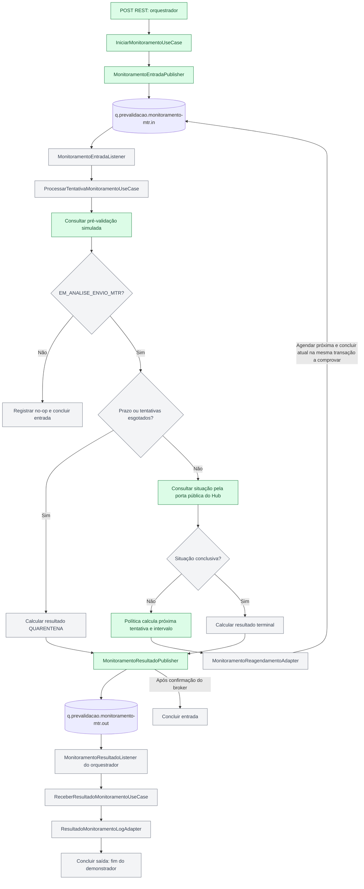

# Guia de desenvolvimento — orquestrador e monitoramento Service Bus

**Continuidade atual:** 6.1 implementado e 7.1-A concluída com publisher da saída.
Última suíte: 1.172 testes padrão em 184 classes; separadamente, seis testes de integração
explícita passaram. Após ContinuarAjustes e correção S5778 no teste, Sonar COMPLIANT:
cobertura 87,4%, duplicação 4,3%, nenhuma issue nova ou HIGH/BLOCKER/CRITICAL.
C2 aceito pelo usuário em 2026-09-09. 7.1 em andamento: publisher de resultado implementado;
caso de uso, classificação e listener ainda pendentes. Ver [continuidade de 7.1](continuidade-7-1.md).

## Roteiro para assumir a entrega

**Comece por este ponto: C2 aceito e 7.1-A concluída; próximo trabalho funcional: 7.1-B.**
O [pacote de commit](pacote-commit.md) descreve as alterações acumuladas desde a base de 4.1.
Sua atualização é uma preparação documental; o hash de entrega deverá ser o commit
efetivamente publicado, sem presumir push apenas pela existência deste guia.

1. Conferir a branch `feature/orquestrador-monitoramento-service-bus` e o hash recebido.
   No workspace atual, preservar todas as alterações locais e o baseline; em outro checkout,
   seguir [AGENTS.md](../../../AGENTS.md) para inicializar a própria sessão.
2. Ler o estado atual de [retomada](retomada.md), o escopo do [plano](plan.md) e a primeira
   pendência do [checklist](todo.md). Registros de pausas e checkpoints antigos são históricos.
3. Usar a seção [aplicação local e testes](#aplicação-local-e-testes-sem-broker) para escolher
   emulador ou filas Azure. `mvn test` continua sem broker, independentemente dessa escolha.
4. Percorrer a [política v1](#configuração-v1-já-implementada), o fluxo REST de 6.1 e o publisher
   da saída de 7.1-A. A mensagem inicial pode ser publicada, mas não será processada
   automaticamente pelos listeners ainda inativos.
5. Resolver as [definições pendentes](#pontos-a-fechar-antes-da-lógica-correspondente) e executar
   somente a próxima subfatia. Reutilizar o que está implementado e atualizar testes,
   inventário e documentação à medida que cada classe passar a funcionar.

| Marco | Uso da entrega |
|---|---|
| Atual — até 7.1-A | Revisar a implementação e reproduzir publicação inicial e publicação de resultado em provas separadas |
| Após 9.1 | Demonstrar o fluxo funcional, incluindo processamento, reagendamento e consumo/log do resultado, após verificar essas etapas |
| Após 10.1/C3 | Revisar correlação de telemetria e cenários integrados de confirmação, falha e redelivery |

## Decisões para navegar e implementar este código

O [guia Service Bus](../../../doc/guias/guia-service-bus-amqp-dossie.md) é a leitura principal
para a conversa entre desenvolvedores: explica a arquitetura no mesmo runtime, os contratos,
os dois fluxos de colaboração e as decisões aceitas. Este inventário permite localizar os arquivos.

| Decisão aplicada | Consequência ao implementar | Referência |
|---|---|---|
| Orquestrador e monitoramento são componentes do monólito modular | Regras ficam em seus componentes; Hub/dossie existentes permanecem preservados | [ADR-0010](../../../doc/adr/0010-extensao-quarkus-service-bus-connection-string-dev-services.md) |
| Hexagonal pragmática permite CDI/Quarkus/Mutiny no núcleo | Não criar wrappers para esconder o framework; SDK, handles e DTOs de borda continuam fora do núcleo | [ADR-0001](../../../doc/adr/0001-monolito-modular-e-hexagonal.md), [ADR-0011](../../../doc/adr/0011-composicao-local-monitoramento-e-fabrica-service-bus.md) |
| Cada borda possui contratos próprios | Compatibilidade por JSON, sem DTO compartilhado entre REST, produtor, consumidor ou Hub | [ADR-0004](../../../doc/adr/0004-contratos-independentes-por-borda.md) |
| Colaboração local usa porta e ACL | Consultar o Hub pela API pública e obter parâmetros do monitoramento sem importar implementação/configuração | [ADR-0003](../../../doc/adr/0003-orquestracao-e-colaboracao-por-portas.md), [ADR-0011](../../../doc/adr/0011-composicao-local-monitoramento-e-fabrica-service-bus.md) |
| Factory única cria os clientes da extensão | Implementada em 6.1 com qualifiers e shutdown; adapters não criam clientes por mensagem | [ADR-0011](../../../doc/adr/0011-composicao-local-monitoramento-e-fabrica-service-bus.md) |
| SAS externa, extensão 1.2.5 e Dev Services local | Preservar Quarkus 3.33.2.1/JDK 25, profiles e config.json; não introduzir Entra/SDK direto alternativo | [ADR-0010](../../../doc/adr/0010-extensao-quarkus-service-bus-connection-string-dev-services.md) |
| Infraestrutura de logging transporta campos já sanitizados | DTO, classificação, identidade e sanitização continuam na borda; Hub é delegado sem alteração | [ADR-0012](../../../doc/adr/0012-campos-json-tipados-logs-service-bus.md) |
| Settlement e telemetria são comportamento observável | Provar operação real e instrumentação do SDK antes de declarar atomicidade ou acrescentar spans | [ADR-0006](../../../doc/adr/0006-compatibilidade-observabilidade-e-testes.md), [ADR-0010](../../../doc/adr/0010-extensao-quarkus-service-bus-connection-string-dev-services.md) |

A política, os contratos/mappers, os erros tipados e os guardrails de 4.1 estão prontos.
O mock de pré-validação e a ACL do Hub foram concluídos em 5.1. Factory, Resource, parâmetros,
iniciação e publisher da entrada funcionam desde 6.1. O publisher de resultado está implementado
em 7.1-A. Listeners, processamento, reagendamento e log final continuam pendentes. O checklist mostra dependências e checkpoints.

## Objetivo e ponto de partida

O [guia Service Bus](../../../doc/guias/guia-service-bus-amqp-dossie.md) apresenta o fluxo e os
contratos vigentes. Este arquivo complementa o guia com inventário Java e roteiro manual.
O nome histórico do guia não autoriza mudança no package `br.gov.caixa.simtr.dossie`.

**Estado da continuidade:** as duas consultas são beans CDI funcionais, com 70 testes novos
e 100% das linhas/condições das seis classes implementadas. Reagendamento e resultado mantêm
seus contratos/mappers verificados. As etapas em RED da pausa são históricas; regressão e
checkpoint atuais estão no checklist.

Este guia permite discutir a arquitetura olhando os arquivos Java e continuar a implementação
sem reconstruir o histórico da conversa. A feature está na branch
`feature/orquestrador-monitoramento-service-bus`.

Leia primeiro [plan.md](plan.md) para escopo e decisões e [todo.md](todo.md) para andamento,
verificações e decisões humanas. Este guia orienta o trabalho; o checklist continua sendo a fonte
do progresso. A antecipação estrutural foi solicitada pelo usuário no C4.4.

A estrutura contém 11 portas (sete com implementação conectada), dois records de parâmetros
funcionais e oito classes pendentes, nos packages
definitivos. As classes pendentes estão marcadas com `@Vetoed` e descritas por Javadoc.
Os comentários `@see` permitem navegar até as dependências previstas na IDE. Essas referências
ainda não representam injeção, chamadas ou implementação das interfaces.

| Estado | O que significa |
|---|---|
| Implementado e verificado | Política, configuração/producer CDI, contratos REST e da fila de entrada, mappers e logs de erro dessas bordas, incluindo reagendamento e resultado, e as consultas de 5.1, publicação inicial de 6.1 e publisher da saída de 7.1-A já possuem implementação e testes |
| Implementação conectada | Consultas, parâmetros, iniciação e ambos os publishers resolvem por CDI; o processamento consumidor continua pendente |
| Interface declarada | A porta existe e usa tipos do próprio componente; ainda não possui implementação conectada |
| Parâmetros funcionais | Records independentes com `limiteEm` e `politicaMonitoramentoVersao`, calculados no monitoramento e traduzidos na ACL |
| Estrutura inativa | O arquivo reserva nome, package e responsabilidade; falta implementar campos ou métodos e os respectivos testes |
| Pendente no checklist | Ter um arquivo Java não conclui o item funcional; isso exige comportamento, testes, revisão e checkpoint |

Não usar os DTOs/modelos vazios como mensagens, instanciar esqueletos para simular sucesso nem
registrá-los como beans. As classes futuras não declaram `implements` ainda: adicionar a porta
correspondente junto da implementação funcional. Isso evita métodos fictícios ou hierarquias
abstratas temporárias. Os tipos vazios também não fixam um schema JSON.

## Arquitetura para a conversa com a equipe

O diagrama mostra o fluxo planejado completo. REST → iniciação → publicação na entrada,
consultas, política e publisher da saída estão implementados. As ligações pelo processamento
e listeners ainda não funcionam; no-op, settlement, reagendamento e log final estão pendentes.
Verde identifica componentes implementados; cinza identifica etapas futuras.



A fábrica `arquitetura.infraestrutura.servicebus.ClientesServiceBus` já fornece suporte técnico aos
adapters Service Bus. Ela não é um componente de negócio, um barramento genérico ou o destino de
toda lógica assíncrona.

| Componente | Responsabilidade | Dependências permitidas |
|---|---|---|
| `orquestrador.dominio` | Solicitação, identificadores e resultado próprio | Tipos do próprio domínio e suporte permitido pelo ADR-0001 |
| `orquestrador.aplicacao` | Iniciar e receber resultado | Domínio e portas próprios |
| `monitoramento.dominio` | Política, tentativa, prazo, situações e decisões | Tipos próprios e suporte permitido pelo ADR-0001 |
| `monitoramento.aplicacao` | Preparar parâmetros e coordenar processamento | Política, domínio e portas próprios |
| Adapters de entrada | Validar/mapear contrato e chamar porta de entrada | API do próprio componente; transporte apenas na borda |
| Adapters de saída | Implementar portas e traduzir integração | Porta/tipos do consumidor e API externa explicitamente permitida |
| ACL de parâmetros | Traduzir resultado do monitoramento | `PrepararMonitoramento` e seus tipos públicos, sem importar política/configuração |
| ACL do Hub | Traduzir identificador e situação mínima | `ConsultarDossieProduto` e tipos públicos referenciados, sem Resource/DTO MTR/caso de uso concreto |
| Infraestrutura Service Bus | Builder da extensão, clientes e lifecycle | SDK e suporte técnico; nenhum domínio ou componente de negócio |

Quarkus, CDI e Mutiny são permitidos no núcleo pela hexagonal pragmática. SDK Azure, DTO de
transporte, client, connection string e handles de settlement permanecem nas bordas.
Cada componente e borda conserva modelos/DTOs próprios, mesmo quando o JSON precisa ser compatível.

Referências: [arquitetura consolidada](../../../doc/arquitetura-distribuida/arquitetura-ddd-integracoes-atomicas.md),
[índice dos ADRs](../../../doc/adr/README.md),
[ADR-0003](../../../doc/adr/0003-orquestracao-e-colaboracao-por-portas.md),
[ADR-0004](../../../doc/adr/0004-contratos-independentes-por-borda.md),
[ADR-0011](../../../doc/adr/0011-composicao-local-monitoramento-e-fabrica-service-bus.md) e
[ADR-0012](../../../doc/adr/0012-campos-json-tipados-logs-service-bus.md).

## Plataforma e fluxo aprovados

A implementação usa a extensão Quarkus Azure Service Bus `1.2.5` com Quarkus `3.33.2.1`
e JDK 25. Ambientes reais usam `QUARKUS_AZURE_SERVICEBUS_CONNECTION_STRING` externa com SAS;
não implementar Entra ID. Dev Services fornece emulador/SQL e connection string local em dev
e nos testes de integração habilitados. Manter
`src/main/azure/servicebus-emulator/config.json` e os simuladores existentes.

O orquestrador escreve na entrada; o listener do monitoramento aciona a aplicação/política,
que decide no-op, resultado/quarentena na saída ou reagendamento na entrada. O orquestrador
consome a saída e conclui o demonstrador após o log. A preparação local de limite/versão do
ADR-0011 ocorre antes da primeira publicação e não substitui esse fluxo assíncrono.
Critérios, confirmação e contratos estão detalhados no guia Service Bus.
`dossie` e Hub permanecem preservados.

## Configuração v1 já implementada

A configuração pertence a `monitoramento` e está pronta desde 4.1.
Em [application.properties](../../../src/main/resources/application.properties):

```properties
monitoramento.politicas.ativa=padrao
monitoramento.politicas.definicoes.padrao.versao=v1
monitoramento.politicas.definicoes.padrao.tipo=progressiva
monitoramento.politicas.definicoes.padrao.intervalos=PT30M,PT3H,PT4H,PT6H
monitoramento.politicas.definicoes.padrao.duracao-maxima=PT24H
# monitoramento.politicas.definicoes.padrao.max-tentativas=5
```

`padrao` é o nome da definição selecionada; `v1` é sua versão. O máximo de tentativas
está comentado: o valor 5 é exemplo, não um limite ativo. A duração máxima de 24 horas
continua obrigatória. Os intervalos são de 30 minutos, 3 horas, 4 horas e 6 horas;
após a lista, repete-se o último intervalo. `DeliveryCount` não é tentativa funcional.

| Arquivo | Responsabilidade implementada |
|---|---|
| [PoliticasMonitoramentoConfig](../../../src/main/java/br/gov/caixa/simtr/monitoramento/adaptador/configuracao/PoliticasMonitoramentoConfig.java) | `ConfigMapping` lê seleção, definições, versão, tipo, lista de `Duration`, limite opcional e duração máxima |
| [PoliticaMonitoramentoProducer](../../../src/main/java/br/gov/caixa/simtr/monitoramento/adaptador/configuracao/PoliticaMonitoramentoProducer.java) | Valida todas as definições no bootstrap e fornece a política selecionada por CDI |
| [PoliticaMonitoramentoProgressiva](../../../src/main/java/br/gov/caixa/simtr/monitoramento/dominio/politica/PoliticaMonitoramentoProgressiva.java) | Calcula limite inicial e decisão de encerrar ou próxima tentativa/intervalo |
| [PrepararMonitoramentoUseCase](../../../src/main/java/br/gov/caixa/simtr/monitoramento/aplicacao/casodeuso/PrepararMonitoramentoUseCase.java) | Usa a política para devolver limite e versão à composição inicial do orquestrador |

Não é necessário recriar essas propriedades ou o objeto de configuração em 7.1.
A seleção atual é por nome da definição; ainda não existe resolução de política por
versão da mensagem. O tratamento dessa divergência está pendente. Calcular o intervalo
também não agenda uma mensagem: a operação transacional no broker pertence a 8.1.

## Inventário da estrutura antecipada

Todos os caminhos abaixo apontam para arquivos Java. A coluna final indica onde os campos,
a lógica ou a conexão deverão ser implementados. O Javadoc de cada classe informa sua função.

| Arquivo | Package após `br.gov.caixa.simtr` | Estado | Item funcional |
|---|---|---|---|
| [ParametrosMonitoramento](../../../src/main/java/br/gov/caixa/simtr/orquestrador/dominio/modelo/ParametrosMonitoramento.java) | `orquestrador.dominio.modelo` | Parâmetros funcionais | 6.1 |
| [ResultadoMonitoramento](../../../src/main/java/br/gov/caixa/simtr/orquestrador/dominio/modelo/ResultadoMonitoramento.java) | `orquestrador.dominio.modelo` | Implementado e verificado; regra de quarentena/conclusivo confirmada | 4.1 |
| [ParametrosMonitoramento](../../../src/main/java/br/gov/caixa/simtr/monitoramento/dominio/modelo/ParametrosMonitoramento.java) | `monitoramento.dominio.modelo` | Parâmetros funcionais | 6.1 |
| [ResultadoMonitoramento](../../../src/main/java/br/gov/caixa/simtr/monitoramento/dominio/modelo/ResultadoMonitoramento.java) | `monitoramento.dominio.modelo` | Implementado e verificado; regra de quarentena/conclusivo confirmada | 4.1 |
| [PreValidacaoConsultada](../../../src/main/java/br/gov/caixa/simtr/monitoramento/dominio/modelo/PreValidacaoConsultada.java) | `monitoramento.dominio.modelo` | Implementado e verificado | 5.1 |
| [SituacaoDossieConsultada](../../../src/main/java/br/gov/caixa/simtr/monitoramento/dominio/modelo/SituacaoDossieConsultada.java) | `monitoramento.dominio.modelo` | Implementado e verificado | 5.1 |
| [DecisaoProcessamento](../../../src/main/java/br/gov/caixa/simtr/monitoramento/dominio/modelo/DecisaoProcessamento.java) | `monitoramento.dominio.modelo` | Estrutura inativa | 7.1/8.1 |
| [ReagendamentoMonitoramento](../../../src/main/java/br/gov/caixa/simtr/monitoramento/dominio/modelo/ReagendamentoMonitoramento.java) | `monitoramento.dominio.modelo` | Estrutura inativa | 8.1 |
| [IniciarMonitoramento](../../../src/main/java/br/gov/caixa/simtr/orquestrador/aplicacao/porta/entrada/IniciarMonitoramento.java) | `orquestrador.aplicacao.porta.entrada` | Implementação conectada | 6.1 |
| [ReceberResultadoMonitoramento](../../../src/main/java/br/gov/caixa/simtr/orquestrador/aplicacao/porta/entrada/ReceberResultadoMonitoramento.java) | `orquestrador.aplicacao.porta.entrada` | Interface declarada | 9.1 |
| [ObterParametrosMonitoramento](../../../src/main/java/br/gov/caixa/simtr/orquestrador/aplicacao/porta/saida/ObterParametrosMonitoramento.java) | `orquestrador.aplicacao.porta.saida` | Implementação conectada | 6.1 |
| [PublicarTentativaMonitoramento](../../../src/main/java/br/gov/caixa/simtr/orquestrador/aplicacao/porta/saida/PublicarTentativaMonitoramento.java) | `orquestrador.aplicacao.porta.saida` | Implementação conectada | 6.1 |
| [RegistrarResultadoMonitoramento](../../../src/main/java/br/gov/caixa/simtr/orquestrador/aplicacao/porta/saida/RegistrarResultadoMonitoramento.java) | `orquestrador.aplicacao.porta.saida` | Interface declarada | 9.1 |
| [PrepararMonitoramento](../../../src/main/java/br/gov/caixa/simtr/monitoramento/aplicacao/porta/entrada/PrepararMonitoramento.java) | `monitoramento.aplicacao.porta.entrada` | Implementação conectada | 6.1 |
| [ProcessarTentativaMonitoramento](../../../src/main/java/br/gov/caixa/simtr/monitoramento/aplicacao/porta/entrada/ProcessarTentativaMonitoramento.java) | `monitoramento.aplicacao.porta.entrada` | Interface declarada | 7.1/8.1 |
| [ConsultarPreValidacao](../../../src/main/java/br/gov/caixa/simtr/monitoramento/aplicacao/porta/saida/ConsultarPreValidacao.java) | `monitoramento.aplicacao.porta.saida` | Implementação conectada | 5.1 |
| [ConsultarSituacaoDossie](../../../src/main/java/br/gov/caixa/simtr/monitoramento/aplicacao/porta/saida/ConsultarSituacaoDossie.java) | `monitoramento.aplicacao.porta.saida` | Implementação conectada | 5.1 |
| [PublicarResultadoMonitoramento](../../../src/main/java/br/gov/caixa/simtr/monitoramento/aplicacao/porta/saida/PublicarResultadoMonitoramento.java) | `monitoramento.aplicacao.porta.saida` | Implementação conectada por CDI | 7.1-A |
| [ReagendarTentativaMonitoramento](../../../src/main/java/br/gov/caixa/simtr/monitoramento/aplicacao/porta/saida/ReagendarTentativaMonitoramento.java) | `monitoramento.aplicacao.porta.saida` | Interface declarada | 8.1 |
| [IniciarMonitoramentoUseCase](../../../src/main/java/br/gov/caixa/simtr/orquestrador/aplicacao/casodeuso/IniciarMonitoramentoUseCase.java) | `orquestrador.aplicacao.casodeuso` | Implementado e verificado | 6.1 |
| [ReceberResultadoMonitoramentoUseCase](../../../src/main/java/br/gov/caixa/simtr/orquestrador/aplicacao/casodeuso/ReceberResultadoMonitoramentoUseCase.java) | `orquestrador.aplicacao.casodeuso` | Estrutura inativa | 9.1 |
| [MonitoramentoDossieResource](../../../src/main/java/br/gov/caixa/simtr/orquestrador/adaptador/entrada/rest/v1/MonitoramentoDossieResource.java) | `orquestrador.adaptador.entrada.rest.v1` | Implementado e verificado | 6.1 |
| [MonitoramentoResultadoListener](../../../src/main/java/br/gov/caixa/simtr/orquestrador/adaptador/entrada/servicebus/MonitoramentoResultadoListener.java) | `orquestrador.adaptador.entrada.servicebus` | Estrutura inativa | 9.1 |
| [MonitoramentoEntradaPublisher](../../../src/main/java/br/gov/caixa/simtr/orquestrador/adaptador/saida/servicebus/MonitoramentoEntradaPublisher.java) | `orquestrador.adaptador.saida.servicebus` | Implementado e verificado | 6.1 |
| [ResultadoMonitoramentoLogAdapter](../../../src/main/java/br/gov/caixa/simtr/orquestrador/adaptador/saida/log/ResultadoMonitoramentoLogAdapter.java) | `orquestrador.adaptador.saida.log` | Estrutura inativa | 9.1 |
| [ParametrosMonitoramentoAcl](../../../src/main/java/br/gov/caixa/simtr/orquestrador/adaptador/saida/acl/monitoramento/ParametrosMonitoramentoAcl.java) | `orquestrador.adaptador.saida.acl.monitoramento` | Implementado e verificado | 6.1 |
| [PrepararMonitoramentoUseCase](../../../src/main/java/br/gov/caixa/simtr/monitoramento/aplicacao/casodeuso/PrepararMonitoramentoUseCase.java) | `monitoramento.aplicacao.casodeuso` | Implementado e verificado | 6.1 |
| [ProcessarTentativaMonitoramentoUseCase](../../../src/main/java/br/gov/caixa/simtr/monitoramento/aplicacao/casodeuso/ProcessarTentativaMonitoramentoUseCase.java) | `monitoramento.aplicacao.casodeuso` | Estrutura inativa | 7.1/8.1 |
| [MonitoramentoEntradaListener](../../../src/main/java/br/gov/caixa/simtr/monitoramento/adaptador/entrada/servicebus/MonitoramentoEntradaListener.java) | `monitoramento.adaptador.entrada.servicebus` | Estrutura inativa | 7.1/8.1 |
| [PreValidacaoSimuladaAdapter](../../../src/main/java/br/gov/caixa/simtr/monitoramento/adaptador/saida/simulador/prevalidacao/PreValidacaoSimuladaAdapter.java) | `monitoramento.adaptador.saida.simulador.prevalidacao` | Implementado e verificado | 5.1 |
| [PreValidacaoSimuladaDto](../../../src/main/java/br/gov/caixa/simtr/monitoramento/adaptador/saida/simulador/prevalidacao/dto/PreValidacaoSimuladaDto.java) | `monitoramento.adaptador.saida.simulador.prevalidacao.dto` | Implementado e verificado; exclusivo da borda | 5.1 |
| [PreValidacaoSimuladaMapper](../../../src/main/java/br/gov/caixa/simtr/monitoramento/adaptador/saida/simulador/prevalidacao/PreValidacaoSimuladaMapper.java) | `monitoramento.adaptador.saida.simulador.prevalidacao` | Implementado e verificado; situação original e origem simulada | 5.1 |
| [SituacaoDossieHubAcl](../../../src/main/java/br/gov/caixa/simtr/monitoramento/adaptador/saida/acl/simtrhub/SituacaoDossieHubAcl.java) | `monitoramento.adaptador.saida.acl.simtrhub` | Implementado e verificado | 5.1 |
| [MonitoramentoResultadoPublisher](../../../src/main/java/br/gov/caixa/simtr/monitoramento/adaptador/saida/servicebus/MonitoramentoResultadoPublisher.java) | `monitoramento.adaptador.saida.servicebus` | Implementado; confirmação, falhas e integração verificadas | 7.1-A |
| [MonitoramentoReagendamentoAdapter](../../../src/main/java/br/gov/caixa/simtr/monitoramento/adaptador/saida/servicebus/MonitoramentoReagendamentoAdapter.java) | `monitoramento.adaptador.saida.servicebus` | Estrutura inativa | 8.1 |
| [ClientesServiceBus](../../../src/main/java/br/gov/caixa/simtr/arquitetura/infraestrutura/servicebus/ClientesServiceBus.java) | `arquitetura.infraestrutura.servicebus` | Implementado e verificado | 6.1 |
| [MonitorarDossieMtrV1](../../../src/main/java/br/gov/caixa/simtr/monitoramento/adaptador/saida/servicebus/dto/MonitorarDossieMtrV1.java) | `monitoramento.adaptador.saida.servicebus.dto` | Implementado; testes de reagendamento em GREEN | 4.1 |
| [MonitoramentoReagendamentoServiceBusMapper](../../../src/main/java/br/gov/caixa/simtr/monitoramento/adaptador/saida/servicebus/MonitoramentoReagendamentoServiceBusMapper.java) | `monitoramento.adaptador.saida.servicebus` | Implementado; testes de reagendamento em GREEN | 4.1 |
| [ResultadoMonitoramentoDossieMtrV1](../../../src/main/java/br/gov/caixa/simtr/monitoramento/adaptador/saida/servicebus/dto/ResultadoMonitoramentoDossieMtrV1.java) | `monitoramento.adaptador.saida.servicebus.dto` | Implementado e verificado; regra de quarentena/conclusivo confirmada | 4.1 |
| [MonitoramentoResultadoServiceBusMapper](../../../src/main/java/br/gov/caixa/simtr/monitoramento/adaptador/saida/servicebus/MonitoramentoResultadoServiceBusMapper.java) | `monitoramento.adaptador.saida.servicebus` | Implementado e verificado; regra de quarentena/conclusivo confirmada | 4.1 |
| [ResultadoMonitoramentoDossieMtrV1](../../../src/main/java/br/gov/caixa/simtr/orquestrador/adaptador/entrada/servicebus/dto/ResultadoMonitoramentoDossieMtrV1.java) | `orquestrador.adaptador.entrada.servicebus.dto` | Implementado e verificado; regra de quarentena/conclusivo confirmada | 4.1 |
| [MonitoramentoResultadoServiceBusMapper](../../../src/main/java/br/gov/caixa/simtr/orquestrador/adaptador/entrada/servicebus/MonitoramentoResultadoServiceBusMapper.java) | `orquestrador.adaptador.entrada.servicebus` | Implementado e verificado; regra de quarentena/conclusivo confirmada | 4.1 |

Os mappers, DTOs de entrada, política e configuração anteriores a C4.4 permanecem implementados.
Não substituí-los por esqueletos. Os futuros listeners/publishers devem usar o padrão de erro das bordas
já verificado em 4.1, com testes do JSON emitido.

Qualifiers implementados: [FilaEntrada](../../../src/main/java/br/gov/caixa/simtr/arquitetura/infraestrutura/servicebus/FilaEntrada.java)
e [FilaSaida](../../../src/main/java/br/gov/caixa/simtr/arquitetura/infraestrutura/servicebus/FilaSaida.java).
O [ErroInicioMonitoramentoDto](../../../src/main/java/br/gov/caixa/simtr/orquestrador/adaptador/entrada/rest/v1/dto/ErroInicioMonitoramentoDto.java)
pertence exclusivamente à borda REST e mantém o formato de erro existente sem importar o Hub.

## Ordem de continuidade

| Passo | Trabalho | Evidência para avançar |
|---|---|---|
| 4.1-E1 | Estrutura Java, portas e proteção de inatividade | Compilação, ArchUnit, CDI, regressão e checkpoint do incremento |
| 4.1-E2 | Conferir este guia e o manifesto do pacote de commit | Links, inventário e estado alinhados ao código/checklist |
| 4.1 — reagendamento | DTO/mapper implementados na saída do monitoramento, sem agendar | JSON/AMQP compatível com a entrada; valores iniciais preservados; erro JSON |
| 4.1 — resultado | Modelos, DTOs/mappers, logs e validação confirmada implementados | 120 testes de contrato, 14 de logs; JSON e quarentena null/zero verificados |
| 4.1 — guardrails | Isolamento de bordas e acesso público pelas ACLs implementados | 19 testes de fronteira após inclusão da borda do simulador em 5.1; provas positivas/negativas e regressão estrutural aprovadas |
| 5.1 — concluído | Consulta simulada da pré-validação e ACL do Hub | 70 testes novos, tradução mínima, cenários controlados, CDI e guardrails |
| 6.1 — implementado | Parâmetros locais, fábrica, POST, caso de uso e publisher | `202` após confirmação, contrato REST, erros, testes sem broker e integração explícita aprovados |
| **C2 — aceito em 2026-09-09** | Revisão humana da publicação inicial e correção C2-R1 | Aceite explícito do usuário; próximo item funcional: 7.1 |
| 7.1-A — concluída | Publisher de resultado pela porta CDI | Confirmação, falhas, testes sem broker e integração explícita; checkpoint COMPLIANT |
| **7.1-B — próximo trabalho** | Decisão/caso de uso terminal e ajuste das situações originais | Definições de códigos/versão registradas; regressão de no-op, limites, classificação e compatibilidade das duas bordas |
| 7.1-C — pendente | Listener, settlement e lifecycle | Publicação antes de Complete, falhas sem segundo settlement e encerramento antes da fábrica; ramo não conclusivo explicitado antes da ativação |
| 7.1-D — pendente | Integração do processamento terminal | Fluxo terminal real, regressão sem broker, revisão, Sonar e documentação |
| 8.1 | Reagendamento transacional | Commit/rollback, redelivery e preservação da tentativa funcional |
| 9.1 | Listener de resultado e registro | Log aprovado, Complete/Abandon/DLQ conforme resultado real |
| 10.1/C3 | Correlação e fluxo ponta a ponta | Propagação, spans e emulador, com limites registrados |
| 11.1–CF | Consolidação e revisão final | Suíte, Sonar, documentação, revisão e encerramento humano |

O [manifesto](pacote-commit.md) descreve o pacote proposto até 7.1-A, com as alterações
acumuladas de 5.1/6.1/C2-R1. A [evidência de 6.1](continuidade-6-1.md) e a
[revisão C2](revisao-c2.md) fundamentam o aceite já registrado. A
[continuidade de 7.1](continuidade-7-1.md) identifica a próxima subfatia: 7.1-B.
A atualização dos documentos não executa publicação Git nem conclui 7.1-B/C/D.
O [roteiro principal](../../../doc/guias/guia-service-bus-amqp-dossie.md#ponto-de-partida-para-o-desenvolvedor)
detalha a sequência de processamento, as dependências de negócio e as verificações para 7.1.

## Como ler e manter o Javadoc

O Javadoc dos tipos antecipados diferencia o estado atual da implementação esperada. Nas classes
inativas, descreve responsabilidade, item funcional, dependências permitidas e cenários a testar.
Nos métodos das portas, `@param` identifica a entrada e `@return` explica a conclusão esperada,
incluindo confirmação/falha nas operações assíncronas. `@see` e `{@link ...}` ligam tipos.

Exemplos para abrir na IDE:
[IniciarMonitoramento](../../../src/main/java/br/gov/caixa/simtr/orquestrador/aplicacao/porta/entrada/IniciarMonitoramento.java)
e [MonitoramentoReagendamentoAdapter](../../../src/main/java/br/gov/caixa/simtr/monitoramento/adaptador/saida/servicebus/MonitoramentoReagendamentoAdapter.java).

As classes vazias ainda não possuem métodos declarados para documentar: sua orientação fica no
Javadoc da classe. Não criar métodos fictícios, construtores vazios explícitos ou exceções
contratuais apenas para preencher a documentação. Ao implementar a fatia, documentar métodos e
construtores reais e atualizar o texto que identificava a pendência. Usar `@throws` somente para
exceções efetivamente previstas pelo contrato; falha emitida por `Uni` deve ser explicada no
retorno/comportamento, sem inventar declaração checked.

Seguir a [especificação Javadoc do JDK 25](https://docs.oracle.com/en/java/javase/25/docs/specs/javadoc/doc-comment-spec.html):
descrição antes dos block tags, nomes de parâmetros iguais aos da assinatura e referências Java
resolvíveis. Não usar tags personalizadas sem suporte configurado.

O complemento de comentários foi conferido com DocLint e saída temporária, sem HTML: nenhum erro;
27 avisos apenas de construtores implícitos sem comentário. Esses construtores foram preservados,
e deverão ser documentados quando forem explicitamente necessários na implementação.
A comparação antes/depois confirmou preservação de todo conteúdo Java fora dos Javadocs.
Nesta edição exclusivamente documental, não houve Maven, baseline, API ou checkpoint Sonar;
a evidência de 859 testes refere-se à estrutura antes desse complemento.

## Como implementar uma classe pendente

1. Conferir o próximo item do `todo.md`, os critérios do `plan.md` e os ADRs aplicáveis.
   Registrar qualquer alteração de contrato, responsabilidade, segurança ou observabilidade antes
   do código, com o checkpoint humano exigido por [AGENTS.md](../../../AGENTS.md).
2. Selecionar uma fatia pequena, com arquivos e comportamento concretos. Não preencher todos os
   esqueletos de uma camada em uma única alteração.
3. Definir cenários e testes de regressão do comportamento que falta. Nesta feature, a orientação
   humana prioriza implementação e cobertura sem exigir uma ordem rígida de TDD.
4. Completar os tipos/DTOs apenas na sua borda. Para casos de uso e adapters de saída, implementar
   a interface indicada no Javadoc. Usar injeção pelas portas; não pelo caso de uso concreto.
5. Implementar o mínimo necessário. Manter SDK/serialização/settlement nos adapters, sem bloqueio
   do event loop. A fábrica usa exclusivamente o builder fornecido pela extensão.
6. Retirar `@Vetoed` somente da classe cuja ativação faz parte da fatia. Aplicar CDI/REST/observer
   somente quando o fluxo correspondente estiver pronto e autorizado. Modelos e DTOs não precisam
   tornar-se beans.
7. Atualizar o Javadoc para descrever o estado implementado. Retirar a classe do inventário
   temporário `EstruturaPlanejada.ESQUELETOS` no mesmo incremento, substituindo sua prova de
   inatividade por teste do comportamento/injeção real. Não apagar a proteção dos demais.
8. Executar testes focados, revisar o diff e concluir o checkpoint coerente. Atualizar o checklist,
   este inventário e o consolidado quando o estado implementado mudar.

`@Vetoed` impede que beans e observers da classe sejam instalados pelo CDI; não é controle de
autorização e não impede instanciação manual. Por isso os esqueletos também não têm métodos de
execução nem anotações REST, e o teste verifica sua ausência no CDI.
Fonte: [Jakarta CDI — Vetoed](https://jakarta.ee/specifications/cdi/4.1/apidocs/jakarta/enterprise/inject/vetoed).

## Contratos e tratamento de erros a preservar

- `idDossieMtr` continua string decimal positiva no intervalo de `Long`, com zeros à esquerda
  preservados. A conversão para o identificador do Hub está implementada na ACL de 5.1.
- Reagendamento conserva `iniciadoEm`, `limiteEm` e versão da política; não recalcular a janela.
- Não reutilizar DTO REST, MTR, simulador ou DTO Java do outro componente para reduzir duplicação.
  A compatibilidade deve ser provada pelo JSON produzido/consumido.
- A falha de contrato/serialização deve produzir o log JSON aprovado, com diagnóstico sanitizado,
  código estável e mesmo id/código propagado pela exceção. O produtor mantém RuntimeException.
- As bordas futuras devem seguir o padrão das bordas de entrada existentes. Não introduzir
  `catch` que engole a falha nem emissão duplicada do mesmo erro em todas as camadas.
- Registro para ação posterior continua sendo log. Persistência, ação automática, Outbox e
  generalização dos erros/logs do Hub permanecem fora do recorte.

## Pontos a fechar antes da lógica correspondente

**Resultado e guardrails de 4.1 já estão concluídos.** Os modelos, DTOs e mappers de resultado
estão implementados, incluindo a validação de quarentena/conclusivo.
[FronteirasMonitoramentoArchUnitTest](../../../src/test/java/br/gov/caixa/simtr/arquitetura/guardrails/FronteirasMonitoramentoArchUnitTest.java)
já verifica acesso das ACLs somente às portas/modelos públicos, isolamento dos DTOs por borda
e direção das dependências, com provas positivas e negativas. Preservar essas regras e
verificá-las sobre as implementações funcionais introduzidas nas próximas fatias.

1. **Classificação em 7.1-B:** aplicar a direção humana registrada abaixo, preservando
   `situacaoMtr` e calculando `situacaoPreValidacao` em campo separado. Fechar as grafias
   pendentes e ajustar a validação das duas bordas com regressão. A ACL já preserva id/nome;
   a fixture `1 / Rascunho` não fornece IDs para os estados conclusivos.
2. **Lifecycle ao conectar listeners:** a factory de 6.1 já cria/fecha quatro clientes por
   qualifiers, com limpeza de falha parcial e fechamento idempotente. Provar que os listeners
   cancelam assinaturas antes do observer `PLATFORM_AFTER` que fecha os clientes.
3. **Versão de política em 7.1/8.1:** definir como tratar mensagem antiga com versão diferente
   da política selecionada. O ADR-0011 proíbe substituição silenciosa.
4. **Decisão e transação em 7.1/8.1:** detalhar o conteúdo de `DecisaoProcessamento` e
   `ReagendamentoMonitoramento` e a associação entre agendamento e settlement da mesma entrega.
   As assinaturas estruturais orientam a discussão; não resolvem essa coordenação. Não expor
   contexto/handles Azure nas portas nem armazenar contexto mutável de entrega em um singleton.
   Provar `schedule + Complete`, rollback e redelivery no SDK/emulador antes de afirmar atomicidade.
5. **Telemetria em 10.1:** caracterizar a instrumentação efetiva do SDK, revisar os nomes
   observáveis planejados e preencher apenas lacunas de propagação/spans, conforme o guia principal.

### Situações informadas e diferença para o contrato atual

Direção literal do usuário em 2026-09-09:

| Situação original informada pelo Hub | Situação de pré-validação a calcular |
|---|---|
| `FINALIZADO_CONFORME` | `CONFORME` |
| `FINALIZADO_INCONFORME` | `INCONFORME` |
| `PENDENTE_INFORMACA` | `INCONFORME` |

A situação MTR recebida deve ser preservada. O [plano](plan.md#direção-humana-para-situações-do-hub--2026-09-09)
registra as confirmações ainda pendentes de `INCONFORME` versus `NAO_CONFORME` e
`PENDENTE_INFORMACA` versus `PENDENTE_INFORMACAO`; não corrigir grafias por suposição.

Hoje, os DTOs de resultado das duas bordas aceitam em CONCLUSIVO apenas `CONFORME`,
`NAO_CONFORME` e `PENDENTE_INFORMACAO` no campo `situacaoMtr`. Os testes de 7.1-A
provam publicação usando esse contrato atual, sem implementar a nova classificação.
O Javadoc dos esqueletos também contém os nomes anteriores. Ajustar esses trechos,
a validação e as provas de compatibilidade na fatia 7.1-B, após fechar as definições.

Para versão de política divergente, as alternativas apresentadas foram usar a definição
da versão recebida quando disponível, com quarentena se ausente, ou quarentena em toda
divergência. Nenhuma foi escolhida; o producer atual não implementa esse tratamento.
A recomendação de manter o consumo geral inativo até haver reagendamento seguro é uma
proposta registrada na [continuidade](continuidade-7-1.md), não uma ativação já implementada.
Detalhar o ramo não conclusivo antes de conectar o listener; Abandon repetido não equivale
ao reagendamento funcional de 8.1.

## Aplicação local e testes sem broker

A escolha local segue o [guia principal](../../../doc/guias/guia-service-bus-amqp-dossie.md#escolha-local-do-desenvolvedor-e-execução-dos-testes):

| Uso | Comando |
|---|---|
| Testes padrão, sem emulador nem fila Azure | `mvn test` |
| Somente integração explícita com emulador | `mvn -Pservicebus-integration test` |
| Aplicação local no emulador | `mvn quarkus:dev` |
| Aplicação local nas filas Azure configuradas | `mvn quarkus:dev "-Dquarkus.profile=dev,azure"` |

Emulador exige Docker e sessão sem connection string/namespace externo. Para Azure, fornecer
externamente `QUARKUS_AZURE_SERVICEBUS_CONNECTION_STRING`, `SERVICE_BUS_INPUT_QUEUE` e
`SERVICE_BUS_OUTPUT_QUEUE`; Dev Services fica desabilitado, com `AMQP_WEB_SOCKETS`.
Credenciais nunca entram nos argumentos, arquivos ou logs. O uso de Azure real não foi testado
nesta entrega; os seis casos de integração, em três classes, usam exclusivamente o emulador.

Surefire exclui a tag `servicebus-integration` por padrão; o profile Maven seleciona apenas
essa tag. Testes locais usam mocks/stubs, mesmo quando usam `@QuarkusTest` para CDI/cobertura.
A extensão e Dev Services permanecem desabilitados na configuração comum de testes.
O profile de integração fixa `test` e verifica as fontes efetivas do Quarkus antes do bootstrap,
incluindo arquivos e `%test`. Conexão/namespace presentes são rejeitados sem expandir expressões;
falha de leitura impede a execução com erro fixo sem causa. A correção C2-R1 possui 11 testes
puros, sem iniciar Quarkus ou broker. O checkpoint Sonar verifica a suíte padrão; a integração
tem evidência separada. Ver [revisão e correção C2](revisao-c2.md).

## Publicação inicial implementada em 6.1

O Resource valida o request e chama somente `IniciarMonitoramento`. Na assinatura do `Uni`,
o caso de uso gera UUIDs/instante, obtém limite/versão pela ACL e monta tentativa 1. O publisher
usa o mapper existente e o sender qualificado da entrada. O `202` depende da confirmação;
falha retorna `500/ARVDOCP9999` com mensagem genérica e DTO próprio, sem causa do broker.
Validação mantém `400/ARVDOCP0001`; nenhuma validação ou capacidade do Hub foi alterada.

O mesmo `Uni` compartilha IDs/confirmação entre assinantes, sem novo envio. Uma nova requisição
é uma nova iniciação; não há idempotência durável entre requisições nem Outbox.
Só a fábrica depende da flag de ativação da extensão. Sem cliente disponível, o Resource
continua registrado e a publicação falha explicitamente; não simula sucesso.
Logs/spans manuais e caracterização da telemetria automática permanecem na Task 10.

## Publicação de resultado implementada em 7.1-A

[MonitoramentoResultadoPublisher](../../../src/main/java/br/gov/caixa/simtr/monitoramento/adaptador/saida/servicebus/MonitoramentoResultadoPublisher.java)
implementa `PublicarResultadoMonitoramento` por CDI. Reutiliza seu mapper e o sender
compartilhado `FilaSaida`; conclui após confirmação do broker. O `Uni` é preguiçoso e
compartilha um envio por invocação; invocações independentes podem publicar novamente.
Falhas do SDK são sanitizadas e a falha própria do mapper é preservada.

O caso de uso de processamento ainda não chama essa porta. A prova no emulador publica
resultados conclusivo/quarentena construídos pelo teste e lê pelo contrato independente do
orquestrador. Ela não demonstra listener de negócio, classificação nem atomicidade entre
publicar a saída e concluir a entrada.

Para reproduzir as verificações sem broker de política/configuração e publisher:

```powershell
mvn -q "-Dtest=PoliticaMonitoramentoProgressivaTest,PoliticasMonitoramentoConfigTest,PoliticaMonitoramentoProducerTest" test
mvn -q "-Dtest=MonitoramentoResultadoPublisherTest,PublicarResultadoMonitoramentoQuarkusTest,ResultadoMonitoramentoContratoTest" test
```

Para a prova com broker, usar o profile de integração da seção anterior. O fechamento da
última execução está na [continuidade de 7.1](continuidade-7-1.md): 1.172 testes padrão,
seis integrações separadas e Sonar COMPLIANT. Não interpretar esses números como uma
nova medição após futuras alterações.

## Verificação e acompanhamento

Stack preservado: Quarkus `3.33.2.1`, JDK 25, extensão Azure Services `1.2.5`, SDK Service Bus
`7.17.12` e ArchUnit `1.4.2`. A versão efetiva está no `pom.xml`/árvore já registrada no plano;
não atualizar dependências junto da estrutura.
Consultar a [entrada Quarkus Azure Services](https://docs.quarkiverse.io/quarkus-azure-services/dev/index.html)
e a [guia Service Bus](https://docs.quarkiverse.io/quarkus-azure-services/dev/quarkus-azure-servicebus.html)
e confrontar exemplos com a versão efetiva. A guia `dev` pode evoluir.

As consultas concluídas seguem o [C5.1 aprovado](preparacao-consultas-5-1.md): modelo da
pré-validação com situação não vazia e origem; modelo do Hub com id/nome originais, sem
classificação. O mock possui DTO/mapper próprios e só responde com a flag
`monitoramento.simulador.prevalidacao.habilitado=true`; o padrão é `false`. Os cenários
`pre-em-analise`, `pre-conforme` e `pre-nao-conforme` são determinísticos.
Ausência, desativação e entrada inválida falham no `Uni`; falhas do Hub são propagadas,
sem retry ou log novo. O [guia principal](../../../doc/guias/guia-service-bus-amqp-dossie.md#consultas-implementadas-em-51)
explicita os modelos, respostas e ativação local.

Para verificar os 70 casos de consulta:

```powershell
mvn -q "-Dtest=PreValidacaoSimuladaMapperTest,PreValidacaoSimuladaAdapterTest,SituacaoDossieHubAclTest,ConsultasMonitoramentoQuarkusTest,PreValidacaoHabilitadaQuarkusTest" test
```

Esses testes usam `@QuarkusTest` para que o `quarkus-jacoco` existente meça também os caminhos
de erro. A ativação do mock fica restrita ao profile específico. Nenhum plugin, exclusão de
cobertura ou dependência foi acrescentado. A limitação da instrumentação automática está na
[guia oficial de cobertura](https://quarkus.io/guides/tests-with-coverage/#coverage-for-tests-not-using-quarkustest).

Na raiz do repositório, os comandos abaixo verificam a estrutura. Contratos/mappers e
consultas possuem API exercitada pelos testes; oito tipos continuam no inventário de esqueletos:

```powershell
mvn -q compile
mvn -q "-Dtest=EstruturaMonitoramentoArchUnitTest,FronteirasMonitoramentoArchUnitTest,EsqueletosMonitoramentoCdiTest,ArchUnitProgressivoTest" test
```

Para uma fatia funcional, selecionar os testes pertinentes ao comportamento alterado. Depois de um
incremento coerente que mude o fingerprint executável:

```powershell
.\validar-checkpoint-sonarqube.ps1
```

O checkpoint executa a verificação completa. Não repetir Maven completo após ele sem mudança ou
falha que justifique. Preservar o baseline existente; não executar `-InitializeBaseline` nesta
retomada. Nunca copiar token para chat, argumentos, arquivos ou logs. Seguir o launcher e o fluxo
de credencial em memória de `AGENTS.md`. Indisponibilidade não equivale a aprovação.

Em `NON_COMPLIANT`, registrar as issues e métricas e obter decisão humana conforme o processo.
Somente a decisão efetivamente dada pelo usuário deve ser registrada pelo script. Os números
anteriores de testes/cobertura estão no `todo.md`; não tratá-los como medição após uma nova edição.

A cada entrega, registrar no checklist: arquivos, requisito atendido, cenários de regressão, testes focados,
checkpoint/fingerprint, riscos remanescentes e próximo item. Manter a distinção entre arquivo
criado, contrato implementado, integração ligada e fluxo verificado.

## Preservação do workspace e conversa com a equipe

Preservar todas as alterações rastreadas e não rastreadas. Não usar `git reset`, `git clean` nem
trocar branch descartando mudanças. O package `dossie`, o Hub, seus logs/erros, extensão, simuladores e
`src/main/azure/servicebus-emulator/config.json` permanecem preservados.

Para a reunião: percorrer o diagrama, abrir as portas e as classes pelos links do inventário,
revisar os cinco pontos pendentes acima e distribuir as próximas fatias pelo checklist.
Não apresentar a estrutura como processamento Service Bus já disponível.

## Referência histórica da revisão do guia Service Bus e orientação Java

O guia técnico principal foi alinhado às decisões vigentes de fluxo, packages, connection
string/SAS, extensão e Dev Services. Nas onze portas, o Javadoc agora descreve o comportamento
de cada método, sua conclusão e falha; foram corrigidos os trechos `undefined`.
Nove classes do fluxo receberam a posição exata nas duas filas, critérios e responsabilidades.
Naquela revisão, a sintaxe foi conferida com DocLint (sem erros; nove avisos de construtores
implícitos), sem alteração fora dos comentários. O RED de reagendamento pertencia à pausa
daquele momento e foi superado pela implementação. O estado vigente inclui 6.1 e 7.1-A implementados, com C2 aceito; a evidência executável e o histórico completo estão no checklist.
