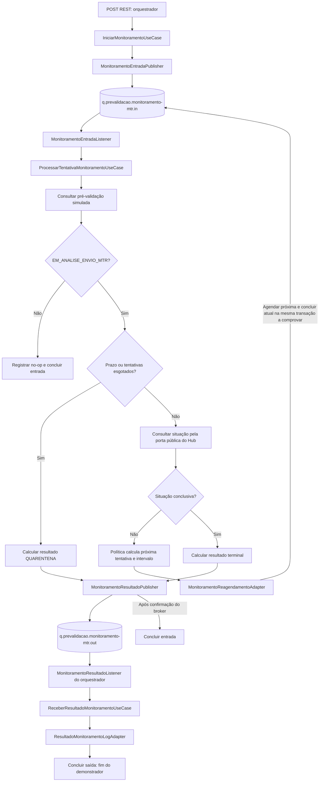

# Guia de desenvolvimento — orquestrador e monitoramento Service Bus

**Continuidade atual:** item 4.1 tecnicamente concluído, incluindo política/configuração,
contratos, mappers, logs tipados, validação confirmada de resultado e guardrails.
Checkpoint COMPLIANT; evidências completas no checklist. Nenhum avanço para 5.1,
listener, publicação, settlement ou encerramento humano da feature.

## Decisões para navegar e implementar este código

O [guia Service Bus](../../../doc/guias/guia-service-bus-amqp-dossie.md) é a leitura principal
para a conversa entre desenvolvedores: explica a arquitetura no mesmo runtime, os contratos,
os dois fluxos de colaboração e as decisões aceitas. Este inventário permite localizar os arquivos.

| Decisão aplicada | Consequência ao implementar | Referência |
|---|---|---|
| Orquestrador e monitoramento são componentes do monólito modular | Regras ficam em seus componentes; Hub/dossie existentes permanecem preservados | [ADR-0010](../../../doc/adr/0010-extensao-quarkus-service-bus-connection-string-dev-services.md) |
| Hexagonal pragmática permite CDI/Quarkus/Mutiny no núcleo | Não criar wrappers para esconder o framework; SDK, handles e DTOs de borda continuam fora do núcleo | [ADR-0001](../../../doc/adr/0001-monolito-modular-e-hexagonal.md), [ADR-0011](../../../doc/adr/0011-composicao-local-monitoramento-e-fabrica-service-bus.md) |
| Cada borda possui contratos próprios | Compatibilidade por JSON, sem DTO compartilhado entre REST, produtor, consumidor ou Hub | [ADR-0004](../../../doc/adr/0004-contratos-independentes-por-borda.md) |
| Colaboração local usa porta e ACL | Consultar o Hub pela API pública e obter parâmetros do monitoramento sem importar implementação/configuração | [ADR-0003](../../../doc/adr/0003-orquestracao-e-colaboracao-por-portas.md), [ADR-0011](../../../doc/adr/0011-composicao-local-monitoramento-e-fabrica-service-bus.md) |
| Factory única cria os clientes da extensão | Implementar em 6.1 com qualifiers e shutdown; adapters não criam clientes por mensagem | [ADR-0011](../../../doc/adr/0011-composicao-local-monitoramento-e-fabrica-service-bus.md) |
| SAS externa, extensão 1.2.5 e Dev Services local | Preservar Quarkus 3.33.2.1/JDK 25, profiles e config.json; não introduzir Entra/SDK direto alternativo | [ADR-0010](../../../doc/adr/0010-extensao-quarkus-service-bus-connection-string-dev-services.md) |
| Infraestrutura de logging transporta campos já sanitizados | DTO, classificação, identidade e sanitização continuam na borda; Hub é delegado sem alteração | [ADR-0012](../../../doc/adr/0012-campos-json-tipados-logs-service-bus.md) |
| Settlement e telemetria são comportamento observável | Provar operação real e instrumentação do SDK antes de declarar atomicidade ou acrescentar spans | [ADR-0006](../../../doc/adr/0006-compatibilidade-observabilidade-e-testes.md), [ADR-0010](../../../doc/adr/0010-extensao-quarkus-service-bus-connection-string-dev-services.md) |

A política, os contratos/mappers, os erros tipados e os guardrails de 4.1 estão prontos.
O próximo item é **5.1**, com o mock de pré-validação e a ACL do Hub. Factory, Resource,
publishers, listeners e casos de uso ainda precisam de implementação; ter arquivo, Javadoc e
porta declarada não equivale a serviço em execução. O checklist mostra dependências e checkpoints.

## Objetivo e ponto de partida

O [guia Service Bus](../../../doc/guias/guia-service-bus-amqp-dossie.md) apresenta o fluxo e os
contratos vigentes. Este arquivo complementa o guia com inventário Java e roteiro manual.
O nome histórico do guia não autoriza mudança no package `br.gov.caixa.simtr.dossie`.

**Estado da continuidade:** DTO/mapper e erro JSON de reagendamento implementados, com os 43
testes novos em GREEN. O RED de compilação da pausa foi reproduzido antes da implementação;
os testes e a fixture foram preservados. Regressão/checkpoint atuais estão no checklist.

Este guia permite discutir a arquitetura olhando os arquivos Java e continuar a implementação
sem reconstruir o histórico da conversa. A feature está na branch
`feature/orquestrador-monitoramento-service-bus`.

Leia primeiro [plan.md](plan.md) para escopo e decisões e [todo.md](todo.md) para andamento,
verificações e decisões humanas. Este guia orienta o trabalho; o checklist continua sendo a fonte
do progresso. A antecipação estrutural foi solicitada pelo usuário no C4.4.

A estrutura contém 11 portas, dois records de parâmetros e 19 classes pendentes, nos packages
definitivos. As classes pendentes estão marcadas com `@Vetoed` e descritas por Javadoc.
Os comentários `@see` permitem navegar até as dependências previstas na IDE. Essas referências
ainda não representam injeção, chamadas ou implementação das interfaces.

| Estado | O que significa |
|---|---|
| Implementado e verificado | Política, configuração/producer CDI, contratos REST e da fila de entrada, mappers e logs de erro dessas bordas, incluindo reagendamento e resultado, já possuem implementação e testes |
| Interface declarada | A porta existe e usa tipos do próprio componente; ainda não possui implementação conectada |
| Dados declarados | Os records independentes de parâmetros têm `limiteEm` e `politicaMonitoramentoVersao`; cálculo e tradução ainda não existem |
| Estrutura inativa | O arquivo reserva nome, package e responsabilidade; falta implementar campos ou métodos e os respectivos testes |
| Pendente no checklist | Ter um arquivo Java não conclui o item funcional; isso exige comportamento, testes, revisão e checkpoint |

Não usar os DTOs/modelos vazios como mensagens, instanciar esqueletos para simular sucesso nem
registrá-los como beans. As classes futuras não declaram `implements` ainda: adicionar a porta
correspondente junto da implementação funcional. Isso evita métodos fictícios ou hierarquias
abstratas temporárias. Os tipos vazios também não fixam um schema JSON.

## Arquitetura para a conversa com a equipe

O diagrama mostra o destino das ligações. Endpoint, listeners, consultas e publicações continuam
pendentes. Não representa um fluxo já executável.



A fábrica `arquitetura.infraestrutura.servicebus.ClientesServiceBus` será suporte técnico dos
adapters Service Bus. Ela não é um componente de negócio, um barramento genérico ou o destino de
toda lógica assíncrona.

| Componente | Responsabilidade | Dependências permitidas |
|---|---|---|
| `orquestrador.dominio` | Solicitação, identificadores e resultado próprio | Tipos do próprio domínio e suporte permitido pelo ADR-0001 |
| `orquestrador.aplicacao` | Iniciar e receber resultado | Domínio e portas próprios |
| `monitoramento.dominio` | Política, tentativa, prazo, situações e decisões | Tipos próprios e suporte permitido pelo ADR-0001 |
| `monitoramento.aplicacao` | Preparar parâmetros e coordenar processamento | Política, domínio e portas próprios |
| Adapters de entrada | Validar/mapear contrato e chamar porta de entrada | API do próprio componente; transporte apenas na borda |
| Adapters de saída | Implementar portas e traduzir integração | Porta/tipos do consumidor e API externa explicitamente permitida |
| ACL de parâmetros | Traduzir resultado do monitoramento | `PrepararMonitoramento` e seus tipos públicos, sem importar política/configuração |
| ACL do Hub | Traduzir identificador e situação mínima | `ConsultarDossieProduto` e tipos públicos referenciados, sem Resource/DTO MTR/caso de uso concreto |
| Infraestrutura Service Bus | Builder da extensão, clientes e lifecycle | SDK e suporte técnico; nenhum domínio ou componente de negócio |

Quarkus, CDI e Mutiny são permitidos no núcleo pela hexagonal pragmática. SDK Azure, DTO de
transporte, client, connection string e handles de settlement permanecem nas bordas.
Cada componente e borda conserva modelos/DTOs próprios, mesmo quando o JSON precisa ser compatível.

Referências: [arquitetura consolidada](../../../doc/arquitetura-distribuida/arquitetura-ddd-integracoes-atomicas.md),
[índice dos ADRs](../../../doc/adr/README.md),
[ADR-0003](../../../doc/adr/0003-orquestracao-e-colaboracao-por-portas.md),
[ADR-0004](../../../doc/adr/0004-contratos-independentes-por-borda.md),
[ADR-0011](../../../doc/adr/0011-composicao-local-monitoramento-e-fabrica-service-bus.md) e
[ADR-0012](../../../doc/adr/0012-campos-json-tipados-logs-service-bus.md).

## Plataforma e fluxo aprovados

A implementação usa a extensão Quarkus Azure Service Bus `1.2.5` com Quarkus `3.33.2.1`
e JDK 25. Ambientes reais usam `QUARKUS_AZURE_SERVICEBUS_CONNECTION_STRING` externa com SAS;
não implementar Entra ID. Dev Services fornece emulador/SQL e connection string local em dev
e nos testes de integração habilitados. Manter
`src/main/azure/servicebus-emulator/config.json` e os simuladores existentes.

O orquestrador escreve na entrada; o listener do monitoramento aciona a aplicação/política,
que decide no-op, resultado/quarentena na saída ou reagendamento na entrada. O orquestrador
consome a saída e conclui o demonstrador após o log. A preparação local de limite/versão do
ADR-0011 ocorre antes da primeira publicação e não substitui esse fluxo assíncrono.
Critérios, confirmação e contratos estão detalhados no guia Service Bus.
`dossie` e Hub permanecem preservados.

## Inventário da estrutura antecipada

Todos os caminhos abaixo apontam para arquivos Java. A coluna final indica onde os campos,
a lógica ou a conexão deverão ser implementados. O Javadoc de cada classe informa sua função.

| Arquivo | Package após `br.gov.caixa.simtr` | Estado | Item funcional |
|---|---|---|---|
| [ParametrosMonitoramento](../../../src/main/java/br/gov/caixa/simtr/orquestrador/dominio/modelo/ParametrosMonitoramento.java) | `orquestrador.dominio.modelo` | Dados declarados | 6.1 |
| [ResultadoMonitoramento](../../../src/main/java/br/gov/caixa/simtr/orquestrador/dominio/modelo/ResultadoMonitoramento.java) | `orquestrador.dominio.modelo` | Implementado e verificado; regra de quarentena/conclusivo confirmada | 4.1 |
| [ParametrosMonitoramento](../../../src/main/java/br/gov/caixa/simtr/monitoramento/dominio/modelo/ParametrosMonitoramento.java) | `monitoramento.dominio.modelo` | Dados declarados | 6.1 |
| [ResultadoMonitoramento](../../../src/main/java/br/gov/caixa/simtr/monitoramento/dominio/modelo/ResultadoMonitoramento.java) | `monitoramento.dominio.modelo` | Implementado e verificado; regra de quarentena/conclusivo confirmada | 4.1 |
| [PreValidacaoConsultada](../../../src/main/java/br/gov/caixa/simtr/monitoramento/dominio/modelo/PreValidacaoConsultada.java) | `monitoramento.dominio.modelo` | Estrutura inativa | 5.1 |
| [SituacaoDossieConsultada](../../../src/main/java/br/gov/caixa/simtr/monitoramento/dominio/modelo/SituacaoDossieConsultada.java) | `monitoramento.dominio.modelo` | Estrutura inativa | 5.1 |
| [DecisaoProcessamento](../../../src/main/java/br/gov/caixa/simtr/monitoramento/dominio/modelo/DecisaoProcessamento.java) | `monitoramento.dominio.modelo` | Estrutura inativa | 7.1/8.1 |
| [ReagendamentoMonitoramento](../../../src/main/java/br/gov/caixa/simtr/monitoramento/dominio/modelo/ReagendamentoMonitoramento.java) | `monitoramento.dominio.modelo` | Estrutura inativa | 8.1 |
| [IniciarMonitoramento](../../../src/main/java/br/gov/caixa/simtr/orquestrador/aplicacao/porta/entrada/IniciarMonitoramento.java) | `orquestrador.aplicacao.porta.entrada` | Interface declarada | 6.1 |
| [ReceberResultadoMonitoramento](../../../src/main/java/br/gov/caixa/simtr/orquestrador/aplicacao/porta/entrada/ReceberResultadoMonitoramento.java) | `orquestrador.aplicacao.porta.entrada` | Interface declarada | 9.1 |
| [ObterParametrosMonitoramento](../../../src/main/java/br/gov/caixa/simtr/orquestrador/aplicacao/porta/saida/ObterParametrosMonitoramento.java) | `orquestrador.aplicacao.porta.saida` | Interface declarada | 6.1 |
| [PublicarTentativaMonitoramento](../../../src/main/java/br/gov/caixa/simtr/orquestrador/aplicacao/porta/saida/PublicarTentativaMonitoramento.java) | `orquestrador.aplicacao.porta.saida` | Interface declarada | 6.1 |
| [RegistrarResultadoMonitoramento](../../../src/main/java/br/gov/caixa/simtr/orquestrador/aplicacao/porta/saida/RegistrarResultadoMonitoramento.java) | `orquestrador.aplicacao.porta.saida` | Interface declarada | 9.1 |
| [PrepararMonitoramento](../../../src/main/java/br/gov/caixa/simtr/monitoramento/aplicacao/porta/entrada/PrepararMonitoramento.java) | `monitoramento.aplicacao.porta.entrada` | Interface declarada | 6.1 |
| [ProcessarTentativaMonitoramento](../../../src/main/java/br/gov/caixa/simtr/monitoramento/aplicacao/porta/entrada/ProcessarTentativaMonitoramento.java) | `monitoramento.aplicacao.porta.entrada` | Interface declarada | 7.1/8.1 |
| [ConsultarPreValidacao](../../../src/main/java/br/gov/caixa/simtr/monitoramento/aplicacao/porta/saida/ConsultarPreValidacao.java) | `monitoramento.aplicacao.porta.saida` | Interface declarada | 5.1 |
| [ConsultarSituacaoDossie](../../../src/main/java/br/gov/caixa/simtr/monitoramento/aplicacao/porta/saida/ConsultarSituacaoDossie.java) | `monitoramento.aplicacao.porta.saida` | Interface declarada | 5.1 |
| [PublicarResultadoMonitoramento](../../../src/main/java/br/gov/caixa/simtr/monitoramento/aplicacao/porta/saida/PublicarResultadoMonitoramento.java) | `monitoramento.aplicacao.porta.saida` | Interface declarada | 7.1 |
| [ReagendarTentativaMonitoramento](../../../src/main/java/br/gov/caixa/simtr/monitoramento/aplicacao/porta/saida/ReagendarTentativaMonitoramento.java) | `monitoramento.aplicacao.porta.saida` | Interface declarada | 8.1 |
| [IniciarMonitoramentoUseCase](../../../src/main/java/br/gov/caixa/simtr/orquestrador/aplicacao/casodeuso/IniciarMonitoramentoUseCase.java) | `orquestrador.aplicacao.casodeuso` | Estrutura inativa | 6.1 |
| [ReceberResultadoMonitoramentoUseCase](../../../src/main/java/br/gov/caixa/simtr/orquestrador/aplicacao/casodeuso/ReceberResultadoMonitoramentoUseCase.java) | `orquestrador.aplicacao.casodeuso` | Estrutura inativa | 9.1 |
| [MonitoramentoDossieResource](../../../src/main/java/br/gov/caixa/simtr/orquestrador/adaptador/entrada/rest/v1/MonitoramentoDossieResource.java) | `orquestrador.adaptador.entrada.rest.v1` | Estrutura inativa | 6.1 |
| [MonitoramentoResultadoListener](../../../src/main/java/br/gov/caixa/simtr/orquestrador/adaptador/entrada/servicebus/MonitoramentoResultadoListener.java) | `orquestrador.adaptador.entrada.servicebus` | Estrutura inativa | 9.1 |
| [MonitoramentoEntradaPublisher](../../../src/main/java/br/gov/caixa/simtr/orquestrador/adaptador/saida/servicebus/MonitoramentoEntradaPublisher.java) | `orquestrador.adaptador.saida.servicebus` | Estrutura inativa | 6.1 |
| [ResultadoMonitoramentoLogAdapter](../../../src/main/java/br/gov/caixa/simtr/orquestrador/adaptador/saida/log/ResultadoMonitoramentoLogAdapter.java) | `orquestrador.adaptador.saida.log` | Estrutura inativa | 9.1 |
| [ParametrosMonitoramentoAcl](../../../src/main/java/br/gov/caixa/simtr/orquestrador/adaptador/saida/acl/monitoramento/ParametrosMonitoramentoAcl.java) | `orquestrador.adaptador.saida.acl.monitoramento` | Estrutura inativa | 6.1 |
| [PrepararMonitoramentoUseCase](../../../src/main/java/br/gov/caixa/simtr/monitoramento/aplicacao/casodeuso/PrepararMonitoramentoUseCase.java) | `monitoramento.aplicacao.casodeuso` | Estrutura inativa | 6.1 |
| [ProcessarTentativaMonitoramentoUseCase](../../../src/main/java/br/gov/caixa/simtr/monitoramento/aplicacao/casodeuso/ProcessarTentativaMonitoramentoUseCase.java) | `monitoramento.aplicacao.casodeuso` | Estrutura inativa | 7.1/8.1 |
| [MonitoramentoEntradaListener](../../../src/main/java/br/gov/caixa/simtr/monitoramento/adaptador/entrada/servicebus/MonitoramentoEntradaListener.java) | `monitoramento.adaptador.entrada.servicebus` | Estrutura inativa | 7.1/8.1 |
| [PreValidacaoSimuladaAdapter](../../../src/main/java/br/gov/caixa/simtr/monitoramento/adaptador/saida/simulador/prevalidacao/PreValidacaoSimuladaAdapter.java) | `monitoramento.adaptador.saida.simulador.prevalidacao` | Estrutura inativa | 5.1 |
| [SituacaoDossieHubAcl](../../../src/main/java/br/gov/caixa/simtr/monitoramento/adaptador/saida/acl/simtrhub/SituacaoDossieHubAcl.java) | `monitoramento.adaptador.saida.acl.simtrhub` | Estrutura inativa | 5.1 |
| [MonitoramentoResultadoPublisher](../../../src/main/java/br/gov/caixa/simtr/monitoramento/adaptador/saida/servicebus/MonitoramentoResultadoPublisher.java) | `monitoramento.adaptador.saida.servicebus` | Estrutura inativa | 7.1 |
| [MonitoramentoReagendamentoAdapter](../../../src/main/java/br/gov/caixa/simtr/monitoramento/adaptador/saida/servicebus/MonitoramentoReagendamentoAdapter.java) | `monitoramento.adaptador.saida.servicebus` | Estrutura inativa | 8.1 |
| [ClientesServiceBus](../../../src/main/java/br/gov/caixa/simtr/arquitetura/infraestrutura/servicebus/ClientesServiceBus.java) | `arquitetura.infraestrutura.servicebus` | Estrutura inativa | 6.1 |
| [MonitorarDossieMtrV1](../../../src/main/java/br/gov/caixa/simtr/monitoramento/adaptador/saida/servicebus/dto/MonitorarDossieMtrV1.java) | `monitoramento.adaptador.saida.servicebus.dto` | Implementado; testes de reagendamento em GREEN | 4.1 |
| [MonitoramentoReagendamentoServiceBusMapper](../../../src/main/java/br/gov/caixa/simtr/monitoramento/adaptador/saida/servicebus/MonitoramentoReagendamentoServiceBusMapper.java) | `monitoramento.adaptador.saida.servicebus` | Implementado; testes de reagendamento em GREEN | 4.1 |
| [ResultadoMonitoramentoDossieMtrV1](../../../src/main/java/br/gov/caixa/simtr/monitoramento/adaptador/saida/servicebus/dto/ResultadoMonitoramentoDossieMtrV1.java) | `monitoramento.adaptador.saida.servicebus.dto` | Implementado e verificado; regra de quarentena/conclusivo confirmada | 4.1 |
| [MonitoramentoResultadoServiceBusMapper](../../../src/main/java/br/gov/caixa/simtr/monitoramento/adaptador/saida/servicebus/MonitoramentoResultadoServiceBusMapper.java) | `monitoramento.adaptador.saida.servicebus` | Implementado e verificado; regra de quarentena/conclusivo confirmada | 4.1 |
| [ResultadoMonitoramentoDossieMtrV1](../../../src/main/java/br/gov/caixa/simtr/orquestrador/adaptador/entrada/servicebus/dto/ResultadoMonitoramentoDossieMtrV1.java) | `orquestrador.adaptador.entrada.servicebus.dto` | Implementado e verificado; regra de quarentena/conclusivo confirmada | 4.1 |
| [MonitoramentoResultadoServiceBusMapper](../../../src/main/java/br/gov/caixa/simtr/orquestrador/adaptador/entrada/servicebus/MonitoramentoResultadoServiceBusMapper.java) | `orquestrador.adaptador.entrada.servicebus` | Implementado e verificado; regra de quarentena/conclusivo confirmada | 4.1 |

Os mappers, DTOs de entrada, política e configuração anteriores a C4.4 permanecem implementados.
Não substituí-los por esqueletos. DTO/helper de erro das bordas futuras devem ser acrescentados
durante 4.1 seguindo as bordas existentes, com testes do JSON emitido.

## Ordem de continuidade

| Passo | Trabalho | Evidência para avançar |
|---|---|---|
| 4.1-E1 | Estrutura Java, portas e proteção de inatividade | Compilação, ArchUnit, CDI, regressão e checkpoint do incremento |
| 4.1-E2 | Conferir este guia e o manifesto do pacote de commit | Links, inventário e estado alinhados ao código/checklist |
| 4.1 — reagendamento | Completar DTO/mapper da saída do monitoramento, sem agendar | JSON/AMQP compatível com a entrada; valores iniciais preservados; erro JSON |
| 4.1 — resultado | Modelos, DTOs/mappers, logs e validação confirmada implementados | 120 testes de contrato, 14 de logs; JSON e quarentena null/zero verificados |
| 4.1 — guardrails | Isolamento de bordas e acesso público pelas ACLs implementados | 18 testes com provas positivas/negativas e regressão estrutural aprovados |
| 5.1 | Consulta simulada da pré-validação e ACL do Hub | Tradução mínima, cenários controlados, CDI e guardrails |
| 6.1 | Parâmetros locais, fábrica, POST, caso de uso e publisher | `202` após confirmação do broker, contrato REST, erro, emulador e C2 |
| 7.1 | Processamento terminal, listener e resultado | RED/GREEN funcional, confirmação de saída antes de Complete |
| 8.1 | Reagendamento transacional | Commit/rollback, redelivery e preservação da tentativa funcional |
| 9.1 | Listener de resultado e registro | Log aprovado, Complete/Abandon/DLQ conforme resultado real |
| 10.1/C3 | Correlação e fluxo ponta a ponta | Propagação, spans e emulador, com limites registrados |
| 11.1–CF | Consolidação e revisão final | Suíte, Sonar, documentação, revisão e encerramento humano |

Preparar o pacote de commit não significa que 4.1 foi concluído. O
[manifesto](pacote-commit.md) separa a base existente da antecipação estrutural e do guia.
Não avançar automaticamente para 5.1 ao terminar a estrutura.

## Como ler e manter o Javadoc

O Javadoc dos tipos antecipados diferencia o estado atual da implementação esperada. Nas classes
inativas, descreve responsabilidade, item funcional, dependências permitidas e cenários a testar.
Nos métodos das portas, `@param` identifica a entrada e `@return` explica a conclusão esperada,
incluindo confirmação/falha nas operações assíncronas. `@see` e `{@link ...}` ligam tipos.

Exemplos para abrir na IDE:
[IniciarMonitoramento](../../../src/main/java/br/gov/caixa/simtr/orquestrador/aplicacao/porta/entrada/IniciarMonitoramento.java)
e [MonitoramentoReagendamentoAdapter](../../../src/main/java/br/gov/caixa/simtr/monitoramento/adaptador/saida/servicebus/MonitoramentoReagendamentoAdapter.java).

As classes vazias ainda não possuem métodos declarados para documentar: sua orientação fica no
Javadoc da classe. Não criar métodos fictícios, construtores vazios explícitos ou exceções
contratuais apenas para preencher a documentação. Ao implementar a fatia, documentar métodos e
construtores reais e atualizar o texto que identificava a pendência. Usar `@throws` somente para
exceções efetivamente previstas pelo contrato; falha emitida por `Uni` deve ser explicada no
retorno/comportamento, sem inventar declaração checked.

Seguir a [especificação Javadoc do JDK 25](https://docs.oracle.com/en/java/javase/25/docs/specs/javadoc/doc-comment-spec.html):
descrição antes dos block tags, nomes de parâmetros iguais aos da assinatura e referências Java
resolvíveis. Não usar tags personalizadas sem suporte configurado.

O complemento de comentários foi conferido com DocLint e saída temporária, sem HTML: nenhum erro;
27 avisos apenas de construtores implícitos sem comentário. Esses construtores foram preservados,
e deverão ser documentados quando forem explicitamente necessários na implementação.
A comparação antes/depois confirmou preservação de todo conteúdo Java fora dos Javadocs.
Nesta edição exclusivamente documental, não houve Maven, baseline, API ou checkpoint Sonar;
a evidência de 859 testes refere-se à estrutura antes desse complemento.

## Como implementar uma classe pendente

1. Conferir o próximo item do `todo.md`, os critérios do `plan.md` e os ADRs aplicáveis.
   Registrar qualquer alteração de contrato, responsabilidade, segurança ou observabilidade antes
   do código, com o checkpoint humano exigido por [AGENTS.md](../../../AGENTS.md).
2. Selecionar uma fatia pequena, com arquivos e comportamento concretos. Não preencher todos os
   esqueletos de uma camada em uma única alteração.
3. Escrever e executar o teste do comportamento que falta. O RED deve falhar pelo requisito,
   não por erro incidental no próprio teste.
4. Completar os tipos/DTOs apenas na sua borda. Para casos de uso e adapters de saída, implementar
   a interface indicada no Javadoc. Usar injeção pelas portas; não pelo caso de uso concreto.
5. Implementar o mínimo necessário. Manter SDK/serialização/settlement nos adapters, sem bloqueio
   do event loop. A fábrica usa exclusivamente o builder fornecido pela extensão.
6. Retirar `@Vetoed` somente da classe cuja ativação faz parte da fatia. Aplicar CDI/REST/observer
   somente quando o fluxo correspondente estiver pronto e autorizado. Modelos e DTOs não precisam
   tornar-se beans.
7. Atualizar o Javadoc para descrever o estado implementado. Retirar a classe do inventário
   temporário `EstruturaPlanejada.ESQUELETOS` no mesmo incremento, substituindo sua prova de
   inatividade por teste do comportamento/injeção real. Não apagar a proteção dos demais.
8. Executar testes focados, revisar o diff e concluir o checkpoint coerente. Atualizar o checklist,
   este inventário e o consolidado quando o estado implementado mudar.

`@Vetoed` impede que beans e observers da classe sejam instalados pelo CDI; não é controle de
autorização e não impede instanciação manual. Por isso os esqueletos também não têm métodos de
execução nem anotações REST, e o teste verifica sua ausência no CDI.
Fonte: [Jakarta CDI — Vetoed](https://jakarta.ee/specifications/cdi/4.1/apidocs/jakarta/enterprise/inject/vetoed).

## Contratos e tratamento de erros a preservar

- `idDossieMtr` continua string decimal positiva no intervalo de `Long`, com zeros à esquerda
  preservados. A conversão para o identificador do Hub pertence à ACL de 5.1.
- Reagendamento conserva `iniciadoEm`, `limiteEm` e versão da política; não recalcular a janela.
- Não reutilizar DTO REST, MTR, simulador ou DTO Java do outro componente para reduzir duplicação.
  A compatibilidade deve ser provada pelo JSON produzido/consumido.
- A falha de contrato/serialização deve produzir o log JSON aprovado, com diagnóstico sanitizado,
  código estável e mesmo id/código propagado pela exceção. O produtor mantém RuntimeException.
- As bordas futuras devem seguir o padrão das bordas de entrada existentes. Não introduzir
  `catch` que engole a falha nem emissão duplicada do mesmo erro em todas as camadas.
- Registro para ação posterior continua sendo log. Persistência, ação automática, Outbox e
  generalização dos erros/logs do Hub permanecem fora do recorte.

## Pontos a fechar antes da lógica correspondente

**Resultado e guardrails de 4.1 já estão concluídos.** Os modelos, DTOs e mappers de resultado
estão implementados, incluindo a validação de quarentena/conclusivo.
[FronteirasMonitoramentoArchUnitTest](../../../src/test/java/br/gov/caixa/simtr/arquitetura/guardrails/FronteirasMonitoramentoArchUnitTest.java)
já verifica acesso das ACLs somente às portas/modelos públicos, isolamento dos DTOs por borda
e direção das dependências, com provas positivas e negativas. Preservar essas regras e
verificá-las sobre as implementações funcionais introduzidas nas próximas fatias.

1. **Consultas em 5.1:** detalhar campos mínimos dos dois modelos de consulta, cenários do
   simulador, ativação explícita e tratamento de ausência/falhas. As portas já existem;
   `PreValidacaoSimuladaAdapter` e `SituacaoDossieHubAcl` ainda estão inativos.
2. **Lifecycle em 6.1:** implementar qualifiers das duas filas, clientes duradouros, identidade,
   inicialização e fechamento. A fábrica ainda não cria clientes; listeners devem encerrar suas
   assinaturas antes deles.
3. **Versão de política em 7.1/8.1:** definir como tratar mensagem antiga com versão diferente
   da política selecionada. O ADR-0011 proíbe substituição silenciosa.
4. **Decisão e transação em 7.1/8.1:** detalhar o conteúdo de `DecisaoProcessamento` e
   `ReagendamentoMonitoramento` e a associação entre agendamento e settlement da mesma entrega.
   As assinaturas estruturais orientam a discussão; não resolvem essa coordenação. Não expor
   contexto/handles Azure nas portas nem armazenar contexto mutável de entrega em um singleton.
   Provar `schedule + Complete`, rollback e redelivery no SDK/emulador antes de afirmar atomicidade.
5. **Telemetria em 10.1:** caracterizar a instrumentação efetiva do SDK, revisar os nomes
   observáveis planejados e preencher apenas lacunas de propagação/spans, conforme o guia principal.

## Verificação e acompanhamento

Stack preservado: Quarkus `3.33.2.1`, JDK 25, extensão Azure Services `1.2.5`, SDK Service Bus
`7.17.12` e ArchUnit `1.4.2`. A versão efetiva está no `pom.xml`/árvore já registrada no plano;
não atualizar dependências junto da estrutura.
Consultar a [entrada Quarkus Azure Services](https://docs.quarkiverse.io/quarkus-azure-services/dev/index.html)
e a [guia Service Bus](https://docs.quarkiverse.io/quarkus-azure-services/dev/quarkus-azure-servicebus.html)
e confrontar exemplos com a versão efetiva. A guia `dev` pode evoluir.

Na raiz do repositório, os comandos abaixo verificam a estrutura. O mapper de reagendamento
e as bordas de resultado possuem API exercitada pelos testes; 19 tipos continuam no inventário de esqueletos:

```powershell
mvn -q compile
mvn -q "-Dtest=EstruturaMonitoramentoArchUnitTest,FronteirasMonitoramentoArchUnitTest,EsqueletosMonitoramentoCdiTest,ArchUnitProgressivoTest" test
```

Para uma fatia funcional, selecionar os testes pertinentes ao comportamento alterado. Depois de um
incremento coerente que mude o fingerprint executável:

```powershell
.\validar-checkpoint-sonarqube.ps1
```

O checkpoint executa a verificação completa. Não repetir Maven completo após ele sem mudança ou
falha que justifique. Preservar o baseline existente; não executar `-InitializeBaseline` nesta
retomada. Nunca copiar token para chat, argumentos, arquivos ou logs. Seguir o launcher e o fluxo
de credencial em memória de `AGENTS.md`. Indisponibilidade não equivale a aprovação.

Em `NON_COMPLIANT`, registrar as issues e métricas e obter decisão humana conforme o processo.
Somente a decisão efetivamente dada pelo usuário deve ser registrada pelo script. Os números
anteriores de testes/cobertura estão no `todo.md`; não tratá-los como medição após uma nova edição.

A cada entrega, registrar no checklist: arquivos, requisito atendido, RED/GREEN, testes focados,
checkpoint/fingerprint, riscos remanescentes e próximo item. Manter a distinção entre arquivo
criado, contrato implementado, integração ligada e fluxo verificado.

## Preservação do workspace e conversa com a equipe

Preservar todas as alterações rastreadas e não rastreadas. Não usar `git reset`, `git clean` nem
trocar branch descartando mudanças. O package `dossie`, o Hub, seus logs/erros, extensão, simuladores e
`src/main/azure/servicebus-emulator/config.json` permanecem preservados.

Para a reunião: percorrer o diagrama, abrir as portas e as classes pelos links do inventário,
revisar os cinco pontos pendentes acima e distribuir as próximas fatias pelo checklist.
Não apresentar a estrutura como processamento Service Bus já disponível.

## Referência histórica da revisão do guia Service Bus e orientação Java

O guia técnico principal foi alinhado às decisões vigentes de fluxo, packages, connection
string/SAS, extensão e Dev Services. Nas onze portas, o Javadoc agora descreve o comportamento
de cada método, sua conclusão e falha; foram corrigidos os trechos `undefined`.
Nove classes do fluxo receberam a posição exata nas duas filas, critérios e responsabilidades.
Naquela revisão, a sintaxe foi conferida com DocLint (sem erros; nove avisos de construtores
implícitos), sem alteração fora dos comentários. O RED de reagendamento pertencia à pausa
daquele momento e foi superado pela implementação. O estado vigente é 4.1 tecnicamente
concluído; a evidência executável e o histórico completo estão no checklist.
